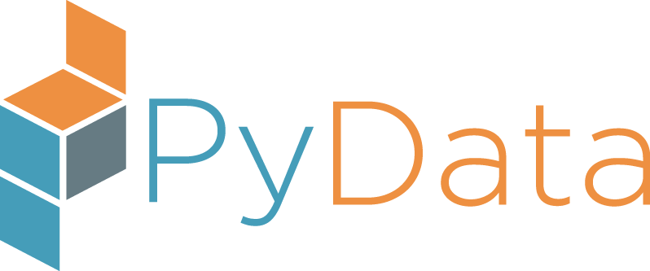

<div style="background-color: #262626"> 
    
</div>


```python
import pandas as pd
import numpy as np
```

<a name="absolute_rank"></a>
# Community Voting Results

### Absolute Ranking


```python
rankings = pd.read_csv('./ranking_pyconx.txt', sep='~', skiprows=1, header=0)
rankings.drop('TID', axis=1, inplace=True)

union_jack = '\U0001F1EC\U0001F1E7'
tricolore = '\U0001F1EE\U0001F1F9'

rankings.Gender = rankings.Gender.apply(lambda g: '+'.join('\U0001f469\u200d\U0001f4bb' if l=='female' else '\U0001f468\u200d\U0001f4bb' 
                                         for l in g.split('+')))
rankings.Lang = rankings.Lang.apply(lambda l: union_jack if l=='en' else tricolore)
pd.set_option('display.max_rows', rankings.index.size)
pd.set_option('display.max_colwidth', 200)
rankings
```


<div>
<style scoped>
    .dataframe tbody tr th:only-of-type {
        vertical-align: middle;
    }

    .dataframe tbody tr th {
        vertical-align: top;
    }

    .dataframe thead th {
        text-align: right;
    }
</style>
<table border="1" class="dataframe">
  <thead>
    <tr style="text-align: right;">
      <th></th>
      <th>Type</th>
      <th>Duration</th>
      <th>Title</th>
      <th>Track</th>
      <th>Level</th>
      <th>Lang</th>
      <th>Speakers</th>
      <th>Gender</th>
    </tr>
  </thead>
  <tbody>
    <tr>
      <th>0</th>
      <td>Talk</td>
      <td>45</td>
      <td>Python Standard Library, the hidden gems</td>
      <td>Python &amp; Friends</td>
      <td>Beginner</td>
      <td>🇮🇹</td>
      <td>Alessandro Molina</td>
      <td>👨‍💻</td>
    </tr>
    <tr>
      <th>1</th>
      <td>Talk</td>
      <td>45</td>
      <td>A practical guide towards explainability and bias evaluation in machine learning</td>
      <td>PyData</td>
      <td>Intermediate</td>
      <td>🇬🇧</td>
      <td>Alejandro Saucedo</td>
      <td>👨‍💻</td>
    </tr>
    <tr>
      <th>2</th>
      <td>Talk</td>
      <td>45</td>
      <td>Please tell me why?! Explaining Machine Learning predictions in Python with Shap</td>
      <td>PyData</td>
      <td>Intermediate</td>
      <td>🇬🇧</td>
      <td>Alessio Guerrieri</td>
      <td>👨‍💻</td>
    </tr>
    <tr>
      <th>3</th>
      <td>Talk</td>
      <td>45</td>
      <td>Predicting Human Activity using Time Series Analysis</td>
      <td>PyData</td>
      <td>Intermediate</td>
      <td>🇬🇧</td>
      <td>Akul Mehra</td>
      <td>👨‍💻</td>
    </tr>
    <tr>
      <th>4</th>
      <td>Talk</td>
      <td>60</td>
      <td>Deep learning: the final frontier for time series analysis and signal processing?</td>
      <td>PyData</td>
      <td>Intermediate</td>
      <td>🇬🇧</td>
      <td>Alexandr Honchar</td>
      <td>👨‍💻</td>
    </tr>
    <tr>
      <th>5</th>
      <td>Talk</td>
      <td>45</td>
      <td>Dimmi perchè?! Spiegare modelli Machine Learning in Python con Shap</td>
      <td>PyData</td>
      <td>Intermediate</td>
      <td>🇮🇹</td>
      <td>Alessio Guerrieri</td>
      <td>👨‍💻</td>
    </tr>
    <tr>
      <th>6</th>
      <td>Training</td>
      <td>240</td>
      <td>PyTorch from the ground up</td>
      <td>PyData</td>
      <td>Intermediate</td>
      <td>🇬🇧</td>
      <td>Alessandro Re</td>
      <td>👨‍💻</td>
    </tr>
    <tr>
      <th>7</th>
      <td>Talk</td>
      <td>45</td>
      <td>Meet dask and distributed: the unsung heroes of Python scientific data ecosystem.</td>
      <td>PyData</td>
      <td>Advanced</td>
      <td>🇬🇧</td>
      <td>Alessandro Amici</td>
      <td>👨‍💻</td>
    </tr>
    <tr>
      <th>8</th>
      <td>Talk</td>
      <td>45</td>
      <td>Uno sguardo alle Dataclasses: quando una namedtuple non basta</td>
      <td>Python &amp; Friends</td>
      <td>Beginner</td>
      <td>🇮🇹</td>
      <td>Alessandro Cucci</td>
      <td>👨‍💻</td>
    </tr>
    <tr>
      <th>9</th>
      <td>Talk</td>
      <td>60</td>
      <td>Demystifying Network Science  with Python</td>
      <td>PyData</td>
      <td>Intermediate</td>
      <td>🇬🇧</td>
      <td>Avneet Kaur</td>
      <td>👩‍💻</td>
    </tr>
    <tr>
      <th>10</th>
      <td>Talk</td>
      <td>60</td>
      <td>Sviluppare per Alexa in Python</td>
      <td>Python &amp; Friends</td>
      <td>Intermediate</td>
      <td>🇮🇹</td>
      <td>Alberto Anceschi</td>
      <td>👨‍💻</td>
    </tr>
    <tr>
      <th>11</th>
      <td>Talk</td>
      <td>60</td>
      <td>Deep Learning with PyTorch for Fun and Profit (Part III / Italian Edition: Divina Commedia)</td>
      <td>PyData</td>
      <td>Intermediate</td>
      <td>🇬🇧</td>
      <td>Alexander Hendorf</td>
      <td>👨‍💻</td>
    </tr>
    <tr>
      <th>12</th>
      <td>Talk</td>
      <td>45</td>
      <td>Deep learning the Bayesian way. Moving towards safer AI !</td>
      <td>PyData</td>
      <td>Intermediate</td>
      <td>🇬🇧</td>
      <td>Ayush Kumar Singh</td>
      <td>👨‍💻</td>
    </tr>
    <tr>
      <th>13</th>
      <td>Talk</td>
      <td>45</td>
      <td>Hearing Colours and Seeing Sounds using Python</td>
      <td>PyData</td>
      <td>Beginner</td>
      <td>🇬🇧</td>
      <td>Aakanksha Chouhan</td>
      <td>👩‍💻</td>
    </tr>
    <tr>
      <th>14</th>
      <td>Talk</td>
      <td>45</td>
      <td>Communicating Between Microservices</td>
      <td>PyWeb &amp; DevOps</td>
      <td>Intermediate</td>
      <td>🇬🇧</td>
      <td>Anton Caceres</td>
      <td>👨‍💻</td>
    </tr>
    <tr>
      <th>15</th>
      <td>Talk</td>
      <td>60</td>
      <td>Kubeflow: portable and scalable machine learning on top of Kubernetes</td>
      <td>PyData</td>
      <td>Intermediate</td>
      <td>🇬🇧</td>
      <td>Akash Tandon</td>
      <td>👨‍💻</td>
    </tr>
    <tr>
      <th>16</th>
      <td>Talk</td>
      <td>60</td>
      <td>Traversing the land of graph computing and databases</td>
      <td>PyDatabase</td>
      <td>Beginner</td>
      <td>🇬🇧</td>
      <td>Akash Tandon</td>
      <td>👨‍💻</td>
    </tr>
    <tr>
      <th>17</th>
      <td>Talk</td>
      <td>45</td>
      <td>Algoritmo di Routing Multi-Obiettivo di Veicoli Elettrici con vincoli di ricarica lungo il percorso</td>
      <td>Python &amp; Friends</td>
      <td>Beginner</td>
      <td>🇮🇹</td>
      <td>Alessandro Betti</td>
      <td>👨‍💻</td>
    </tr>
    <tr>
      <th>18</th>
      <td>Talk</td>
      <td>45</td>
      <td>Building a Celery alternative in Django on Kubernetes</td>
      <td>PyWeb &amp; DevOps</td>
      <td>Intermediate</td>
      <td>🇬🇧</td>
      <td>Alec Clowes</td>
      <td>👨‍💻</td>
    </tr>
    <tr>
      <th>19</th>
      <td>Talk</td>
      <td>45</td>
      <td>A Worked Intro to Scikit-learn</td>
      <td>PyData</td>
      <td>Beginner</td>
      <td>🇬🇧</td>
      <td>Anders Bogsnes</td>
      <td>👨‍💻</td>
    </tr>
    <tr>
      <th>20</th>
      <td>Talk</td>
      <td>45</td>
      <td>Machine learning approaches for road scene video analysis</td>
      <td>PyData</td>
      <td>Intermediate</td>
      <td>🇬🇧</td>
      <td>Andrea Benericetti</td>
      <td>👨‍💻</td>
    </tr>
    <tr>
      <th>21</th>
      <td>Talk</td>
      <td>45</td>
      <td>Text Extraction from PDFs made Easy</td>
      <td>PyData</td>
      <td>Beginner</td>
      <td>🇬🇧</td>
      <td>Aakriti Jain</td>
      <td>👩‍💻</td>
    </tr>
    <tr>
      <th>22</th>
      <td>Talk</td>
      <td>45</td>
      <td>Sharing is Caring! - how to free the CPU from message passing hell - shared memory saved the day</td>
      <td>Python &amp; Friends</td>
      <td>Intermediate</td>
      <td>🇬🇧</td>
      <td>Andrei Neagu</td>
      <td>👨‍💻</td>
    </tr>
    <tr>
      <th>23</th>
      <td>Talk</td>
      <td>45</td>
      <td>Architectures for the real world: retina U-nets, prototypical networks and VA-GANs in PyTorch</td>
      <td>PyData</td>
      <td>Intermediate</td>
      <td>🇬🇧</td>
      <td>Alessandro Re</td>
      <td>👨‍💻</td>
    </tr>
    <tr>
      <th>24</th>
      <td>Talk</td>
      <td>240</td>
      <td>An insight into Python Garbage Collection</td>
      <td>Python &amp; Friends</td>
      <td>Intermediate</td>
      <td>🇬🇧</td>
      <td>Fabio Falzoi</td>
      <td>👨‍💻</td>
    </tr>
    <tr>
      <th>25</th>
      <td>Training</td>
      <td>240</td>
      <td>Kubernetes 101 for Python Developer</td>
      <td>PyWeb &amp; DevOps</td>
      <td>Intermediate</td>
      <td>🇬🇧</td>
      <td>Christian Barra</td>
      <td>👨‍💻</td>
    </tr>
    <tr>
      <th>26</th>
      <td>Talk</td>
      <td>45</td>
      <td>Understanding Caching in Python</td>
      <td>Python &amp; Friends</td>
      <td>Beginner</td>
      <td>🇬🇧</td>
      <td>Chirag Shah</td>
      <td>👨‍💻</td>
    </tr>
    <tr>
      <th>27</th>
      <td>Talk</td>
      <td>60</td>
      <td>Spotting Sharks with the TensorFlow Object Detection API</td>
      <td>PyData</td>
      <td>Intermediate</td>
      <td>🇬🇧</td>
      <td>Andrew Carter</td>
      <td>👨‍💻</td>
    </tr>
    <tr>
      <th>28</th>
      <td>Talk</td>
      <td>45</td>
      <td>Porting your Python web app to serverless in 30 minutes</td>
      <td>PyWeb &amp; DevOps</td>
      <td>Intermediate</td>
      <td>🇬🇧</td>
      <td>Alex Casalboni</td>
      <td>👨‍💻</td>
    </tr>
    <tr>
      <th>29</th>
      <td>Talk</td>
      <td>45</td>
      <td>Choosing the right (managed) database in 2019</td>
      <td>PyDatabase</td>
      <td>Beginner</td>
      <td>🇮🇹</td>
      <td>Alex Casalboni</td>
      <td>👨‍💻</td>
    </tr>
    <tr>
      <th>30</th>
      <td>Talk</td>
      <td>45</td>
      <td>Defence Against the Dark Arts: Adversarial ML</td>
      <td>PyData</td>
      <td>Intermediate</td>
      <td>🇬🇧</td>
      <td>Amit Kushwaha</td>
      <td>👨‍💻</td>
    </tr>
    <tr>
      <th>31</th>
      <td>Talk</td>
      <td>45</td>
      <td>AI and algorithmic art</td>
      <td>PyData</td>
      <td>Beginner</td>
      <td>🇬🇧</td>
      <td>Cheuk Ho</td>
      <td>👩‍💻</td>
    </tr>
    <tr>
      <th>32</th>
      <td>Talk</td>
      <td>60</td>
      <td>Understanding multithreading by deciphering the cpython interpreter source code.</td>
      <td>Python &amp; Friends</td>
      <td>Beginner</td>
      <td>🇬🇧</td>
      <td>Chirag Shah</td>
      <td>👨‍💻</td>
    </tr>
    <tr>
      <th>33</th>
      <td>Talk</td>
      <td>45</td>
      <td>How to help an international organisation transitioning to Python.</td>
      <td>PyData</td>
      <td>Beginner</td>
      <td>🇬🇧</td>
      <td>Alessandro Amici</td>
      <td>👨‍💻</td>
    </tr>
    <tr>
      <th>34</th>
      <td>Talk</td>
      <td>45</td>
      <td>What's trending this month?</td>
      <td>PyData</td>
      <td>Beginner</td>
      <td>🇬🇧</td>
      <td>Alisha Aneja</td>
      <td>👩‍💻</td>
    </tr>
    <tr>
      <th>35</th>
      <td>Talk</td>
      <td>45</td>
      <td>Thinking functionally: Introduction to FP in Python</td>
      <td>Python &amp; Friends</td>
      <td>Beginner</td>
      <td>🇬🇧</td>
      <td>Alisha Aneja</td>
      <td>👩‍💻</td>
    </tr>
    <tr>
      <th>36</th>
      <td>Talk</td>
      <td>45</td>
      <td>How to write a JIT compiler in 30 minutes</td>
      <td>Python &amp; Friends</td>
      <td>Advanced</td>
      <td>🇬🇧</td>
      <td>Antonio Cuni</td>
      <td>👨‍💻</td>
    </tr>
    <tr>
      <th>37</th>
      <td>Talk</td>
      <td>45</td>
      <td>Good features beat algorithms</td>
      <td>PyData</td>
      <td>Beginner</td>
      <td>🇬🇧</td>
      <td>Pietro Mascolo</td>
      <td>👨‍💻</td>
    </tr>
    <tr>
      <th>38</th>
      <td>Talk</td>
      <td>90</td>
      <td>Understanding how a malware works using Python</td>
      <td>Python &amp; Friends</td>
      <td>Intermediate</td>
      <td>🇬🇧</td>
      <td>Yan Orestes</td>
      <td>👨‍💻</td>
    </tr>
    <tr>
      <th>39</th>
      <td>Talk</td>
      <td>45</td>
      <td>Adaptive Online Geospatial Machine Learning</td>
      <td>PyData</td>
      <td>Intermediate</td>
      <td>🇬🇧</td>
      <td>Breno Freitas</td>
      <td>👨‍💻</td>
    </tr>
    <tr>
      <th>40</th>
      <td>Talk</td>
      <td>60</td>
      <td>Configuration management and service discovery in a serverless world</td>
      <td>PyWeb &amp; DevOps</td>
      <td>Advanced</td>
      <td>🇬🇧</td>
      <td>Alex Casalboni</td>
      <td>👨‍💻</td>
    </tr>
    <tr>
      <th>41</th>
      <td>Talk</td>
      <td>60</td>
      <td>TensorFlow 2.0: the Good and the Bad</td>
      <td>PyData</td>
      <td>Beginner</td>
      <td>🇬🇧</td>
      <td>Michele De Simoni</td>
      <td>👨‍💻</td>
    </tr>
    <tr>
      <th>42</th>
      <td>Talk</td>
      <td>45</td>
      <td>Python and Elasticsearch: An introduction</td>
      <td>PyData</td>
      <td>Beginner</td>
      <td>🇬🇧</td>
      <td>Fabio Falzoi</td>
      <td>👨‍💻</td>
    </tr>
    <tr>
      <th>43</th>
      <td>Talk</td>
      <td>45</td>
      <td>Scrivere i primi test frontend con python? Si Può!</td>
      <td>PyWeb &amp; DevOps</td>
      <td>Beginner</td>
      <td>🇮🇹</td>
      <td>Fiorella De Luca</td>
      <td>👩‍💻</td>
    </tr>
    <tr>
      <th>44</th>
      <td>Talk</td>
      <td>45</td>
      <td>Doing data science in the real world- Not the usual fairy tale !</td>
      <td>PyData</td>
      <td>Intermediate</td>
      <td>🇬🇧</td>
      <td>Daniel Ajisafe</td>
      <td>👨‍💻</td>
    </tr>
    <tr>
      <th>45</th>
      <td>Training</td>
      <td>240</td>
      <td>Geospatial analysis with Python</td>
      <td>PyData</td>
      <td>Intermediate</td>
      <td>🇬🇧</td>
      <td>Francesco Bruni</td>
      <td>👨‍💻</td>
    </tr>
    <tr>
      <th>46</th>
      <td>Talk</td>
      <td>45</td>
      <td>Darkweb + Python: discover, analyze and extract information from hidden services</td>
      <td>PyWeb &amp; DevOps</td>
      <td>Intermediate</td>
      <td>🇬🇧</td>
      <td>Jose Manuel Ortega</td>
      <td>👨‍💻</td>
    </tr>
    <tr>
      <th>47</th>
      <td>Talk</td>
      <td>45</td>
      <td>Introduction to deep learning for computer vision</td>
      <td>PyData</td>
      <td>Intermediate</td>
      <td>🇬🇧</td>
      <td>Daniel Ajisafe</td>
      <td>👨‍💻</td>
    </tr>
    <tr>
      <th>48</th>
      <td>Talk</td>
      <td>90</td>
      <td>Clean architectures in Python: why, what, how</td>
      <td>Python &amp; Friends</td>
      <td>Intermediate</td>
      <td>🇬🇧</td>
      <td>Leonardo Giordani</td>
      <td>👨‍💻</td>
    </tr>
    <tr>
      <th>49</th>
      <td>Talk</td>
      <td>90</td>
      <td>Clean architectures in Python: perché, cosa, come</td>
      <td>Python &amp; Friends</td>
      <td>Intermediate</td>
      <td>🇮🇹</td>
      <td>Leonardo Giordani</td>
      <td>👨‍💻</td>
    </tr>
    <tr>
      <th>50</th>
      <td>Talk</td>
      <td>45</td>
      <td>Growing vegetables with Python</td>
      <td>PyWeb &amp; DevOps</td>
      <td>Intermediate</td>
      <td>🇬🇧</td>
      <td>Christian Barra</td>
      <td>👨‍💻</td>
    </tr>
    <tr>
      <th>51</th>
      <td>Talk</td>
      <td>45</td>
      <td>Ravioli vs Pelmeni software architecture (microservices vs services)</td>
      <td>PyWeb &amp; DevOps</td>
      <td>Intermediate</td>
      <td>🇬🇧</td>
      <td>Anastasiia Tymoshchuk</td>
      <td>👩‍💻</td>
    </tr>
    <tr>
      <th>52</th>
      <td>Training</td>
      <td>240</td>
      <td>TDD in Python with pytest</td>
      <td>Python &amp; Friends</td>
      <td>Beginner</td>
      <td>🇬🇧</td>
      <td>Leonardo Giordani</td>
      <td>👨‍💻</td>
    </tr>
    <tr>
      <th>53</th>
      <td>Training</td>
      <td>240</td>
      <td>Creare una Dashboard con Flask e Vue.js</td>
      <td>PyWeb &amp; DevOps</td>
      <td>Beginner</td>
      <td>🇮🇹</td>
      <td>Gianfranco Castro</td>
      <td>👨‍💻</td>
    </tr>
    <tr>
      <th>54</th>
      <td>Training</td>
      <td>240</td>
      <td>But I never wanted to do DevOps!</td>
      <td>PyWeb &amp; DevOps</td>
      <td>Beginner</td>
      <td>🇬🇧</td>
      <td>Daniele Procida</td>
      <td>👨‍💻</td>
    </tr>
    <tr>
      <th>55</th>
      <td>Talk</td>
      <td>45</td>
      <td>You don't need n dimensions when you have pandas</td>
      <td>PyData</td>
      <td>Beginner</td>
      <td>🇬🇧</td>
      <td>Pietro Battiston</td>
      <td>👨‍💻</td>
    </tr>
    <tr>
      <th>56</th>
      <td>Talk</td>
      <td>60</td>
      <td>Refactoring con i test in Python: un esempio pratico</td>
      <td>Python &amp; Friends</td>
      <td>Beginner</td>
      <td>🇮🇹</td>
      <td>Leonardo Giordani</td>
      <td>👨‍💻</td>
    </tr>
    <tr>
      <th>57</th>
      <td>Talk</td>
      <td>45</td>
      <td>Deepfake: usare il deep learning per sostituire i volti</td>
      <td>PyData</td>
      <td>Intermediate</td>
      <td>🇮🇹</td>
      <td>David Santucci</td>
      <td>👨‍💻</td>
    </tr>
    <tr>
      <th>58</th>
      <td>Talk</td>
      <td>45</td>
      <td>Python Website is Slow? Think Again!</td>
      <td>PyWeb &amp; DevOps</td>
      <td>Intermediate</td>
      <td>🇬🇧</td>
      <td>Iskandar Setiadi</td>
      <td>👨‍💻</td>
    </tr>
    <tr>
      <th>59</th>
      <td>Talk</td>
      <td>45</td>
      <td>Chatbot from zero to hero</td>
      <td>PyData</td>
      <td>Beginner</td>
      <td>🇮🇹</td>
      <td>Gianluca Carucci,Fabrizio Romano</td>
      <td>👨‍💻+👨‍💻</td>
    </tr>
    <tr>
      <th>60</th>
      <td>Training</td>
      <td>240</td>
      <td>Human Mobility Analysis: from the theory to the practice</td>
      <td>PyData</td>
      <td>Intermediate</td>
      <td>🇬🇧</td>
      <td>Luca Pappalardo</td>
      <td>👨‍💻</td>
    </tr>
    <tr>
      <th>61</th>
      <td>Talk</td>
      <td>45</td>
      <td>Mappe 🗺️ con GeoDjango 🌎, PostGIS 🐘 e Leaflet 🍃</td>
      <td>PyWeb &amp; DevOps</td>
      <td>Intermediate</td>
      <td>🇮🇹</td>
      <td>Paolo Melchiorre</td>
      <td>👨‍💻</td>
    </tr>
    <tr>
      <th>62</th>
      <td>Talk</td>
      <td>60</td>
      <td>Pandas ecosystem 2019</td>
      <td>PyData</td>
      <td>Intermediate</td>
      <td>🇬🇧</td>
      <td>Marc Garcia</td>
      <td>👨‍💻</td>
    </tr>
    <tr>
      <th>63</th>
      <td>Talk</td>
      <td>45</td>
      <td>Modern gold mining: Leveraging Deep Learning to predict GMV for 100k+ shops</td>
      <td>PyData</td>
      <td>Intermediate</td>
      <td>🇬🇧</td>
      <td>Breno Freitas</td>
      <td>👨‍💻</td>
    </tr>
    <tr>
      <th>64</th>
      <td>Talk</td>
      <td>45</td>
      <td>Asynchronous Web Development with Flask</td>
      <td>PyWeb &amp; DevOps</td>
      <td>Intermediate</td>
      <td>🇬🇧</td>
      <td>Miguel Grinberg</td>
      <td>👨‍💻</td>
    </tr>
    <tr>
      <th>65</th>
      <td>Talk</td>
      <td>45</td>
      <td>26 librerie in 40 minuti</td>
      <td>Python &amp; Friends</td>
      <td>Beginner</td>
      <td>🇮🇹</td>
      <td>Danilo Abbasciano</td>
      <td>👨‍💻</td>
    </tr>
    <tr>
      <th>66</th>
      <td>Talk</td>
      <td>45</td>
      <td>Learning new words in English using Python</td>
      <td>PyData</td>
      <td>Beginner</td>
      <td>🇬🇧</td>
      <td>Anuj Menta</td>
      <td>👨‍💻</td>
    </tr>
    <tr>
      <th>67</th>
      <td>Talk</td>
      <td>45</td>
      <td>TurboGears 2.4, 10 years of redesigning a web framework</td>
      <td>PyWeb &amp; DevOps</td>
      <td>Beginner</td>
      <td>🇮🇹</td>
      <td>Alessandro Molina</td>
      <td>👨‍💻</td>
    </tr>
    <tr>
      <th>68</th>
      <td>Talk</td>
      <td>60</td>
      <td>#STOPCODING. Alziamo le mani dalla tastiera e iniziamo a capire e risolvere i problemi!</td>
      <td>Python &amp; Friends</td>
      <td>Beginner</td>
      <td>🇮🇹</td>
      <td>Gabriele Giaccari</td>
      <td>👨‍💻</td>
    </tr>
    <tr>
      <th>69</th>
      <td>Talk</td>
      <td>240</td>
      <td>TDD in Python con pytest</td>
      <td>Python &amp; Friends</td>
      <td>Beginner</td>
      <td>🇮🇹</td>
      <td>Leonardo Giordani</td>
      <td>👨‍💻</td>
    </tr>
    <tr>
      <th>70</th>
      <td>Training</td>
      <td>240</td>
      <td>Playing with Data by using of Python, Pandas</td>
      <td>PyData</td>
      <td>Intermediate</td>
      <td>🇬🇧</td>
      <td>Abhijeet Mote</td>
      <td>👨‍💻</td>
    </tr>
    <tr>
      <th>71</th>
      <td>Training</td>
      <td>240</td>
      <td>Securing a Python applications</td>
      <td>PyWeb &amp; DevOps</td>
      <td>Beginner</td>
      <td>🇬🇧</td>
      <td>Tilak T</td>
      <td>👨‍💻</td>
    </tr>
    <tr>
      <th>72</th>
      <td>Talk</td>
      <td>45</td>
      <td>Using Vault to better protect your secrets.</td>
      <td>PyWeb &amp; DevOps</td>
      <td>Beginner</td>
      <td>🇬🇧</td>
      <td>Bryce Verdier</td>
      <td>👨‍💻</td>
    </tr>
    <tr>
      <th>73</th>
      <td>Talk</td>
      <td>60</td>
      <td>Say No to the Dependency Hell: Proper Management of Software Dependencies</td>
      <td>Python &amp; Friends</td>
      <td>Intermediate</td>
      <td>🇬🇧</td>
      <td>Ivan Pashchenko</td>
      <td>👨‍💻</td>
    </tr>
    <tr>
      <th>74</th>
      <td>Talk</td>
      <td>45</td>
      <td>Immagino: un racconto di serverless e codeless (più o meno).</td>
      <td>PyWeb &amp; DevOps</td>
      <td>Beginner</td>
      <td>🇮🇹</td>
      <td>Christian Strappazzon</td>
      <td>👨‍💻</td>
    </tr>
    <tr>
      <th>75</th>
      <td>Talk</td>
      <td>45</td>
      <td>Good code documents itself and other lies</td>
      <td>Python &amp; Friends</td>
      <td>Beginner</td>
      <td>🇬🇧</td>
      <td>Tania Allard</td>
      <td>👩‍💻</td>
    </tr>
    <tr>
      <th>76</th>
      <td>Talk</td>
      <td>45</td>
      <td>Forecasting and observing Airfare trends using Python and Neural Networks</td>
      <td>PyData</td>
      <td>Beginner</td>
      <td>🇬🇧</td>
      <td>Anuj Menta</td>
      <td>👨‍💻</td>
    </tr>
    <tr>
      <th>77</th>
      <td>Talk</td>
      <td>45</td>
      <td>Python on IoT devices thanks to Mbed Linux OS</td>
      <td>PyBusiness</td>
      <td>Beginner</td>
      <td>🇬🇧</td>
      <td>Diego Russo</td>
      <td>👨‍💻</td>
    </tr>
    <tr>
      <th>78</th>
      <td>Talk</td>
      <td>45</td>
      <td>Get native with Cython</td>
      <td>Python &amp; Friends</td>
      <td>Intermediate</td>
      <td>🇬🇧</td>
      <td>Stefan Behnel</td>
      <td>👨‍💻</td>
    </tr>
    <tr>
      <th>79</th>
      <td>Talk</td>
      <td>45</td>
      <td>Let the AI Do the Talk: Adventures with Natural Language Generation</td>
      <td>PyData</td>
      <td>Beginner</td>
      <td>🇬🇧</td>
      <td>Marco Bonzanini</td>
      <td>👨‍💻</td>
    </tr>
    <tr>
      <th>80</th>
      <td>Talk</td>
      <td>45</td>
      <td>Probabilistic Programming and Bayesian Deep Learning</td>
      <td>PyData</td>
      <td>Beginner</td>
      <td>🇬🇧</td>
      <td>Sandeep Saurabh</td>
      <td>👨‍💻</td>
    </tr>
    <tr>
      <th>81</th>
      <td>Talk</td>
      <td>45</td>
      <td>Using Python to create political acts</td>
      <td>Python &amp; Friends</td>
      <td>Beginner</td>
      <td>🇬🇧</td>
      <td>Felipe Cabral</td>
      <td>👨‍💻</td>
    </tr>
    <tr>
      <th>82</th>
      <td>Talk</td>
      <td>45</td>
      <td>Non ti servono n dimensioni quando hai pandas</td>
      <td>PyData</td>
      <td>Beginner</td>
      <td>🇮🇹</td>
      <td>Pietro Battiston</td>
      <td>👨‍💻</td>
    </tr>
    <tr>
      <th>83</th>
      <td>Talk</td>
      <td>45</td>
      <td>NLP researchers on language modelling : What do they know? Do they know things? Let's find out!</td>
      <td>PyData</td>
      <td>Beginner</td>
      <td>🇬🇧</td>
      <td>Arnav Arora</td>
      <td>👨‍💻</td>
    </tr>
    <tr>
      <th>84</th>
      <td>Talk</td>
      <td>60</td>
      <td>Using Python and machine learning to detect the replay of memories in the hippocampus</td>
      <td>PyData</td>
      <td>Beginner</td>
      <td>🇬🇧</td>
      <td>Pietro Marchesi</td>
      <td>👨‍💻</td>
    </tr>
    <tr>
      <th>85</th>
      <td>Talk</td>
      <td>45</td>
      <td>Let’s talk about MLOps</td>
      <td>PyData</td>
      <td>Intermediate</td>
      <td>🇬🇧</td>
      <td>Christian Barra</td>
      <td>👨‍💻</td>
    </tr>
    <tr>
      <th>86</th>
      <td>Talk</td>
      <td>60</td>
      <td>Machine learning workflow con Apache Airflow</td>
      <td>PyData</td>
      <td>Beginner</td>
      <td>🇮🇹</td>
      <td>Claudio Masolo</td>
      <td>👨‍💻</td>
    </tr>
    <tr>
      <th>87</th>
      <td>Talk</td>
      <td>45</td>
      <td>What Football Captains and Tribal Chieftans Can Teach Us About Leading Software Teams</td>
      <td>PyBusiness</td>
      <td>Beginner</td>
      <td>🇬🇧</td>
      <td>Ahmad Alhour</td>
      <td>👨‍💻</td>
    </tr>
    <tr>
      <th>88</th>
      <td>Talk</td>
      <td>45</td>
      <td>Data analysis in Python - come in, don't get lost</td>
      <td>PyData</td>
      <td>Beginner</td>
      <td>🇬🇧</td>
      <td>Pietro Battiston</td>
      <td>👨‍💻</td>
    </tr>
    <tr>
      <th>89</th>
      <td>Talk</td>
      <td>45</td>
      <td>Analisi di dati in Python - ti serve una cartina?</td>
      <td>PyData</td>
      <td>Beginner</td>
      <td>🇮🇹</td>
      <td>Pietro Battiston</td>
      <td>👨‍💻</td>
    </tr>
    <tr>
      <th>90</th>
      <td>Talk</td>
      <td>45</td>
      <td>Ternary CPUs: how they work and how Python helps designing one</td>
      <td>Python &amp; Friends</td>
      <td>Advanced</td>
      <td>🇬🇧</td>
      <td>Cesare Di Mauro</td>
      <td>👨‍💻</td>
    </tr>
    <tr>
      <th>91</th>
      <td>Talk</td>
      <td>45</td>
      <td>Robust and charming dataviz with RainCloud Plots</td>
      <td>PyData</td>
      <td>Beginner</td>
      <td>🇬🇧</td>
      <td>Davide Poggiali</td>
      <td>👨‍💻</td>
    </tr>
    <tr>
      <th>92</th>
      <td>Talk</td>
      <td>45</td>
      <td>Cyber security auditing with python tools</td>
      <td>PyWeb &amp; DevOps</td>
      <td>Intermediate</td>
      <td>🇬🇧</td>
      <td>Jose Manuel Ortega</td>
      <td>👨‍💻</td>
    </tr>
    <tr>
      <th>93</th>
      <td>Talk</td>
      <td>45</td>
      <td>Matematica e fisica al liceo con Python e Jupyter</td>
      <td>PyData</td>
      <td>Beginner</td>
      <td>🇮🇹</td>
      <td>Davide Passaro</td>
      <td>👨‍💻</td>
    </tr>
    <tr>
      <th>94</th>
      <td>Talk</td>
      <td>45</td>
      <td>Does rain cause traffic delays? Weather and geophysical processing for data scientists.</td>
      <td>PyData</td>
      <td>Intermediate</td>
      <td>🇬🇧</td>
      <td>Michael Salib</td>
      <td>👨‍💻</td>
    </tr>
    <tr>
      <th>95</th>
      <td>Talk</td>
      <td>45</td>
      <td>Quando la tua applicazione Django non va abbastanza veloce</td>
      <td>PyWeb &amp; DevOps</td>
      <td>Intermediate</td>
      <td>🇮🇹</td>
      <td>Riccardo Magliocchetti</td>
      <td>👨‍💻</td>
    </tr>
    <tr>
      <th>96</th>
      <td>Talk</td>
      <td>45</td>
      <td>Machine Learning behind chatbots</td>
      <td>PyData</td>
      <td>Intermediate</td>
      <td>🇬🇧</td>
      <td>Bhavani Ravi</td>
      <td>👩‍💻</td>
    </tr>
    <tr>
      <th>97</th>
      <td>Talk</td>
      <td>45</td>
      <td>My way. Story of resistance: Python vs PHP</td>
      <td>Python &amp; Friends</td>
      <td>Beginner</td>
      <td>🇬🇧</td>
      <td>Anastasiia Tymoshchuk</td>
      <td>👩‍💻</td>
    </tr>
    <tr>
      <th>98</th>
      <td>Talk</td>
      <td>60</td>
      <td>Introduction to Face Processing with Computer Vision</td>
      <td>PyData</td>
      <td>Beginner</td>
      <td>🇬🇧</td>
      <td>Gabriel Bianconi</td>
      <td>👨‍💻</td>
    </tr>
    <tr>
      <th>99</th>
      <td>Talk</td>
      <td>45</td>
      <td>Using OpenAPI (and Python) to standardize a Country's API Ecosystem</td>
      <td>PyWeb &amp; DevOps</td>
      <td>Beginner</td>
      <td>🇬🇧</td>
      <td>Roberto Polli</td>
      <td>👨‍💻</td>
    </tr>
    <tr>
      <th>100</th>
      <td>Talk</td>
      <td>45</td>
      <td>Importing anything from anywhere</td>
      <td>Python &amp; Friends</td>
      <td>Intermediate</td>
      <td>🇬🇧</td>
      <td>Hrvoje Gazibara</td>
      <td>👨‍💻</td>
    </tr>
    <tr>
      <th>101</th>
      <td>Talk</td>
      <td>45</td>
      <td>Pipenv per la gestione delle dipendenze negli ambienti di sviluppo e di produzione</td>
      <td>PyWeb &amp; DevOps</td>
      <td>Intermediate</td>
      <td>🇮🇹</td>
      <td>Marco Santamaria</td>
      <td>👨‍💻</td>
    </tr>
    <tr>
      <th>102</th>
      <td>Talk</td>
      <td>45</td>
      <td>A primer on manifold dimensionality reduction techniques</td>
      <td>PyData</td>
      <td>Intermediate</td>
      <td>🇬🇧</td>
      <td>Pietro Mascolo</td>
      <td>👨‍💻</td>
    </tr>
    <tr>
      <th>103</th>
      <td>Talk</td>
      <td>45</td>
      <td>Extracting tabular data from PDFs with Camelot &amp; Excalibur</td>
      <td>PyData</td>
      <td>Beginner</td>
      <td>🇬🇧</td>
      <td>Vinayak Mehta</td>
      <td>👨‍💻</td>
    </tr>
    <tr>
      <th>104</th>
      <td>Talk</td>
      <td>45</td>
      <td>Real world Graphene - lessons learned from building a GraphQL API on top of a large Django project</td>
      <td>PyWeb &amp; DevOps</td>
      <td>Intermediate</td>
      <td>🇬🇧</td>
      <td>Marcin Gębala</td>
      <td>👨‍💻</td>
    </tr>
    <tr>
      <th>105</th>
      <td>Training</td>
      <td>240</td>
      <td>How to learn the world in Keras</td>
      <td>PyData</td>
      <td>Beginner</td>
      <td>🇬🇧</td>
      <td>Prakhar Srivastava</td>
      <td>👨‍💻</td>
    </tr>
    <tr>
      <th>106</th>
      <td>Talk</td>
      <td>45</td>
      <td>Basta problemi con tensorflow usando Docker &amp; Nvidia Docker</td>
      <td>PyWeb &amp; DevOps</td>
      <td>Beginner</td>
      <td>🇮🇹</td>
      <td>Nicola Landro</td>
      <td>👨‍💻</td>
    </tr>
    <tr>
      <th>107</th>
      <td>Talk</td>
      <td>45</td>
      <td>MACHINE LEARNING FOR INVENTORY MANAGEMENT</td>
      <td>PyData</td>
      <td>Intermediate</td>
      <td>🇬🇧</td>
      <td>Laura De Stefanis</td>
      <td>👩‍💻</td>
    </tr>
    <tr>
      <th>108</th>
      <td>Talk</td>
      <td>60</td>
      <td>How Far Can You Stretch Your Elasticsearch?</td>
      <td>PyDatabase</td>
      <td>Beginner</td>
      <td>🇬🇧</td>
      <td>Nikolay Vasiliev</td>
      <td>👨‍💻</td>
    </tr>
    <tr>
      <th>109</th>
      <td>Talk</td>
      <td>45</td>
      <td>Usa lo Zen, Luke!</td>
      <td>PyWeb &amp; DevOps</td>
      <td>Beginner</td>
      <td>🇮🇹</td>
      <td>Lorenzo Mele</td>
      <td>👨‍💻</td>
    </tr>
    <tr>
      <th>110</th>
      <td>Talk</td>
      <td>45</td>
      <td>Web Automation con Selenium Web Driver: browser automation per i nostri progetti web</td>
      <td>PyWeb &amp; DevOps</td>
      <td>Beginner</td>
      <td>🇮🇹</td>
      <td>Gianfranco Castro</td>
      <td>👨‍💻</td>
    </tr>
    <tr>
      <th>111</th>
      <td>Talk</td>
      <td>45</td>
      <td>Deep Learning in Python: Image Recognition for Anime Characters</td>
      <td>PyData</td>
      <td>Beginner</td>
      <td>🇬🇧</td>
      <td>Iskandar Setiadi</td>
      <td>👨‍💻</td>
    </tr>
    <tr>
      <th>112</th>
      <td>Talk</td>
      <td>45</td>
      <td>Plot at first sight!</td>
      <td>PyData</td>
      <td>Beginner</td>
      <td>🇬🇧</td>
      <td>Fabrizio Ruffini</td>
      <td>👨‍💻</td>
    </tr>
    <tr>
      <th>113</th>
      <td>Talk</td>
      <td>60</td>
      <td>What is your Machine learning test score?</td>
      <td>PyData</td>
      <td>Intermediate</td>
      <td>🇬🇧</td>
      <td>Tania Allard</td>
      <td>👩‍💻</td>
    </tr>
    <tr>
      <th>114</th>
      <td>Training</td>
      <td>240</td>
      <td>Dive into Object-oriented Python</td>
      <td>Python &amp; Friends</td>
      <td>Beginner</td>
      <td>🇬🇧</td>
      <td>Leonardo Giordani</td>
      <td>👨‍💻</td>
    </tr>
    <tr>
      <th>115</th>
      <td>Talk</td>
      <td>45</td>
      <td>Building Python Applications with MongoDB</td>
      <td>PyDatabase</td>
      <td>Intermediate</td>
      <td>🇬🇧</td>
      <td>Joe Drumgoole</td>
      <td>👨‍💻</td>
    </tr>
    <tr>
      <th>116</th>
      <td>Training</td>
      <td>240</td>
      <td>Deep Diving into GANs: form theory to production</td>
      <td>PyData</td>
      <td>Intermediate</td>
      <td>🇬🇧</td>
      <td>Michele De Simoni</td>
      <td>👨‍💻</td>
    </tr>
    <tr>
      <th>117</th>
      <td>Talk</td>
      <td>45</td>
      <td>Object detection and Human recognition with YOLO in Python</td>
      <td>PyData</td>
      <td>Beginner</td>
      <td>🇬🇧</td>
      <td>Kajal Puri</td>
      <td>👩‍💻</td>
    </tr>
    <tr>
      <th>118</th>
      <td>Talk</td>
      <td>45</td>
      <td>Apprendimento permanente e futuro dell'istruzione superiore: il caso OMSCS</td>
      <td>Python &amp; Friends</td>
      <td>Beginner</td>
      <td>🇮🇹</td>
      <td>Alan Franzoni</td>
      <td>👨‍💻</td>
    </tr>
    <tr>
      <th>119</th>
      <td>Talk</td>
      <td>60</td>
      <td>Flying Python: How to control your drone with Python, a Raspberry Pi and a lot of tape!</td>
      <td>Python &amp; Friends</td>
      <td>Beginner</td>
      <td>🇬🇧</td>
      <td>Franco Minucci</td>
      <td>👨‍💻</td>
    </tr>
    <tr>
      <th>120</th>
      <td>Talk</td>
      <td>45</td>
      <td>Looking through the window of the Azerbaijani Laundromat</td>
      <td>PyData</td>
      <td>Beginner</td>
      <td>🇬🇧</td>
      <td>Martin Ruskov</td>
      <td>👨‍💻</td>
    </tr>
    <tr>
      <th>121</th>
      <td>Talk</td>
      <td>90</td>
      <td>DevOps - La rivoluzione industriale nell'era dell'informazione</td>
      <td>PyWeb &amp; DevOps</td>
      <td>Intermediate</td>
      <td>🇮🇹</td>
      <td>Giovanni Cannata</td>
      <td>👨‍💻</td>
    </tr>
    <tr>
      <th>122</th>
      <td>Talk</td>
      <td>60</td>
      <td>Internet delle cose con Redis e django-channels</td>
      <td>PyWeb &amp; DevOps</td>
      <td>Beginner</td>
      <td>🇮🇹</td>
      <td>Mario Orlandi</td>
      <td>👨‍💻</td>
    </tr>
    <tr>
      <th>123</th>
      <td>Talk</td>
      <td>45</td>
      <td>Advanced test patterns with pytest</td>
      <td>Python &amp; Friends</td>
      <td>Intermediate</td>
      <td>🇬🇧</td>
      <td>Massimiliano Pippi</td>
      <td>👨‍💻</td>
    </tr>
    <tr>
      <th>124</th>
      <td>Talk</td>
      <td>45</td>
      <td>Image Classification using Deep Learning (Capsule Networks)</td>
      <td>PyData</td>
      <td>Beginner</td>
      <td>🇬🇧</td>
      <td>Sandeep Saurabh</td>
      <td>👨‍💻</td>
    </tr>
    <tr>
      <th>125</th>
      <td>Talk</td>
      <td>45</td>
      <td>Decoupling Django with Django REST (and a sprinkle of React)</td>
      <td>PyWeb &amp; DevOps</td>
      <td>Beginner</td>
      <td>🇬🇧</td>
      <td>Valentino Gagliardi</td>
      <td>👨‍💻</td>
    </tr>
    <tr>
      <th>126</th>
      <td>Talk</td>
      <td>45</td>
      <td>Multi-modal classification with PyTorch</td>
      <td>PyData</td>
      <td>Intermediate</td>
      <td>🇬🇧</td>
      <td>Jennifer Seale</td>
      <td>👩‍💻</td>
    </tr>
    <tr>
      <th>127</th>
      <td>Talk</td>
      <td>60</td>
      <td>Building world-class data processing pipelines using Apache Airflow</td>
      <td>PyData</td>
      <td>Intermediate</td>
      <td>🇬🇧</td>
      <td>Hrvoje Gazibara</td>
      <td>👨‍💻</td>
    </tr>
    <tr>
      <th>128</th>
      <td>Talk</td>
      <td>45</td>
      <td>CalcoloGrafia: riconoscimento ed esecuzione di calcoli scritti a mano</td>
      <td>PyData</td>
      <td>Intermediate</td>
      <td>🇮🇹</td>
      <td>Omar Rampado</td>
      <td>👨‍💻</td>
    </tr>
    <tr>
      <th>129</th>
      <td>Talk</td>
      <td>45</td>
      <td>Service discovery</td>
      <td>PyWeb &amp; DevOps</td>
      <td>Beginner</td>
      <td>🇮🇹</td>
      <td>Davide Setti</td>
      <td>👨‍💻</td>
    </tr>
    <tr>
      <th>130</th>
      <td>Talk</td>
      <td>45</td>
      <td>Deep Learning for brain MRI segmentation: Big Data, AI and HPC meet together</td>
      <td>PyData</td>
      <td>Intermediate</td>
      <td>🇬🇧</td>
      <td>Giuseppe Di Bernardo</td>
      <td>👨‍💻</td>
    </tr>
    <tr>
      <th>131</th>
      <td>Talk</td>
      <td>60</td>
      <td>Python to transform businesses and lives</td>
      <td>PyBusiness</td>
      <td>Beginner</td>
      <td>🇬🇧</td>
      <td>Aashi Narula</td>
      <td>👩‍💻</td>
    </tr>
    <tr>
      <th>132</th>
      <td>Talk</td>
      <td>60</td>
      <td>Python &amp; Serverless: Refactor your monolith piece by piece</td>
      <td>PyWeb &amp; DevOps</td>
      <td>Intermediate</td>
      <td>🇬🇧</td>
      <td>Giuseppe Vallarelli</td>
      <td>👨‍💻</td>
    </tr>
    <tr>
      <th>133</th>
      <td>Talk</td>
      <td>45</td>
      <td>Documentation in practice</td>
      <td>Python &amp; Friends</td>
      <td>Beginner</td>
      <td>🇬🇧</td>
      <td>Daniele Procida</td>
      <td>👨‍💻</td>
    </tr>
    <tr>
      <th>134</th>
      <td>Talk</td>
      <td>45</td>
      <td>The world's simplest, cheapest plotter</td>
      <td>Python &amp; Friends</td>
      <td>Beginner</td>
      <td>🇬🇧</td>
      <td>Daniele Procida</td>
      <td>👨‍💻</td>
    </tr>
    <tr>
      <th>135</th>
      <td>Talk</td>
      <td>45</td>
      <td>Py2Nim: compiling Python to idiomatic code in statically typed languages</td>
      <td>Python &amp; Friends</td>
      <td>Intermediate</td>
      <td>🇬🇧</td>
      <td>Alexander Ivanov</td>
      <td>👨‍💻</td>
    </tr>
    <tr>
      <th>136</th>
      <td>Talk</td>
      <td>45</td>
      <td>TemPy! Una alternativa al templating tradizionale usando solo Python.</td>
      <td>PyWeb &amp; DevOps</td>
      <td>Beginner</td>
      <td>🇮🇹</td>
      <td>Federico Cerchiari</td>
      <td>👨‍💻</td>
    </tr>
    <tr>
      <th>137</th>
      <td>Talk</td>
      <td>45</td>
      <td>Perceiving Python Programming Paradigms</td>
      <td>Python &amp; Friends</td>
      <td>Beginner</td>
      <td>🇬🇧</td>
      <td>Jigyasa Grover</td>
      <td>👩‍💻</td>
    </tr>
    <tr>
      <th>138</th>
      <td>Talk</td>
      <td>45</td>
      <td>Quality:The Best Business Plan</td>
      <td>PyBusiness</td>
      <td>Intermediate</td>
      <td>🇬🇧</td>
      <td>Anubha Maneshwar</td>
      <td>👩‍💻</td>
    </tr>
    <tr>
      <th>139</th>
      <td>Talk</td>
      <td>60</td>
      <td>Text Summarisation made fun!</td>
      <td>PyData</td>
      <td>Intermediate</td>
      <td>🇬🇧</td>
      <td>Harshdeep Singh</td>
      <td>👨‍💻</td>
    </tr>
    <tr>
      <th>140</th>
      <td>Talk</td>
      <td>45</td>
      <td>Hippo: Framework di testing basato su scikit-learn</td>
      <td>PyData</td>
      <td>Intermediate</td>
      <td>🇮🇹</td>
      <td>Thomas Bridi</td>
      <td>👨‍💻</td>
    </tr>
    <tr>
      <th>141</th>
      <td>Talk</td>
      <td>45</td>
      <td>From Monolith to Microservices: Design, Build, Deploy, Learn</td>
      <td>PyWeb &amp; DevOps</td>
      <td>Intermediate</td>
      <td>🇬🇧</td>
      <td>Elmer Thomas</td>
      <td>👨‍💻</td>
    </tr>
    <tr>
      <th>142</th>
      <td>Talk</td>
      <td>60</td>
      <td>Python &amp; Serverless: Refactor your monolith piece by piece (Ita)</td>
      <td>PyWeb &amp; DevOps</td>
      <td>Intermediate</td>
      <td>🇮🇹</td>
      <td>Giuseppe Vallarelli</td>
      <td>👨‍💻</td>
    </tr>
    <tr>
      <th>143</th>
      <td>Talk</td>
      <td>60</td>
      <td>AbracaGAN: introduction to the almost magical world of GANs</td>
      <td>PyData</td>
      <td>Intermediate</td>
      <td>🇬🇧</td>
      <td>Michele De Simoni</td>
      <td>👨‍💻</td>
    </tr>
    <tr>
      <th>144</th>
      <td>Talk</td>
      <td>45</td>
      <td>Generative models - Building algorithms capable of imagination</td>
      <td>PyData</td>
      <td>Intermediate</td>
      <td>🇬🇧</td>
      <td>Prakhar Srivastava</td>
      <td>👨‍💻</td>
    </tr>
    <tr>
      <th>145</th>
      <td>Talk</td>
      <td>45</td>
      <td>Association Rules Mining Using Python Generators and Pandas to Handle Large Datasets</td>
      <td>PyData</td>
      <td>Intermediate</td>
      <td>🇬🇧</td>
      <td>Pacham Pacham Sri Srinivasan</td>
      <td>👨‍💻</td>
    </tr>
    <tr>
      <th>146</th>
      <td>Talk</td>
      <td>45</td>
      <td>Stereotypes, Role Models &amp; Learning to Code</td>
      <td>Python &amp; Friends</td>
      <td>Beginner</td>
      <td>🇬🇧</td>
      <td>Cat Lamin</td>
      <td>👩‍💻</td>
    </tr>
    <tr>
      <th>147</th>
      <td>Talk</td>
      <td>60</td>
      <td>Do more with Twitter data: Understanding the people behind the Tweet</td>
      <td>PyData</td>
      <td>Beginner</td>
      <td>🇬🇧</td>
      <td>Karishma Babbar</td>
      <td>👩‍💻</td>
    </tr>
    <tr>
      <th>148</th>
      <td>Training</td>
      <td>240</td>
      <td>BigData e Apache Spark</td>
      <td>PyData</td>
      <td>Beginner</td>
      <td>🇬🇧</td>
      <td>Domenico Gioia</td>
      <td>👨‍💻</td>
    </tr>
    <tr>
      <th>149</th>
      <td>Talk</td>
      <td>45</td>
      <td>Introduzione a Pyramid Web Framework</td>
      <td>PyWeb &amp; DevOps</td>
      <td>Beginner</td>
      <td>🇮🇹</td>
      <td>Diego Mazzanti</td>
      <td>👨‍💻</td>
    </tr>
    <tr>
      <th>150</th>
      <td>Talk</td>
      <td>45</td>
      <td>Everything your model doesn't know</td>
      <td>PyData</td>
      <td>Intermediate</td>
      <td>🇬🇧</td>
      <td>Simone Scardapane</td>
      <td>👨‍💻</td>
    </tr>
    <tr>
      <th>151</th>
      <td>Talk</td>
      <td>45</td>
      <td>Serverless or Containers?: two options to run python code in the cloud.</td>
      <td>PyWeb &amp; DevOps</td>
      <td>Intermediate</td>
      <td>🇬🇧</td>
      <td>Marco Pavanelli</td>
      <td>👨‍💻</td>
    </tr>
    <tr>
      <th>152</th>
      <td>Talk</td>
      <td>60</td>
      <td>How to build a pizza-bot and chat with him to order your custom Capricciosa</td>
      <td>Python &amp; Friends</td>
      <td>Intermediate</td>
      <td>🇬🇧</td>
      <td>David Santucci</td>
      <td>👨‍💻</td>
    </tr>
    <tr>
      <th>153</th>
      <td>Talk</td>
      <td>45</td>
      <td>Open Notebook Science: Ricerca libera e riproducibile con Python</td>
      <td>PyData</td>
      <td>Beginner</td>
      <td>🇮🇹</td>
      <td>Marco Scarselli</td>
      <td>👨‍💻</td>
    </tr>
    <tr>
      <th>154</th>
      <td>Training</td>
      <td>240</td>
      <td>Object Oriented Programming in Python</td>
      <td>Python &amp; Friends</td>
      <td>Beginner</td>
      <td>🇬🇧</td>
      <td>Lakshmi Boggaram</td>
      <td>👩‍💻</td>
    </tr>
    <tr>
      <th>155</th>
      <td>Talk</td>
      <td>60</td>
      <td>Flying Python: Controlla il tuo drone con Python, un Raspberry Pi e tanto nastro adesivo!</td>
      <td>Python &amp; Friends</td>
      <td>Beginner</td>
      <td>🇮🇹</td>
      <td>Franco Minucci</td>
      <td>👨‍💻</td>
    </tr>
    <tr>
      <th>156</th>
      <td>Talk</td>
      <td>45</td>
      <td>Work smarter, not harder: task automation with Pyinvoke</td>
      <td>Python &amp; Friends</td>
      <td>Beginner</td>
      <td>🇬🇧</td>
      <td>Massimiliano Pippi</td>
      <td>👨‍💻</td>
    </tr>
    <tr>
      <th>157</th>
      <td>Talk</td>
      <td>45</td>
      <td>Beyond Paradigms: key features for better Python</td>
      <td>Python &amp; Friends</td>
      <td>Beginner</td>
      <td>🇬🇧</td>
      <td>Luciano Ramalho</td>
      <td>👨‍💻</td>
    </tr>
    <tr>
      <th>158</th>
      <td>Talk</td>
      <td>45</td>
      <td>Beating the bookies in football – predicting matches with Machine Learning</td>
      <td>PyData</td>
      <td>Intermediate</td>
      <td>🇬🇧</td>
      <td>Michał Górnik</td>
      <td>👨‍💻</td>
    </tr>
    <tr>
      <th>159</th>
      <td>Talk</td>
      <td>45</td>
      <td>Developing Natural Language Processing Applications using Python</td>
      <td>PyData</td>
      <td>Beginner</td>
      <td>🇬🇧</td>
      <td>Saloni Garg</td>
      <td>👩‍💻</td>
    </tr>
    <tr>
      <th>160</th>
      <td>Talk</td>
      <td>45</td>
      <td>A Tour of the Python Standard Libaray</td>
      <td>Python &amp; Friends</td>
      <td>Beginner</td>
      <td>🇬🇧</td>
      <td>Niklas Meinzer</td>
      <td>👨‍💻</td>
    </tr>
    <tr>
      <th>161</th>
      <td>Talk</td>
      <td>45</td>
      <td>Building a Data Pipeline with Observability in Mind</td>
      <td>PyData</td>
      <td>Intermediate</td>
      <td>🇬🇧</td>
      <td>Jiaqi Liu</td>
      <td>👩‍💻</td>
    </tr>
    <tr>
      <th>162</th>
      <td>Talk</td>
      <td>90</td>
      <td>Bitcoin 101 con Python</td>
      <td>Python &amp; Friends</td>
      <td>Beginner</td>
      <td>🇮🇹</td>
      <td>Mirko Bonasorte</td>
      <td>👨‍💻</td>
    </tr>
    <tr>
      <th>163</th>
      <td>Talk</td>
      <td>45</td>
      <td>One formula, many molecules: using metaheuristics and Python to run molecular simulations.</td>
      <td>PyData</td>
      <td>Beginner</td>
      <td>🇬🇧</td>
      <td>Giordano Mancini</td>
      <td>👨‍💻</td>
    </tr>
    <tr>
      <th>164</th>
      <td>Talk</td>
      <td>60</td>
      <td>PostgreSQL on the kube</td>
      <td>PyDatabase</td>
      <td>Beginner</td>
      <td>🇮🇹</td>
      <td>Marco Nenciarini</td>
      <td>👨‍💻</td>
    </tr>
    <tr>
      <th>165</th>
      <td>Talk</td>
      <td>45</td>
      <td>How to write 15 tests in 15 minutes</td>
      <td>Python &amp; Friends</td>
      <td>Beginner</td>
      <td>🇬🇧</td>
      <td>Suryansh Tibarewal</td>
      <td>👨‍💻</td>
    </tr>
    <tr>
      <th>166</th>
      <td>Talk</td>
      <td>45</td>
      <td>Levers to deliver great solutions</td>
      <td>PyWeb &amp; DevOps</td>
      <td>Intermediate</td>
      <td>🇬🇧</td>
      <td>Christian Barra</td>
      <td>👨‍💻</td>
    </tr>
    <tr>
      <th>167</th>
      <td>Talk</td>
      <td>45</td>
      <td>Identification of anomalous shutdown in Vehicle Tracking Units: a practical machine learning problem</td>
      <td>PyData</td>
      <td>Intermediate</td>
      <td>🇬🇧</td>
      <td>Luca Bravi</td>
      <td>👨‍💻</td>
    </tr>
    <tr>
      <th>168</th>
      <td>Talk</td>
      <td>45</td>
      <td>È facile gestire un progetto Django se sai come farlo!</td>
      <td>PyWeb &amp; DevOps</td>
      <td>Intermediate</td>
      <td>🇮🇹</td>
      <td>Raffaele Colace</td>
      <td>👨‍💻</td>
    </tr>
    <tr>
      <th>169</th>
      <td>Training</td>
      <td>240</td>
      <td>Dive into Object-oriented Python</td>
      <td>Python &amp; Friends</td>
      <td>Beginner</td>
      <td>🇮🇹</td>
      <td>Leonardo Giordani</td>
      <td>👨‍💻</td>
    </tr>
    <tr>
      <th>170</th>
      <td>Talk</td>
      <td>45</td>
      <td>Bayesian Modeling and MCMC sampling with PyMC3</td>
      <td>PyData</td>
      <td>Beginner</td>
      <td>🇬🇧</td>
      <td>Shreya Khurana</td>
      <td>👩‍💻</td>
    </tr>
    <tr>
      <th>171</th>
      <td>Talk</td>
      <td>45</td>
      <td>Build text classification models ( CBOW and Skip-gram) with FastText in python</td>
      <td>PyData</td>
      <td>Beginner</td>
      <td>🇬🇧</td>
      <td>Kajal Puri</td>
      <td>👩‍💻</td>
    </tr>
    <tr>
      <th>172</th>
      <td>Training</td>
      <td>240</td>
      <td>Get started with asyncio and Tornado web services</td>
      <td>PyWeb &amp; DevOps</td>
      <td>Intermediate</td>
      <td>🇬🇧</td>
      <td>Stefan Behnel</td>
      <td>👨‍💻</td>
    </tr>
    <tr>
      <th>173</th>
      <td>Talk</td>
      <td>60</td>
      <td>Let's predict the weather! Building a real time global rain forecaster.</td>
      <td>PyData</td>
      <td>Intermediate</td>
      <td>🇬🇧</td>
      <td>Michael Salib</td>
      <td>👨‍💻</td>
    </tr>
    <tr>
      <th>174</th>
      <td>Talk</td>
      <td>45</td>
      <td>pyCAIR: Content Aware Image Resizing in Python</td>
      <td>Python &amp; Friends</td>
      <td>Beginner</td>
      <td>🇬🇧</td>
      <td>Chirag Shah</td>
      <td>👨‍💻</td>
    </tr>
    <tr>
      <th>175</th>
      <td>Talk</td>
      <td>45</td>
      <td>BigData e Apache Cassandra</td>
      <td>PyData</td>
      <td>Beginner</td>
      <td>🇮🇹</td>
      <td>Domenico Gioia</td>
      <td>👨‍💻</td>
    </tr>
    <tr>
      <th>176</th>
      <td>Talk</td>
      <td>45</td>
      <td>Microservices at Scale</td>
      <td>PyWeb &amp; DevOps</td>
      <td>Intermediate</td>
      <td>🇬🇧</td>
      <td>Jordi Soucheiron</td>
      <td>👨‍💻</td>
    </tr>
    <tr>
      <th>177</th>
      <td>Talk</td>
      <td>60</td>
      <td>Continuous Delivery in the era of Kubernetes and OpenShift</td>
      <td>PyWeb &amp; DevOps</td>
      <td>Advanced</td>
      <td>🇬🇧</td>
      <td>Peter Bittner</td>
      <td>👨‍💻</td>
    </tr>
    <tr>
      <th>178</th>
      <td>Talk</td>
      <td>45</td>
      <td>Escaping the hell of the None type checking</td>
      <td>Python &amp; Friends</td>
      <td>Beginner</td>
      <td>🇬🇧</td>
      <td>Kendrick Tan</td>
      <td>👨‍💻</td>
    </tr>
    <tr>
      <th>179</th>
      <td>Talk</td>
      <td>240</td>
      <td>A zero to Hero training on Text Mining and NLP</td>
      <td>PyData</td>
      <td>Intermediate</td>
      <td>🇬🇧</td>
      <td>Navid Nobani</td>
      <td>👨‍💻</td>
    </tr>
    <tr>
      <th>180</th>
      <td>Talk</td>
      <td>45</td>
      <td>Web applications and web services aren’t secure as we think</td>
      <td>PyWeb &amp; DevOps</td>
      <td>Beginner</td>
      <td>🇬🇧</td>
      <td>Tilak T</td>
      <td>👨‍💻</td>
    </tr>
    <tr>
      <th>181</th>
      <td>Talk</td>
      <td>45</td>
      <td>Scatole e pacchetti - Un solo modo ovvio per farli?</td>
      <td>Python &amp; Friends</td>
      <td>Beginner</td>
      <td>🇮🇹</td>
      <td>Pietro Brunetti</td>
      <td>👨‍💻</td>
    </tr>
    <tr>
      <th>182</th>
      <td>Talk</td>
      <td>60</td>
      <td>Python e Serverless: Cucina istantanea per proprietari di pitoni</td>
      <td>PyWeb &amp; DevOps</td>
      <td>Intermediate</td>
      <td>🇮🇹</td>
      <td>Pietro Brunetti</td>
      <td>👨‍💻</td>
    </tr>
    <tr>
      <th>183</th>
      <td>Talk</td>
      <td>45</td>
      <td>Deploy immutabili con Docker e infrastructure as code</td>
      <td>PyWeb &amp; DevOps</td>
      <td>Intermediate</td>
      <td>🇮🇹</td>
      <td>Paolo Ferretti</td>
      <td>👨‍💻</td>
    </tr>
    <tr>
      <th>184</th>
      <td>Talk</td>
      <td>45</td>
      <td>Set Practice: learning from Python's set types</td>
      <td>Python &amp; Friends</td>
      <td>Intermediate</td>
      <td>🇬🇧</td>
      <td>Luciano Ramalho</td>
      <td>👨‍💻</td>
    </tr>
    <tr>
      <th>185</th>
      <td>Talk</td>
      <td>45</td>
      <td>Analyzing geospatial data using geopandas</td>
      <td>PyData</td>
      <td>Beginner</td>
      <td>🇬🇧</td>
      <td>Marvin Bensch</td>
      <td>👨‍💻</td>
    </tr>
    <tr>
      <th>186</th>
      <td>Talk</td>
      <td>45</td>
      <td>Sviluppare una data strategy in una start-up</td>
      <td>PyData</td>
      <td>Beginner</td>
      <td>🇮🇹</td>
      <td>Pietro Mascolo</td>
      <td>👨‍💻</td>
    </tr>
    <tr>
      <th>187</th>
      <td>Talk</td>
      <td>60</td>
      <td>Refactoring with tests in Python: a practical example</td>
      <td>Python &amp; Friends</td>
      <td>Beginner</td>
      <td>🇬🇧</td>
      <td>Leonardo Giordani</td>
      <td>👨‍💻</td>
    </tr>
    <tr>
      <th>188</th>
      <td>Talk</td>
      <td>45</td>
      <td>Non e' una DataViz per vecchi</td>
      <td>Python &amp; Friends</td>
      <td>Beginner</td>
      <td>🇮🇹</td>
      <td>Fabrizio Ruffini</td>
      <td>👨‍💻</td>
    </tr>
    <tr>
      <th>189</th>
      <td>Training</td>
      <td>240</td>
      <td>Reincarnating Shakespeare with Recurrent Neural Networks</td>
      <td>PyData</td>
      <td>Beginner</td>
      <td>🇬🇧</td>
      <td>Vaibhav Srivastava</td>
      <td>👨‍💻</td>
    </tr>
    <tr>
      <th>190</th>
      <td>Talk</td>
      <td>90</td>
      <td>Demystifying Natural Language Processing using Python (Scikit-Learn/ Keras)</td>
      <td>PyData</td>
      <td>Beginner</td>
      <td>🇬🇧</td>
      <td>Vaibhav Srivastava</td>
      <td>👨‍💻</td>
    </tr>
    <tr>
      <th>191</th>
      <td>Talk</td>
      <td>45</td>
      <td>Learning to drive with deep neural networks</td>
      <td>PyData</td>
      <td>Intermediate</td>
      <td>🇬🇧</td>
      <td>Leonardo Sarti</td>
      <td>👨‍💻</td>
    </tr>
    <tr>
      <th>192</th>
      <td>Talk</td>
      <td>45</td>
      <td>Building serverless bot like a pro</td>
      <td>PyWeb &amp; DevOps</td>
      <td>Beginner</td>
      <td>🇬🇧</td>
      <td>Vaibhav Singh</td>
      <td>👨‍💻</td>
    </tr>
    <tr>
      <th>193</th>
      <td>Talk</td>
      <td>45</td>
      <td>An Introduction to Meta-Development Tasks for Releasing Open Source Python Packages</td>
      <td>Python &amp; Friends</td>
      <td>Beginner</td>
      <td>🇬🇧</td>
      <td>Susam Pal</td>
      <td>👨‍💻</td>
    </tr>
    <tr>
      <th>194</th>
      <td>Talk</td>
      <td>60</td>
      <td>Sviluppo di interfacce grafiche con wxPython</td>
      <td>Python &amp; Friends</td>
      <td>Beginner</td>
      <td>🇮🇹</td>
      <td>Roberto Pancaldi</td>
      <td>👨‍💻</td>
    </tr>
    <tr>
      <th>195</th>
      <td>Talk</td>
      <td>60</td>
      <td>Mr.AUTOCLICK</td>
      <td>PyBusiness</td>
      <td>Advanced</td>
      <td>🇮🇹</td>
      <td>Cristiano Borotto</td>
      <td>👨‍💻</td>
    </tr>
    <tr>
      <th>196</th>
      <td>Talk</td>
      <td>60</td>
      <td>Using PuLP for Optimizing Train Scheduling for Indian Railways</td>
      <td>Python &amp; Friends</td>
      <td>Intermediate</td>
      <td>🇬🇧</td>
      <td>Chetan Chauhan</td>
      <td>👨‍💻</td>
    </tr>
    <tr>
      <th>197</th>
      <td>Talk</td>
      <td>45</td>
      <td>RedisAI</td>
      <td>PyData</td>
      <td>Intermediate</td>
      <td>🇬🇧</td>
      <td>Luca Antiga</td>
      <td>👨‍💻</td>
    </tr>
    <tr>
      <th>198</th>
      <td>Talk</td>
      <td>60</td>
      <td>Portiamo un pezzo di codice sul Cloud</td>
      <td>PyWeb &amp; DevOps</td>
      <td>Intermediate</td>
      <td>🇮🇹</td>
      <td>Lorenzo Mele</td>
      <td>👨‍💻</td>
    </tr>
    <tr>
      <th>199</th>
      <td>Talk</td>
      <td>45</td>
      <td>Protecting Privacy and Security — For Yourself and Your Community</td>
      <td>Python &amp; Friends</td>
      <td>Beginner</td>
      <td>🇬🇧</td>
      <td>Justin Mayer</td>
      <td>👨‍💻</td>
    </tr>
    <tr>
      <th>200</th>
      <td>Talk</td>
      <td>45</td>
      <td>Analizzare Django con i raggi X</td>
      <td>PyWeb &amp; DevOps</td>
      <td>Beginner</td>
      <td>🇮🇹</td>
      <td>Martino Pizzol</td>
      <td>👨‍💻</td>
    </tr>
    <tr>
      <th>201</th>
      <td>Talk</td>
      <td>60</td>
      <td>openvas_lib: eseguire scansioni di vulnerabilità con python</td>
      <td>Python &amp; Friends</td>
      <td>Intermediate</td>
      <td>🇮🇹</td>
      <td>Loredana Sideri</td>
      <td>👩‍💻</td>
    </tr>
    <tr>
      <th>202</th>
      <td>Talk</td>
      <td>60</td>
      <td>Realizziamo un sistema di acquisizione dati IOT con Trueverit</td>
      <td>PyWeb &amp; DevOps</td>
      <td>Advanced</td>
      <td>🇮🇹</td>
      <td>Simone Fardella</td>
      <td>👨‍💻</td>
    </tr>
    <tr>
      <th>203</th>
      <td>Talk</td>
      <td>45</td>
      <td>Diagrammi phi-delta: implementazione di un tool visivo per sistemi di Machine Learning</td>
      <td>PyData</td>
      <td>Advanced</td>
      <td>🇮🇹</td>
      <td>Giuliano Armano</td>
      <td>👨‍💻</td>
    </tr>
    <tr>
      <th>204</th>
      <td>Talk</td>
      <td>45</td>
      <td>The art of building a sophisticated psychologist with Python</td>
      <td>PyData</td>
      <td>Beginner</td>
      <td>🇬🇧</td>
      <td>Harshinee Sriram</td>
      <td>👩‍💻</td>
    </tr>
    <tr>
      <th>205</th>
      <td>Talk</td>
      <td>45</td>
      <td>TFW your country is funding Open Source development</td>
      <td>Python &amp; Friends</td>
      <td>Beginner</td>
      <td>🇬🇧</td>
      <td>Riccardo Magliocchetti</td>
      <td>👨‍💻</td>
    </tr>
    <tr>
      <th>206</th>
      <td>Talk</td>
      <td>60</td>
      <td>Dummies guide to Spark (using Python)!</td>
      <td>PyData</td>
      <td>Beginner</td>
      <td>🇬🇧</td>
      <td>Harshdeep Singh</td>
      <td>👨‍💻</td>
    </tr>
    <tr>
      <th>207</th>
      <td>Training</td>
      <td>240</td>
      <td>Developing for Voice User Interfaces</td>
      <td>PyWeb &amp; DevOps</td>
      <td>Beginner</td>
      <td>🇬🇧</td>
      <td>Suryansh Tibarewal</td>
      <td>👨‍💻</td>
    </tr>
    <tr>
      <th>208</th>
      <td>Talk</td>
      <td>45</td>
      <td>Going Serverless with Python</td>
      <td>PyWeb &amp; DevOps</td>
      <td>Intermediate</td>
      <td>🇬🇧</td>
      <td>Jorge Luis Galvis Quintero</td>
      <td>👨‍💻</td>
    </tr>
    <tr>
      <th>209</th>
      <td>Talk</td>
      <td>60</td>
      <td>Applicazioni veloci per desktop - Tabelle/Maschere/Tab/Estrazioni in pochi click</td>
      <td>PyDatabase</td>
      <td>Beginner</td>
      <td>🇮🇹</td>
      <td>Marco Muratore</td>
      <td>👨‍💻</td>
    </tr>
    <tr>
      <th>210</th>
      <td>Talk</td>
      <td>45</td>
      <td>Less Python in PySpark: Techniques to reduce UDF usage</td>
      <td>PyData</td>
      <td>Intermediate</td>
      <td>🇬🇧</td>
      <td>Diego Martin</td>
      <td>👨‍💻</td>
    </tr>
    <tr>
      <th>211</th>
      <td>Talk</td>
      <td>45</td>
      <td>Switching from batch ETL to streaming pipelines</td>
      <td>Python &amp; Friends</td>
      <td>Intermediate</td>
      <td>🇬🇧</td>
      <td>Francesco Bruni</td>
      <td>👨‍💻</td>
    </tr>
    <tr>
      <th>212</th>
      <td>Talk</td>
      <td>45</td>
      <td>The matchmaking system in Hearthstone: how to simulate it with Python</td>
      <td>Python &amp; Friends</td>
      <td>Intermediate</td>
      <td>🇬🇧</td>
      <td>Giulio Giorgio</td>
      <td>👨‍💻</td>
    </tr>
    <tr>
      <th>213</th>
      <td>Talk</td>
      <td>45</td>
      <td>You don't have to be mad to work here, but it helps</td>
      <td>Python &amp; Friends</td>
      <td>Beginner</td>
      <td>🇬🇧</td>
      <td>Cat Lamin</td>
      <td>👩‍💻</td>
    </tr>
    <tr>
      <th>214</th>
      <td>Talk</td>
      <td>45</td>
      <td>Why should kids learn to code and how can we help?</td>
      <td>Python &amp; Friends</td>
      <td>Beginner</td>
      <td>🇬🇧</td>
      <td>Cat Lamin</td>
      <td>👩‍💻</td>
    </tr>
    <tr>
      <th>215</th>
      <td>Talk</td>
      <td>45</td>
      <td>Una formula, molte molecole: usare Python e metodi metaeuristici per determinare proprietà molecolari</td>
      <td>PyData</td>
      <td>Beginner</td>
      <td>🇮🇹</td>
      <td>Giordano Mancini</td>
      <td>👨‍💻</td>
    </tr>
    <tr>
      <th>216</th>
      <td>Talk</td>
      <td>60</td>
      <td>A Multi-Patient Data Driven Approach to Blood Glucose Prediction</td>
      <td>PyData</td>
      <td>Intermediate</td>
      <td>🇬🇧</td>
      <td>Stefano Terna</td>
      <td>👨‍💻</td>
    </tr>
    <tr>
      <th>217</th>
      <td>Talk</td>
      <td>60</td>
      <td>Learning from Constraints: a Distributed and Privacy-Preserving Approach</td>
      <td>PyData</td>
      <td>Beginner</td>
      <td>🇬🇧</td>
      <td>Francesco Farina</td>
      <td>👨‍💻</td>
    </tr>
    <tr>
      <th>218</th>
      <td>Training</td>
      <td>240</td>
      <td>Pythonic Objects: idiomatic OOP in Python</td>
      <td>Python &amp; Friends</td>
      <td>Beginner</td>
      <td>🇬🇧</td>
      <td>Luciano Ramalho</td>
      <td>👨‍💻</td>
    </tr>
    <tr>
      <th>219</th>
      <td>Talk</td>
      <td>45</td>
      <td>Mastering Mock Object Library to Write Better Unit Tests</td>
      <td>Python &amp; Friends</td>
      <td>Beginner</td>
      <td>🇬🇧</td>
      <td>Sunaina Pai</td>
      <td>👩‍💻</td>
    </tr>
    <tr>
      <th>220</th>
      <td>Talk</td>
      <td>45</td>
      <td>MVP, is never just a MVP</td>
      <td>Python &amp; Friends</td>
      <td>Beginner</td>
      <td>🇬🇧</td>
      <td>Suryansh Tibarewal</td>
      <td>👨‍💻</td>
    </tr>
    <tr>
      <th>221</th>
      <td>Talk</td>
      <td>60</td>
      <td>Learning and using "new generation" blockchain with Python</td>
      <td>Python &amp; Friends</td>
      <td>Beginner</td>
      <td>🇬🇧</td>
      <td>Paolo D'Onorio De Meo</td>
      <td>👨‍💻</td>
    </tr>
    <tr>
      <th>222</th>
      <td>Talk</td>
      <td>60</td>
      <td>Learning from Constraints: un Appoccio Distribuito e Privacy-Preserving</td>
      <td>PyData</td>
      <td>Beginner</td>
      <td>🇮🇹</td>
      <td>Francesco Farina</td>
      <td>👨‍💻</td>
    </tr>
    <tr>
      <th>223</th>
      <td>Talk</td>
      <td>45</td>
      <td>BigData e Apache Spark</td>
      <td>PyData</td>
      <td>Beginner</td>
      <td>🇮🇹</td>
      <td>Domenico Gioia</td>
      <td>👨‍💻</td>
    </tr>
    <tr>
      <th>224</th>
      <td>Talk</td>
      <td>60</td>
      <td>Automating massively-scalable operational pipelines with AutoML and Apache Airflow</td>
      <td>PyData</td>
      <td>Advanced</td>
      <td>🇬🇧</td>
      <td>Zubin John</td>
      <td>👨‍💻</td>
    </tr>
    <tr>
      <th>225</th>
      <td>Talk</td>
      <td>60</td>
      <td>Python and the MySQL 8.0 Document Store</td>
      <td>PyDatabase</td>
      <td>Beginner</td>
      <td>🇬🇧</td>
      <td>Frédéric Descamps</td>
      <td>👨‍💻</td>
    </tr>
    <tr>
      <th>226</th>
      <td>Talk</td>
      <td>45</td>
      <td>Python e MySQL 8.0 Document Store</td>
      <td>PyDatabase</td>
      <td>Beginner</td>
      <td>🇮🇹</td>
      <td>Frédéric Descamps</td>
      <td>👨‍💻</td>
    </tr>
    <tr>
      <th>227</th>
      <td>Talk</td>
      <td>45</td>
      <td>Building Python Modules using @rustlang</td>
      <td>Python &amp; Friends</td>
      <td>Beginner</td>
      <td>🇬🇧</td>
      <td>Jayesh Katta Ramalingaiah</td>
      <td>👨‍💻</td>
    </tr>
    <tr>
      <th>228</th>
      <td>Talk</td>
      <td>45</td>
      <td>Python in Computer Vision</td>
      <td>Python &amp; Friends</td>
      <td>Beginner</td>
      <td>🇬🇧</td>
      <td>Tariro Chagwiza</td>
      <td>👩‍💻</td>
    </tr>
    <tr>
      <th>229</th>
      <td>Talk</td>
      <td>45</td>
      <td>Tornado web services on asyncio</td>
      <td>PyWeb &amp; DevOps</td>
      <td>Intermediate</td>
      <td>🇬🇧</td>
      <td>Stefan Behnel</td>
      <td>👨‍💻</td>
    </tr>
    <tr>
      <th>230</th>
      <td>Talk</td>
      <td>45</td>
      <td>Developing a Data Strategy in a start-up environment</td>
      <td>PyData</td>
      <td>Beginner</td>
      <td>🇬🇧</td>
      <td>Pietro Mascolo</td>
      <td>👨‍💻</td>
    </tr>
    <tr>
      <th>231</th>
      <td>Talk</td>
      <td>45</td>
      <td>Python and MongoDB with Ming</td>
      <td>PyDatabase</td>
      <td>Beginner</td>
      <td>🇬🇧</td>
      <td>Walter Danilo Galante</td>
      <td>👨‍💻</td>
    </tr>
    <tr>
      <th>232</th>
      <td>Talk</td>
      <td>45</td>
      <td>Genropy e lo storage di file in cloud</td>
      <td>PyBusiness</td>
      <td>Beginner</td>
      <td>🇮🇹</td>
      <td>Francesco Porcari</td>
      <td>👨‍💻</td>
    </tr>
    <tr>
      <th>233</th>
      <td>Talk</td>
      <td>45</td>
      <td>La fatturazione elettronica con Erpy.</td>
      <td>PyBusiness</td>
      <td>Beginner</td>
      <td>🇮🇹</td>
      <td>Giovanni Porcari</td>
      <td>👨‍💻</td>
    </tr>
    <tr>
      <th>234</th>
      <td>Talk</td>
      <td>45</td>
      <td>Building footprint extraction using semantic segmentation</td>
      <td>PyData</td>
      <td>Intermediate</td>
      <td>🇬🇧</td>
      <td>Shubham Goel</td>
      <td>👨‍💻</td>
    </tr>
    <tr>
      <th>235</th>
      <td>Talk</td>
      <td>60</td>
      <td>A Plain English Overview of Text Mining Techniques</td>
      <td>PyData</td>
      <td>Beginner</td>
      <td>🇬🇧</td>
      <td>Tariq Rashid</td>
      <td>👨‍💻</td>
    </tr>
    <tr>
      <th>236</th>
      <td>Talk</td>
      <td>60</td>
      <td>La sicurezza dei database MySQL (con speciale attenzione alla GDPR)</td>
      <td>PyDatabase</td>
      <td>Beginner</td>
      <td>🇮🇹</td>
      <td>Marco Carlessi</td>
      <td>👨‍💻</td>
    </tr>
    <tr>
      <th>237</th>
      <td>Talk</td>
      <td>45</td>
      <td>Serverless WebSocket con API Gateway e AWS Lambda</td>
      <td>PyWeb &amp; DevOps</td>
      <td>Beginner</td>
      <td>🇮🇹</td>
      <td>Matteo Zuccon</td>
      <td>👨‍💻</td>
    </tr>
    <tr>
      <th>238</th>
      <td>Talk</td>
      <td>60</td>
      <td>MySQL e le architetture a micro servizi</td>
      <td>PyDatabase</td>
      <td>Beginner</td>
      <td>🇮🇹</td>
      <td>Marco Carlessi</td>
      <td>👨‍💻</td>
    </tr>
    <tr>
      <th>239</th>
      <td>Talk</td>
      <td>45</td>
      <td>Il matchmaking in Hearthstone: come simularlo in Python</td>
      <td>Python &amp; Friends</td>
      <td>Intermediate</td>
      <td>🇮🇹</td>
      <td>Giulio Giorgio</td>
      <td>👨‍💻</td>
    </tr>
    <tr>
      <th>240</th>
      <td>Talk</td>
      <td>45</td>
      <td>Being Pragmatic: a Simple Developer Mindset</td>
      <td>Python &amp; Friends</td>
      <td>Beginner</td>
      <td>🇬🇧</td>
      <td>Gianluca Romanin</td>
      <td>👨‍💻</td>
    </tr>
    <tr>
      <th>241</th>
      <td>Talk</td>
      <td>45</td>
      <td>concurrent.futures.RpcExecutor: modern python rpc protocol</td>
      <td>PyWeb &amp; DevOps</td>
      <td>Intermediate</td>
      <td>🇬🇧</td>
      <td>Simone Marzola</td>
      <td>👨‍💻</td>
    </tr>
    <tr>
      <th>242</th>
      <td>Talk</td>
      <td>60</td>
      <td>Celery pseudoservices</td>
      <td>PyWeb &amp; DevOps</td>
      <td>Intermediate</td>
      <td>🇮🇹</td>
      <td>Simone Gasbarroni</td>
      <td>👨‍💻</td>
    </tr>
    <tr>
      <th>243</th>
      <td>Training</td>
      <td>240</td>
      <td>Trasformiamo i nostri dati in un applicativo con Genropy</td>
      <td>PyBusiness</td>
      <td>Beginner</td>
      <td>🇮🇹</td>
      <td>Francesco Porcari</td>
      <td>👨‍💻</td>
    </tr>
    <tr>
      <th>244</th>
      <td>Talk</td>
      <td>45</td>
      <td>Ticket e task in Erpy</td>
      <td>PyBusiness</td>
      <td>Beginner</td>
      <td>🇮🇹</td>
      <td>Francesco Porcari</td>
      <td>👨‍💻</td>
    </tr>
    <tr>
      <th>245</th>
      <td>Talk</td>
      <td>45</td>
      <td>The Future of Chatbots in the Travel Industry</td>
      <td>PyData</td>
      <td>Beginner</td>
      <td>🇬🇧</td>
      <td>Prabh Simran Baweja</td>
      <td>👨‍💻</td>
    </tr>
    <tr>
      <th>246</th>
      <td>Talk</td>
      <td>60</td>
      <td>How to build and e-commerce website with Odoo</td>
      <td>PyBusiness</td>
      <td>Beginner</td>
      <td>🇬🇧</td>
      <td>Davide Corio</td>
      <td>👨‍💻</td>
    </tr>
    <tr>
      <th>247</th>
      <td>Talk</td>
      <td>45</td>
      <td>Share Python libraries between AWS Lambda Functions &amp; Layers and continuously deploy with Terraform</td>
      <td>PyWeb &amp; DevOps</td>
      <td>Intermediate</td>
      <td>🇬🇧</td>
      <td>Toshiya Doi</td>
      <td>👨‍💻</td>
    </tr>
    <tr>
      <th>248</th>
      <td>Talk</td>
      <td>45</td>
      <td>Serverless App Showdown: How to choose the right cloud provider</td>
      <td>PyWeb &amp; DevOps</td>
      <td>Intermediate</td>
      <td>🇬🇧</td>
      <td>Michelle Brenner</td>
      <td>👩‍💻</td>
    </tr>
    <tr>
      <th>249</th>
      <td>Talk</td>
      <td>45</td>
      <td>Custom design patterns per lavorare meglio in team</td>
      <td>Python &amp; Friends</td>
      <td>Beginner</td>
      <td>🇮🇹</td>
      <td>Paolo Ferretti</td>
      <td>👨‍💻</td>
    </tr>
    <tr>
      <th>250</th>
      <td>Talk</td>
      <td>45</td>
      <td>ldap3 - come nasce (e cresce) un progetto open source</td>
      <td>Python &amp; Friends</td>
      <td>Beginner</td>
      <td>🇮🇹</td>
      <td>Giovanni Cannata</td>
      <td>👨‍💻</td>
    </tr>
    <tr>
      <th>251</th>
      <td>Talk</td>
      <td>45</td>
      <td>Use the Zen, Luke!</td>
      <td>Python &amp; Friends</td>
      <td>Beginner</td>
      <td>🇬🇧</td>
      <td>Lorenzo Mele</td>
      <td>👨‍💻</td>
    </tr>
    <tr>
      <th>252</th>
      <td>Talk</td>
      <td>45</td>
      <td>Python and Serverless - instant cooking for snakes owners</td>
      <td>PyWeb &amp; DevOps</td>
      <td>Intermediate</td>
      <td>🇬🇧</td>
      <td>Pietro Brunetti</td>
      <td>👨‍💻</td>
    </tr>
    <tr>
      <th>253</th>
      <td>Talk</td>
      <td>45</td>
      <td>Converting your last Python 2 program to Python 3 - The Why and How</td>
      <td>Python &amp; Friends</td>
      <td>Beginner</td>
      <td>🇬🇧</td>
      <td>Yan Orestes</td>
      <td>👨‍💻</td>
    </tr>
    <tr>
      <th>254</th>
      <td>Talk</td>
      <td>45</td>
      <td>Artisanal Async Adventures</td>
      <td>Python &amp; Friends</td>
      <td>Intermediate</td>
      <td>🇬🇧</td>
      <td>Jonas Obrist</td>
      <td>👨‍💻</td>
    </tr>
    <tr>
      <th>255</th>
      <td>Talk</td>
      <td>45</td>
      <td>Adoption of Serverless in Python</td>
      <td>PyWeb &amp; DevOps</td>
      <td>Beginner</td>
      <td>🇬🇧</td>
      <td>Tilak T</td>
      <td>👨‍💻</td>
    </tr>
    <tr>
      <th>256</th>
      <td>Talk</td>
      <td>60</td>
      <td>Let's bring a piece of code on the cloud</td>
      <td>PyWeb &amp; DevOps</td>
      <td>Intermediate</td>
      <td>🇬🇧</td>
      <td>Lorenzo Mele</td>
      <td>👨‍💻</td>
    </tr>
    <tr>
      <th>257</th>
      <td>Talk</td>
      <td>45</td>
      <td>GoalSurvival - using Python to scrape football scoring events and to perform survival analysis</td>
      <td>PyData</td>
      <td>Intermediate</td>
      <td>🇬🇧</td>
      <td>Joaquim Borges</td>
      <td>👨‍💻</td>
    </tr>
    <tr>
      <th>258</th>
      <td>Talk</td>
      <td>60</td>
      <td>Towards Interpretable Visual Question Answering via Compositional Reasoning</td>
      <td>PyData</td>
      <td>Intermediate</td>
      <td>🇬🇧</td>
      <td>Vedika Agarwal</td>
      <td>👩‍💻</td>
    </tr>
    <tr>
      <th>259</th>
      <td>Talk</td>
      <td>45</td>
      <td>Python e MongoDB con Ming</td>
      <td>PyDatabase</td>
      <td>Beginner</td>
      <td>🇮🇹</td>
      <td>Walter Danilo Galante</td>
      <td>👨‍💻</td>
    </tr>
    <tr>
      <th>260</th>
      <td>Talk</td>
      <td>45</td>
      <td>What the *** happened to this car??</td>
      <td>PyData</td>
      <td>Intermediate</td>
      <td>🇬🇧</td>
      <td>Nicolas Pierre</td>
      <td>👨‍💻</td>
    </tr>
    <tr>
      <th>261</th>
      <td>Talk</td>
      <td>60</td>
      <td>Creative Coding with Python and P5js</td>
      <td>Python &amp; Friends</td>
      <td>Beginner</td>
      <td>🇬🇧</td>
      <td>Tariq Rashid</td>
      <td>👨‍💻</td>
    </tr>
    <tr>
      <th>262</th>
      <td>Talk</td>
      <td>45</td>
      <td>Recognition of Inlet wet Food to Drying Process Through a Deep Learning Approach</td>
      <td>Python &amp; Friends</td>
      <td>Intermediate</td>
      <td>🇬🇧</td>
      <td>Roberto Moscetti</td>
      <td>👨‍💻</td>
    </tr>
    <tr>
      <th>263</th>
      <td>Talk</td>
      <td>45</td>
      <td>MySQL Shell : the best DBA tool ? - How to use the MySQL Shell as a Python framework for DBAs</td>
      <td>PyDatabase</td>
      <td>Beginner</td>
      <td>🇬🇧</td>
      <td>Frédéric Descamps</td>
      <td>👨‍💻</td>
    </tr>
    <tr>
      <th>264</th>
      <td>Talk</td>
      <td>60</td>
      <td>MySQL and micro service architectures</td>
      <td>PyDatabase</td>
      <td>Beginner</td>
      <td>🇬🇧</td>
      <td>Marco Carlessi</td>
      <td>👨‍💻</td>
    </tr>
    <tr>
      <th>265</th>
      <td>Talk</td>
      <td>45</td>
      <td>7 Deadly Sins of React</td>
      <td>PyWeb &amp; DevOps</td>
      <td>Intermediate</td>
      <td>🇬🇧</td>
      <td>Ersel Aker</td>
      <td>👨‍💻</td>
    </tr>
    <tr>
      <th>266</th>
      <td>Talk</td>
      <td>60</td>
      <td>Costruire un sito e-commerce con Odoo</td>
      <td>PyBusiness</td>
      <td>Beginner</td>
      <td>🇮🇹</td>
      <td>Davide Corio</td>
      <td>👨‍💻</td>
    </tr>
    <tr>
      <th>267</th>
      <td>Talk</td>
      <td>60</td>
      <td>Engineering Fashion Technology and Human Organs: Interdisciplinary making for better wellbeing</td>
      <td>Python &amp; Friends</td>
      <td>Beginner</td>
      <td>🇬🇧</td>
      <td>Rachel Konichiwakitty</td>
      <td>👩‍💻</td>
    </tr>
    <tr>
      <th>268</th>
      <td>Talk</td>
      <td>45</td>
      <td>Ereditá delle View Django: come usare le Class View</td>
      <td>PyWeb &amp; DevOps</td>
      <td>Intermediate</td>
      <td>🇮🇹</td>
      <td>Matteo Scarpa</td>
      <td>👨‍💻</td>
    </tr>
    <tr>
      <th>269</th>
      <td>Talk</td>
      <td>45</td>
      <td>MySQL HA cosi facile?... è pazzesco!</td>
      <td>PyWeb &amp; DevOps</td>
      <td>Beginner</td>
      <td>🇮🇹</td>
      <td>Frédéric Descamps</td>
      <td>👨‍💻</td>
    </tr>
    <tr>
      <th>270</th>
      <td>Talk</td>
      <td>45</td>
      <td>G3W-Suite, una suite dedicata alla pubblicazione su web di progetti cartografici e alla loro gestion</td>
      <td>PyWeb &amp; DevOps</td>
      <td>Beginner</td>
      <td>🇮🇹</td>
      <td>Walter Lorenzetti</td>
      <td>👨‍💻</td>
    </tr>
    <tr>
      <th>271</th>
      <td>Talk</td>
      <td>60</td>
      <td>Editing di Django models nel front-end</td>
      <td>PyWeb &amp; DevOps</td>
      <td>Beginner</td>
      <td>🇮🇹</td>
      <td>Mario Orlandi</td>
      <td>👨‍💻</td>
    </tr>
    <tr>
      <th>272</th>
      <td>Talk</td>
      <td>45</td>
      <td>Python + Neo4j: How a Graph DB can make a transit app more intelligent</td>
      <td>Python &amp; Friends</td>
      <td>Beginner</td>
      <td>🇬🇧</td>
      <td>Navid Nobani</td>
      <td>👨‍💻</td>
    </tr>
    <tr>
      <th>273</th>
      <td>Talk</td>
      <td>60</td>
      <td>Security for MySQL database (and GDPR)</td>
      <td>PyDatabase</td>
      <td>Beginner</td>
      <td>🇬🇧</td>
      <td>Marco Carlessi</td>
      <td>👨‍💻</td>
    </tr>
    <tr>
      <th>274</th>
      <td>Talk</td>
      <td>45</td>
      <td>Boxes and packets - only one obvious way to do them?</td>
      <td>Python &amp; Friends</td>
      <td>Beginner</td>
      <td>🇬🇧</td>
      <td>Pietro Brunetti</td>
      <td>👨‍💻</td>
    </tr>
    <tr>
      <th>275</th>
      <td>Talk</td>
      <td>45</td>
      <td>Modern Tech meets Traditional Music: Assisting Angklung Rehearsals with Python</td>
      <td>Python &amp; Friends</td>
      <td>Beginner</td>
      <td>🇬🇧</td>
      <td>Trapsilo Bumi</td>
      <td>👨‍💻</td>
    </tr>
    <tr>
      <th>276</th>
      <td>Talk</td>
      <td>45</td>
      <td>MySQL HA do easy that's insane !</td>
      <td>PyWeb &amp; DevOps</td>
      <td>Beginner</td>
      <td>🇬🇧</td>
      <td>Frédéric Descamps</td>
      <td>👨‍💻</td>
    </tr>
  </tbody>
</table>
</div>


```python
trainings = rankings[rankings['Type'].values == 'Training']
talks = rankings[rankings['Type'].values == 'Talk']
```

<a name="stats"></a>
# Stats

## Speakers Stats


```python
from collections import defaultdict
speakers = defaultdict(set)
```


```python
for i, speaker in enumerate(rankings.Speakers.values):
    for j, name in enumerate(speaker.split(',')):
        gender = rankings.Gender[i].split('+')[j]
        speakers[gender].add(name)
```


```python
count_speakers = sum(len(s) for s in speakers.values())
print(count_speakers)
```

    187


```python
for k in speakers:
    print('{} --> {}'.format(k, len(speakers[k])))
```

    👨‍💻 --> 159
    👩‍💻 --> 28


## Talks Stats


```python
print('Talks --> {}'.format(talks.index.size))
print('Trainings --> {}'.format(trainings.index.size))
```

    Talks --> 257
    Trainings --> 20


### Lang


```python
rankings.Lang.value_counts()
```


    🇬🇧    200
    🇮🇹     77
    Name: Lang, dtype: int64


### Level


```python
rankings.Level.value_counts()
```


    Beginner        157
    Intermediate    111
    Advanced          9
    Name: Level, dtype: int64


<a name="trainings"></a>
# Trainings Ranking


```python
trainings
```


<div>
<style scoped>
    .dataframe tbody tr th:only-of-type {
        vertical-align: middle;
    }

    .dataframe tbody tr th {
        vertical-align: top;
    }

    .dataframe thead th {
        text-align: right;
    }
</style>
<table border="1" class="dataframe">
  <thead>
    <tr style="text-align: right;">
      <th></th>
      <th>Type</th>
      <th>Duration</th>
      <th>Title</th>
      <th>Track</th>
      <th>Level</th>
      <th>Lang</th>
      <th>Speakers</th>
      <th>Gender</th>
    </tr>
  </thead>
  <tbody>
    <tr>
      <th>6</th>
      <td>Training</td>
      <td>240</td>
      <td>PyTorch from the ground up</td>
      <td>PyData</td>
      <td>Intermediate</td>
      <td>🇬🇧</td>
      <td>Alessandro Re</td>
      <td>👨‍💻</td>
    </tr>
    <tr>
      <th>25</th>
      <td>Training</td>
      <td>240</td>
      <td>Kubernetes 101 for Python Developer</td>
      <td>PyWeb &amp; DevOps</td>
      <td>Intermediate</td>
      <td>🇬🇧</td>
      <td>Christian Barra</td>
      <td>👨‍💻</td>
    </tr>
    <tr>
      <th>45</th>
      <td>Training</td>
      <td>240</td>
      <td>Geospatial analysis with Python</td>
      <td>PyData</td>
      <td>Intermediate</td>
      <td>🇬🇧</td>
      <td>Francesco Bruni</td>
      <td>👨‍💻</td>
    </tr>
    <tr>
      <th>52</th>
      <td>Training</td>
      <td>240</td>
      <td>TDD in Python with pytest</td>
      <td>Python &amp; Friends</td>
      <td>Beginner</td>
      <td>🇬🇧</td>
      <td>Leonardo Giordani</td>
      <td>👨‍💻</td>
    </tr>
    <tr>
      <th>53</th>
      <td>Training</td>
      <td>240</td>
      <td>Creare una Dashboard con Flask e Vue.js</td>
      <td>PyWeb &amp; DevOps</td>
      <td>Beginner</td>
      <td>🇮🇹</td>
      <td>Gianfranco Castro</td>
      <td>👨‍💻</td>
    </tr>
    <tr>
      <th>54</th>
      <td>Training</td>
      <td>240</td>
      <td>But I never wanted to do DevOps!</td>
      <td>PyWeb &amp; DevOps</td>
      <td>Beginner</td>
      <td>🇬🇧</td>
      <td>Daniele Procida</td>
      <td>👨‍💻</td>
    </tr>
    <tr>
      <th>60</th>
      <td>Training</td>
      <td>240</td>
      <td>Human Mobility Analysis: from the theory to the practice</td>
      <td>PyData</td>
      <td>Intermediate</td>
      <td>🇬🇧</td>
      <td>Luca Pappalardo</td>
      <td>👨‍💻</td>
    </tr>
    <tr>
      <th>70</th>
      <td>Training</td>
      <td>240</td>
      <td>Playing with Data by using of Python, Pandas</td>
      <td>PyData</td>
      <td>Intermediate</td>
      <td>🇬🇧</td>
      <td>Abhijeet Mote</td>
      <td>👨‍💻</td>
    </tr>
    <tr>
      <th>71</th>
      <td>Training</td>
      <td>240</td>
      <td>Securing a Python applications</td>
      <td>PyWeb &amp; DevOps</td>
      <td>Beginner</td>
      <td>🇬🇧</td>
      <td>Tilak T</td>
      <td>👨‍💻</td>
    </tr>
    <tr>
      <th>105</th>
      <td>Training</td>
      <td>240</td>
      <td>How to learn the world in Keras</td>
      <td>PyData</td>
      <td>Beginner</td>
      <td>🇬🇧</td>
      <td>Prakhar Srivastava</td>
      <td>👨‍💻</td>
    </tr>
    <tr>
      <th>114</th>
      <td>Training</td>
      <td>240</td>
      <td>Dive into Object-oriented Python</td>
      <td>Python &amp; Friends</td>
      <td>Beginner</td>
      <td>🇬🇧</td>
      <td>Leonardo Giordani</td>
      <td>👨‍💻</td>
    </tr>
    <tr>
      <th>116</th>
      <td>Training</td>
      <td>240</td>
      <td>Deep Diving into GANs: form theory to production</td>
      <td>PyData</td>
      <td>Intermediate</td>
      <td>🇬🇧</td>
      <td>Michele De Simoni</td>
      <td>👨‍💻</td>
    </tr>
    <tr>
      <th>148</th>
      <td>Training</td>
      <td>240</td>
      <td>BigData e Apache Spark</td>
      <td>PyData</td>
      <td>Beginner</td>
      <td>🇬🇧</td>
      <td>Domenico Gioia</td>
      <td>👨‍💻</td>
    </tr>
    <tr>
      <th>154</th>
      <td>Training</td>
      <td>240</td>
      <td>Object Oriented Programming in Python</td>
      <td>Python &amp; Friends</td>
      <td>Beginner</td>
      <td>🇬🇧</td>
      <td>Lakshmi Boggaram</td>
      <td>👩‍💻</td>
    </tr>
    <tr>
      <th>169</th>
      <td>Training</td>
      <td>240</td>
      <td>Dive into Object-oriented Python</td>
      <td>Python &amp; Friends</td>
      <td>Beginner</td>
      <td>🇮🇹</td>
      <td>Leonardo Giordani</td>
      <td>👨‍💻</td>
    </tr>
    <tr>
      <th>172</th>
      <td>Training</td>
      <td>240</td>
      <td>Get started with asyncio and Tornado web services</td>
      <td>PyWeb &amp; DevOps</td>
      <td>Intermediate</td>
      <td>🇬🇧</td>
      <td>Stefan Behnel</td>
      <td>👨‍💻</td>
    </tr>
    <tr>
      <th>189</th>
      <td>Training</td>
      <td>240</td>
      <td>Reincarnating Shakespeare with Recurrent Neural Networks</td>
      <td>PyData</td>
      <td>Beginner</td>
      <td>🇬🇧</td>
      <td>Vaibhav Srivastava</td>
      <td>👨‍💻</td>
    </tr>
    <tr>
      <th>207</th>
      <td>Training</td>
      <td>240</td>
      <td>Developing for Voice User Interfaces</td>
      <td>PyWeb &amp; DevOps</td>
      <td>Beginner</td>
      <td>🇬🇧</td>
      <td>Suryansh Tibarewal</td>
      <td>👨‍💻</td>
    </tr>
    <tr>
      <th>218</th>
      <td>Training</td>
      <td>240</td>
      <td>Pythonic Objects: idiomatic OOP in Python</td>
      <td>Python &amp; Friends</td>
      <td>Beginner</td>
      <td>🇬🇧</td>
      <td>Luciano Ramalho</td>
      <td>👨‍💻</td>
    </tr>
    <tr>
      <th>243</th>
      <td>Training</td>
      <td>240</td>
      <td>Trasformiamo i nostri dati in un applicativo con Genropy</td>
      <td>PyBusiness</td>
      <td>Beginner</td>
      <td>🇮🇹</td>
      <td>Francesco Porcari</td>
      <td>👨‍💻</td>
    </tr>
  </tbody>
</table>
</div>


<a name="talks"></a>
# Talks Ranking (per single Track)

<div style="background-color: #FAFAFA">
    <a name="pydata"></a>
    
</div>


```python
pydataers = talks[talks['Track'].values == 'PyData']
pydataers.index = np.arange(1, pydataers.index.size+1)
pydataers
```


<div>
<style scoped>
    .dataframe tbody tr th:only-of-type {
        vertical-align: middle;
    }

    .dataframe tbody tr th {
        vertical-align: top;
    }

    .dataframe thead th {
        text-align: right;
    }
</style>
<table border="1" class="dataframe">
  <thead>
    <tr style="text-align: right;">
      <th></th>
      <th>Type</th>
      <th>Duration</th>
      <th>Title</th>
      <th>Track</th>
      <th>Level</th>
      <th>Lang</th>
      <th>Speakers</th>
      <th>Gender</th>
    </tr>
  </thead>
  <tbody>
    <tr>
      <th>1</th>
      <td>Talk</td>
      <td>45</td>
      <td>A practical guide towards explainability and bias evaluation in machine learning</td>
      <td>PyData</td>
      <td>Intermediate</td>
      <td>🇬🇧</td>
      <td>Alejandro Saucedo</td>
      <td>👨‍💻</td>
    </tr>
    <tr>
      <th>2</th>
      <td>Talk</td>
      <td>45</td>
      <td>Please tell me why?! Explaining Machine Learning predictions in Python with Shap</td>
      <td>PyData</td>
      <td>Intermediate</td>
      <td>🇬🇧</td>
      <td>Alessio Guerrieri</td>
      <td>👨‍💻</td>
    </tr>
    <tr>
      <th>3</th>
      <td>Talk</td>
      <td>45</td>
      <td>Predicting Human Activity using Time Series Analysis</td>
      <td>PyData</td>
      <td>Intermediate</td>
      <td>🇬🇧</td>
      <td>Akul Mehra</td>
      <td>👨‍💻</td>
    </tr>
    <tr>
      <th>4</th>
      <td>Talk</td>
      <td>60</td>
      <td>Deep learning: the final frontier for time series analysis and signal processing?</td>
      <td>PyData</td>
      <td>Intermediate</td>
      <td>🇬🇧</td>
      <td>Alexandr Honchar</td>
      <td>👨‍💻</td>
    </tr>
    <tr>
      <th>5</th>
      <td>Talk</td>
      <td>45</td>
      <td>Dimmi perchè?! Spiegare modelli Machine Learning in Python con Shap</td>
      <td>PyData</td>
      <td>Intermediate</td>
      <td>🇮🇹</td>
      <td>Alessio Guerrieri</td>
      <td>👨‍💻</td>
    </tr>
    <tr>
      <th>6</th>
      <td>Talk</td>
      <td>45</td>
      <td>Meet dask and distributed: the unsung heroes of Python scientific data ecosystem.</td>
      <td>PyData</td>
      <td>Advanced</td>
      <td>🇬🇧</td>
      <td>Alessandro Amici</td>
      <td>👨‍💻</td>
    </tr>
    <tr>
      <th>7</th>
      <td>Talk</td>
      <td>60</td>
      <td>Demystifying Network Science  with Python</td>
      <td>PyData</td>
      <td>Intermediate</td>
      <td>🇬🇧</td>
      <td>Avneet Kaur</td>
      <td>👩‍💻</td>
    </tr>
    <tr>
      <th>8</th>
      <td>Talk</td>
      <td>60</td>
      <td>Deep Learning with PyTorch for Fun and Profit (Part III / Italian Edition: Divina Commedia)</td>
      <td>PyData</td>
      <td>Intermediate</td>
      <td>🇬🇧</td>
      <td>Alexander Hendorf</td>
      <td>👨‍💻</td>
    </tr>
    <tr>
      <th>9</th>
      <td>Talk</td>
      <td>45</td>
      <td>Deep learning the Bayesian way. Moving towards safer AI !</td>
      <td>PyData</td>
      <td>Intermediate</td>
      <td>🇬🇧</td>
      <td>Ayush Kumar Singh</td>
      <td>👨‍💻</td>
    </tr>
    <tr>
      <th>10</th>
      <td>Talk</td>
      <td>45</td>
      <td>Hearing Colours and Seeing Sounds using Python</td>
      <td>PyData</td>
      <td>Beginner</td>
      <td>🇬🇧</td>
      <td>Aakanksha Chouhan</td>
      <td>👩‍💻</td>
    </tr>
    <tr>
      <th>11</th>
      <td>Talk</td>
      <td>60</td>
      <td>Kubeflow: portable and scalable machine learning on top of Kubernetes</td>
      <td>PyData</td>
      <td>Intermediate</td>
      <td>🇬🇧</td>
      <td>Akash Tandon</td>
      <td>👨‍💻</td>
    </tr>
    <tr>
      <th>12</th>
      <td>Talk</td>
      <td>45</td>
      <td>A Worked Intro to Scikit-learn</td>
      <td>PyData</td>
      <td>Beginner</td>
      <td>🇬🇧</td>
      <td>Anders Bogsnes</td>
      <td>👨‍💻</td>
    </tr>
    <tr>
      <th>13</th>
      <td>Talk</td>
      <td>45</td>
      <td>Machine learning approaches for road scene video analysis</td>
      <td>PyData</td>
      <td>Intermediate</td>
      <td>🇬🇧</td>
      <td>Andrea Benericetti</td>
      <td>👨‍💻</td>
    </tr>
    <tr>
      <th>14</th>
      <td>Talk</td>
      <td>45</td>
      <td>Text Extraction from PDFs made Easy</td>
      <td>PyData</td>
      <td>Beginner</td>
      <td>🇬🇧</td>
      <td>Aakriti Jain</td>
      <td>👩‍💻</td>
    </tr>
    <tr>
      <th>15</th>
      <td>Talk</td>
      <td>45</td>
      <td>Architectures for the real world: retina U-nets, prototypical networks and VA-GANs in PyTorch</td>
      <td>PyData</td>
      <td>Intermediate</td>
      <td>🇬🇧</td>
      <td>Alessandro Re</td>
      <td>👨‍💻</td>
    </tr>
    <tr>
      <th>16</th>
      <td>Talk</td>
      <td>60</td>
      <td>Spotting Sharks with the TensorFlow Object Detection API</td>
      <td>PyData</td>
      <td>Intermediate</td>
      <td>🇬🇧</td>
      <td>Andrew Carter</td>
      <td>👨‍💻</td>
    </tr>
    <tr>
      <th>17</th>
      <td>Talk</td>
      <td>45</td>
      <td>Defence Against the Dark Arts: Adversarial ML</td>
      <td>PyData</td>
      <td>Intermediate</td>
      <td>🇬🇧</td>
      <td>Amit Kushwaha</td>
      <td>👨‍💻</td>
    </tr>
    <tr>
      <th>18</th>
      <td>Talk</td>
      <td>45</td>
      <td>AI and algorithmic art</td>
      <td>PyData</td>
      <td>Beginner</td>
      <td>🇬🇧</td>
      <td>Cheuk Ho</td>
      <td>👩‍💻</td>
    </tr>
    <tr>
      <th>19</th>
      <td>Talk</td>
      <td>45</td>
      <td>How to help an international organisation transitioning to Python.</td>
      <td>PyData</td>
      <td>Beginner</td>
      <td>🇬🇧</td>
      <td>Alessandro Amici</td>
      <td>👨‍💻</td>
    </tr>
    <tr>
      <th>20</th>
      <td>Talk</td>
      <td>45</td>
      <td>What's trending this month?</td>
      <td>PyData</td>
      <td>Beginner</td>
      <td>🇬🇧</td>
      <td>Alisha Aneja</td>
      <td>👩‍💻</td>
    </tr>
    <tr>
      <th>21</th>
      <td>Talk</td>
      <td>45</td>
      <td>Good features beat algorithms</td>
      <td>PyData</td>
      <td>Beginner</td>
      <td>🇬🇧</td>
      <td>Pietro Mascolo</td>
      <td>👨‍💻</td>
    </tr>
    <tr>
      <th>22</th>
      <td>Talk</td>
      <td>45</td>
      <td>Adaptive Online Geospatial Machine Learning</td>
      <td>PyData</td>
      <td>Intermediate</td>
      <td>🇬🇧</td>
      <td>Breno Freitas</td>
      <td>👨‍💻</td>
    </tr>
    <tr>
      <th>23</th>
      <td>Talk</td>
      <td>60</td>
      <td>TensorFlow 2.0: the Good and the Bad</td>
      <td>PyData</td>
      <td>Beginner</td>
      <td>🇬🇧</td>
      <td>Michele De Simoni</td>
      <td>👨‍💻</td>
    </tr>
    <tr>
      <th>24</th>
      <td>Talk</td>
      <td>45</td>
      <td>Python and Elasticsearch: An introduction</td>
      <td>PyData</td>
      <td>Beginner</td>
      <td>🇬🇧</td>
      <td>Fabio Falzoi</td>
      <td>👨‍💻</td>
    </tr>
    <tr>
      <th>25</th>
      <td>Talk</td>
      <td>45</td>
      <td>Doing data science in the real world- Not the usual fairy tale !</td>
      <td>PyData</td>
      <td>Intermediate</td>
      <td>🇬🇧</td>
      <td>Daniel Ajisafe</td>
      <td>👨‍💻</td>
    </tr>
    <tr>
      <th>26</th>
      <td>Talk</td>
      <td>45</td>
      <td>Introduction to deep learning for computer vision</td>
      <td>PyData</td>
      <td>Intermediate</td>
      <td>🇬🇧</td>
      <td>Daniel Ajisafe</td>
      <td>👨‍💻</td>
    </tr>
    <tr>
      <th>27</th>
      <td>Talk</td>
      <td>45</td>
      <td>You don't need n dimensions when you have pandas</td>
      <td>PyData</td>
      <td>Beginner</td>
      <td>🇬🇧</td>
      <td>Pietro Battiston</td>
      <td>👨‍💻</td>
    </tr>
    <tr>
      <th>28</th>
      <td>Talk</td>
      <td>45</td>
      <td>Deepfake: usare il deep learning per sostituire i volti</td>
      <td>PyData</td>
      <td>Intermediate</td>
      <td>🇮🇹</td>
      <td>David Santucci</td>
      <td>👨‍💻</td>
    </tr>
    <tr>
      <th>29</th>
      <td>Talk</td>
      <td>45</td>
      <td>Chatbot from zero to hero</td>
      <td>PyData</td>
      <td>Beginner</td>
      <td>🇮🇹</td>
      <td>Gianluca Carucci,Fabrizio Romano</td>
      <td>👨‍💻+👨‍💻</td>
    </tr>
    <tr>
      <th>30</th>
      <td>Talk</td>
      <td>60</td>
      <td>Pandas ecosystem 2019</td>
      <td>PyData</td>
      <td>Intermediate</td>
      <td>🇬🇧</td>
      <td>Marc Garcia</td>
      <td>👨‍💻</td>
    </tr>
    <tr>
      <th>31</th>
      <td>Talk</td>
      <td>45</td>
      <td>Modern gold mining: Leveraging Deep Learning to predict GMV for 100k+ shops</td>
      <td>PyData</td>
      <td>Intermediate</td>
      <td>🇬🇧</td>
      <td>Breno Freitas</td>
      <td>👨‍💻</td>
    </tr>
    <tr>
      <th>32</th>
      <td>Talk</td>
      <td>45</td>
      <td>Learning new words in English using Python</td>
      <td>PyData</td>
      <td>Beginner</td>
      <td>🇬🇧</td>
      <td>Anuj Menta</td>
      <td>👨‍💻</td>
    </tr>
    <tr>
      <th>33</th>
      <td>Talk</td>
      <td>45</td>
      <td>Forecasting and observing Airfare trends using Python and Neural Networks</td>
      <td>PyData</td>
      <td>Beginner</td>
      <td>🇬🇧</td>
      <td>Anuj Menta</td>
      <td>👨‍💻</td>
    </tr>
    <tr>
      <th>34</th>
      <td>Talk</td>
      <td>45</td>
      <td>Let the AI Do the Talk: Adventures with Natural Language Generation</td>
      <td>PyData</td>
      <td>Beginner</td>
      <td>🇬🇧</td>
      <td>Marco Bonzanini</td>
      <td>👨‍💻</td>
    </tr>
    <tr>
      <th>35</th>
      <td>Talk</td>
      <td>45</td>
      <td>Probabilistic Programming and Bayesian Deep Learning</td>
      <td>PyData</td>
      <td>Beginner</td>
      <td>🇬🇧</td>
      <td>Sandeep Saurabh</td>
      <td>👨‍💻</td>
    </tr>
    <tr>
      <th>36</th>
      <td>Talk</td>
      <td>45</td>
      <td>Non ti servono n dimensioni quando hai pandas</td>
      <td>PyData</td>
      <td>Beginner</td>
      <td>🇮🇹</td>
      <td>Pietro Battiston</td>
      <td>👨‍💻</td>
    </tr>
    <tr>
      <th>37</th>
      <td>Talk</td>
      <td>45</td>
      <td>NLP researchers on language modelling : What do they know? Do they know things? Let's find out!</td>
      <td>PyData</td>
      <td>Beginner</td>
      <td>🇬🇧</td>
      <td>Arnav Arora</td>
      <td>👨‍💻</td>
    </tr>
    <tr>
      <th>38</th>
      <td>Talk</td>
      <td>60</td>
      <td>Using Python and machine learning to detect the replay of memories in the hippocampus</td>
      <td>PyData</td>
      <td>Beginner</td>
      <td>🇬🇧</td>
      <td>Pietro Marchesi</td>
      <td>👨‍💻</td>
    </tr>
    <tr>
      <th>39</th>
      <td>Talk</td>
      <td>45</td>
      <td>Let’s talk about MLOps</td>
      <td>PyData</td>
      <td>Intermediate</td>
      <td>🇬🇧</td>
      <td>Christian Barra</td>
      <td>👨‍💻</td>
    </tr>
    <tr>
      <th>40</th>
      <td>Talk</td>
      <td>60</td>
      <td>Machine learning workflow con Apache Airflow</td>
      <td>PyData</td>
      <td>Beginner</td>
      <td>🇮🇹</td>
      <td>Claudio Masolo</td>
      <td>👨‍💻</td>
    </tr>
    <tr>
      <th>41</th>
      <td>Talk</td>
      <td>45</td>
      <td>Data analysis in Python - come in, don't get lost</td>
      <td>PyData</td>
      <td>Beginner</td>
      <td>🇬🇧</td>
      <td>Pietro Battiston</td>
      <td>👨‍💻</td>
    </tr>
    <tr>
      <th>42</th>
      <td>Talk</td>
      <td>45</td>
      <td>Analisi di dati in Python - ti serve una cartina?</td>
      <td>PyData</td>
      <td>Beginner</td>
      <td>🇮🇹</td>
      <td>Pietro Battiston</td>
      <td>👨‍💻</td>
    </tr>
    <tr>
      <th>43</th>
      <td>Talk</td>
      <td>45</td>
      <td>Robust and charming dataviz with RainCloud Plots</td>
      <td>PyData</td>
      <td>Beginner</td>
      <td>🇬🇧</td>
      <td>Davide Poggiali</td>
      <td>👨‍💻</td>
    </tr>
    <tr>
      <th>44</th>
      <td>Talk</td>
      <td>45</td>
      <td>Matematica e fisica al liceo con Python e Jupyter</td>
      <td>PyData</td>
      <td>Beginner</td>
      <td>🇮🇹</td>
      <td>Davide Passaro</td>
      <td>👨‍💻</td>
    </tr>
    <tr>
      <th>45</th>
      <td>Talk</td>
      <td>45</td>
      <td>Does rain cause traffic delays? Weather and geophysical processing for data scientists.</td>
      <td>PyData</td>
      <td>Intermediate</td>
      <td>🇬🇧</td>
      <td>Michael Salib</td>
      <td>👨‍💻</td>
    </tr>
    <tr>
      <th>46</th>
      <td>Talk</td>
      <td>45</td>
      <td>Machine Learning behind chatbots</td>
      <td>PyData</td>
      <td>Intermediate</td>
      <td>🇬🇧</td>
      <td>Bhavani Ravi</td>
      <td>👩‍💻</td>
    </tr>
    <tr>
      <th>47</th>
      <td>Talk</td>
      <td>60</td>
      <td>Introduction to Face Processing with Computer Vision</td>
      <td>PyData</td>
      <td>Beginner</td>
      <td>🇬🇧</td>
      <td>Gabriel Bianconi</td>
      <td>👨‍💻</td>
    </tr>
    <tr>
      <th>48</th>
      <td>Talk</td>
      <td>45</td>
      <td>A primer on manifold dimensionality reduction techniques</td>
      <td>PyData</td>
      <td>Intermediate</td>
      <td>🇬🇧</td>
      <td>Pietro Mascolo</td>
      <td>👨‍💻</td>
    </tr>
    <tr>
      <th>49</th>
      <td>Talk</td>
      <td>45</td>
      <td>Extracting tabular data from PDFs with Camelot &amp; Excalibur</td>
      <td>PyData</td>
      <td>Beginner</td>
      <td>🇬🇧</td>
      <td>Vinayak Mehta</td>
      <td>👨‍💻</td>
    </tr>
    <tr>
      <th>50</th>
      <td>Talk</td>
      <td>45</td>
      <td>MACHINE LEARNING FOR INVENTORY MANAGEMENT</td>
      <td>PyData</td>
      <td>Intermediate</td>
      <td>🇬🇧</td>
      <td>Laura De Stefanis</td>
      <td>👩‍💻</td>
    </tr>
    <tr>
      <th>51</th>
      <td>Talk</td>
      <td>45</td>
      <td>Deep Learning in Python: Image Recognition for Anime Characters</td>
      <td>PyData</td>
      <td>Beginner</td>
      <td>🇬🇧</td>
      <td>Iskandar Setiadi</td>
      <td>👨‍💻</td>
    </tr>
    <tr>
      <th>52</th>
      <td>Talk</td>
      <td>45</td>
      <td>Plot at first sight!</td>
      <td>PyData</td>
      <td>Beginner</td>
      <td>🇬🇧</td>
      <td>Fabrizio Ruffini</td>
      <td>👨‍💻</td>
    </tr>
    <tr>
      <th>53</th>
      <td>Talk</td>
      <td>60</td>
      <td>What is your Machine learning test score?</td>
      <td>PyData</td>
      <td>Intermediate</td>
      <td>🇬🇧</td>
      <td>Tania Allard</td>
      <td>👩‍💻</td>
    </tr>
    <tr>
      <th>54</th>
      <td>Talk</td>
      <td>45</td>
      <td>Object detection and Human recognition with YOLO in Python</td>
      <td>PyData</td>
      <td>Beginner</td>
      <td>🇬🇧</td>
      <td>Kajal Puri</td>
      <td>👩‍💻</td>
    </tr>
    <tr>
      <th>55</th>
      <td>Talk</td>
      <td>45</td>
      <td>Looking through the window of the Azerbaijani Laundromat</td>
      <td>PyData</td>
      <td>Beginner</td>
      <td>🇬🇧</td>
      <td>Martin Ruskov</td>
      <td>👨‍💻</td>
    </tr>
    <tr>
      <th>56</th>
      <td>Talk</td>
      <td>45</td>
      <td>Image Classification using Deep Learning (Capsule Networks)</td>
      <td>PyData</td>
      <td>Beginner</td>
      <td>🇬🇧</td>
      <td>Sandeep Saurabh</td>
      <td>👨‍💻</td>
    </tr>
    <tr>
      <th>57</th>
      <td>Talk</td>
      <td>45</td>
      <td>Multi-modal classification with PyTorch</td>
      <td>PyData</td>
      <td>Intermediate</td>
      <td>🇬🇧</td>
      <td>Jennifer Seale</td>
      <td>👩‍💻</td>
    </tr>
    <tr>
      <th>58</th>
      <td>Talk</td>
      <td>60</td>
      <td>Building world-class data processing pipelines using Apache Airflow</td>
      <td>PyData</td>
      <td>Intermediate</td>
      <td>🇬🇧</td>
      <td>Hrvoje Gazibara</td>
      <td>👨‍💻</td>
    </tr>
    <tr>
      <th>59</th>
      <td>Talk</td>
      <td>45</td>
      <td>CalcoloGrafia: riconoscimento ed esecuzione di calcoli scritti a mano</td>
      <td>PyData</td>
      <td>Intermediate</td>
      <td>🇮🇹</td>
      <td>Omar Rampado</td>
      <td>👨‍💻</td>
    </tr>
    <tr>
      <th>60</th>
      <td>Talk</td>
      <td>45</td>
      <td>Deep Learning for brain MRI segmentation: Big Data, AI and HPC meet together</td>
      <td>PyData</td>
      <td>Intermediate</td>
      <td>🇬🇧</td>
      <td>Giuseppe Di Bernardo</td>
      <td>👨‍💻</td>
    </tr>
    <tr>
      <th>61</th>
      <td>Talk</td>
      <td>60</td>
      <td>Text Summarisation made fun!</td>
      <td>PyData</td>
      <td>Intermediate</td>
      <td>🇬🇧</td>
      <td>Harshdeep Singh</td>
      <td>👨‍💻</td>
    </tr>
    <tr>
      <th>62</th>
      <td>Talk</td>
      <td>45</td>
      <td>Hippo: Framework di testing basato su scikit-learn</td>
      <td>PyData</td>
      <td>Intermediate</td>
      <td>🇮🇹</td>
      <td>Thomas Bridi</td>
      <td>👨‍💻</td>
    </tr>
    <tr>
      <th>63</th>
      <td>Talk</td>
      <td>60</td>
      <td>AbracaGAN: introduction to the almost magical world of GANs</td>
      <td>PyData</td>
      <td>Intermediate</td>
      <td>🇬🇧</td>
      <td>Michele De Simoni</td>
      <td>👨‍💻</td>
    </tr>
    <tr>
      <th>64</th>
      <td>Talk</td>
      <td>45</td>
      <td>Generative models - Building algorithms capable of imagination</td>
      <td>PyData</td>
      <td>Intermediate</td>
      <td>🇬🇧</td>
      <td>Prakhar Srivastava</td>
      <td>👨‍💻</td>
    </tr>
    <tr>
      <th>65</th>
      <td>Talk</td>
      <td>45</td>
      <td>Association Rules Mining Using Python Generators and Pandas to Handle Large Datasets</td>
      <td>PyData</td>
      <td>Intermediate</td>
      <td>🇬🇧</td>
      <td>Pacham Pacham Sri Srinivasan</td>
      <td>👨‍💻</td>
    </tr>
    <tr>
      <th>66</th>
      <td>Talk</td>
      <td>60</td>
      <td>Do more with Twitter data: Understanding the people behind the Tweet</td>
      <td>PyData</td>
      <td>Beginner</td>
      <td>🇬🇧</td>
      <td>Karishma Babbar</td>
      <td>👩‍💻</td>
    </tr>
    <tr>
      <th>67</th>
      <td>Talk</td>
      <td>45</td>
      <td>Everything your model doesn't know</td>
      <td>PyData</td>
      <td>Intermediate</td>
      <td>🇬🇧</td>
      <td>Simone Scardapane</td>
      <td>👨‍💻</td>
    </tr>
    <tr>
      <th>68</th>
      <td>Talk</td>
      <td>45</td>
      <td>Open Notebook Science: Ricerca libera e riproducibile con Python</td>
      <td>PyData</td>
      <td>Beginner</td>
      <td>🇮🇹</td>
      <td>Marco Scarselli</td>
      <td>👨‍💻</td>
    </tr>
    <tr>
      <th>69</th>
      <td>Talk</td>
      <td>45</td>
      <td>Beating the bookies in football – predicting matches with Machine Learning</td>
      <td>PyData</td>
      <td>Intermediate</td>
      <td>🇬🇧</td>
      <td>Michał Górnik</td>
      <td>👨‍💻</td>
    </tr>
    <tr>
      <th>70</th>
      <td>Talk</td>
      <td>45</td>
      <td>Developing Natural Language Processing Applications using Python</td>
      <td>PyData</td>
      <td>Beginner</td>
      <td>🇬🇧</td>
      <td>Saloni Garg</td>
      <td>👩‍💻</td>
    </tr>
    <tr>
      <th>71</th>
      <td>Talk</td>
      <td>45</td>
      <td>Building a Data Pipeline with Observability in Mind</td>
      <td>PyData</td>
      <td>Intermediate</td>
      <td>🇬🇧</td>
      <td>Jiaqi Liu</td>
      <td>👩‍💻</td>
    </tr>
    <tr>
      <th>72</th>
      <td>Talk</td>
      <td>45</td>
      <td>One formula, many molecules: using metaheuristics and Python to run molecular simulations.</td>
      <td>PyData</td>
      <td>Beginner</td>
      <td>🇬🇧</td>
      <td>Giordano Mancini</td>
      <td>👨‍💻</td>
    </tr>
    <tr>
      <th>73</th>
      <td>Talk</td>
      <td>45</td>
      <td>Identification of anomalous shutdown in Vehicle Tracking Units: a practical machine learning problem</td>
      <td>PyData</td>
      <td>Intermediate</td>
      <td>🇬🇧</td>
      <td>Luca Bravi</td>
      <td>👨‍💻</td>
    </tr>
    <tr>
      <th>74</th>
      <td>Talk</td>
      <td>45</td>
      <td>Bayesian Modeling and MCMC sampling with PyMC3</td>
      <td>PyData</td>
      <td>Beginner</td>
      <td>🇬🇧</td>
      <td>Shreya Khurana</td>
      <td>👩‍💻</td>
    </tr>
    <tr>
      <th>75</th>
      <td>Talk</td>
      <td>45</td>
      <td>Build text classification models ( CBOW and Skip-gram) with FastText in python</td>
      <td>PyData</td>
      <td>Beginner</td>
      <td>🇬🇧</td>
      <td>Kajal Puri</td>
      <td>👩‍💻</td>
    </tr>
    <tr>
      <th>76</th>
      <td>Talk</td>
      <td>60</td>
      <td>Let's predict the weather! Building a real time global rain forecaster.</td>
      <td>PyData</td>
      <td>Intermediate</td>
      <td>🇬🇧</td>
      <td>Michael Salib</td>
      <td>👨‍💻</td>
    </tr>
    <tr>
      <th>77</th>
      <td>Talk</td>
      <td>45</td>
      <td>BigData e Apache Cassandra</td>
      <td>PyData</td>
      <td>Beginner</td>
      <td>🇮🇹</td>
      <td>Domenico Gioia</td>
      <td>👨‍💻</td>
    </tr>
    <tr>
      <th>78</th>
      <td>Talk</td>
      <td>240</td>
      <td>A zero to Hero training on Text Mining and NLP</td>
      <td>PyData</td>
      <td>Intermediate</td>
      <td>🇬🇧</td>
      <td>Navid Nobani</td>
      <td>👨‍💻</td>
    </tr>
    <tr>
      <th>79</th>
      <td>Talk</td>
      <td>45</td>
      <td>Analyzing geospatial data using geopandas</td>
      <td>PyData</td>
      <td>Beginner</td>
      <td>🇬🇧</td>
      <td>Marvin Bensch</td>
      <td>👨‍💻</td>
    </tr>
    <tr>
      <th>80</th>
      <td>Talk</td>
      <td>45</td>
      <td>Sviluppare una data strategy in una start-up</td>
      <td>PyData</td>
      <td>Beginner</td>
      <td>🇮🇹</td>
      <td>Pietro Mascolo</td>
      <td>👨‍💻</td>
    </tr>
    <tr>
      <th>81</th>
      <td>Talk</td>
      <td>90</td>
      <td>Demystifying Natural Language Processing using Python (Scikit-Learn/ Keras)</td>
      <td>PyData</td>
      <td>Beginner</td>
      <td>🇬🇧</td>
      <td>Vaibhav Srivastava</td>
      <td>👨‍💻</td>
    </tr>
    <tr>
      <th>82</th>
      <td>Talk</td>
      <td>45</td>
      <td>Learning to drive with deep neural networks</td>
      <td>PyData</td>
      <td>Intermediate</td>
      <td>🇬🇧</td>
      <td>Leonardo Sarti</td>
      <td>👨‍💻</td>
    </tr>
    <tr>
      <th>83</th>
      <td>Talk</td>
      <td>45</td>
      <td>RedisAI</td>
      <td>PyData</td>
      <td>Intermediate</td>
      <td>🇬🇧</td>
      <td>Luca Antiga</td>
      <td>👨‍💻</td>
    </tr>
    <tr>
      <th>84</th>
      <td>Talk</td>
      <td>45</td>
      <td>Diagrammi phi-delta: implementazione di un tool visivo per sistemi di Machine Learning</td>
      <td>PyData</td>
      <td>Advanced</td>
      <td>🇮🇹</td>
      <td>Giuliano Armano</td>
      <td>👨‍💻</td>
    </tr>
    <tr>
      <th>85</th>
      <td>Talk</td>
      <td>45</td>
      <td>The art of building a sophisticated psychologist with Python</td>
      <td>PyData</td>
      <td>Beginner</td>
      <td>🇬🇧</td>
      <td>Harshinee Sriram</td>
      <td>👩‍💻</td>
    </tr>
    <tr>
      <th>86</th>
      <td>Talk</td>
      <td>60</td>
      <td>Dummies guide to Spark (using Python)!</td>
      <td>PyData</td>
      <td>Beginner</td>
      <td>🇬🇧</td>
      <td>Harshdeep Singh</td>
      <td>👨‍💻</td>
    </tr>
    <tr>
      <th>87</th>
      <td>Talk</td>
      <td>45</td>
      <td>Less Python in PySpark: Techniques to reduce UDF usage</td>
      <td>PyData</td>
      <td>Intermediate</td>
      <td>🇬🇧</td>
      <td>Diego Martin</td>
      <td>👨‍💻</td>
    </tr>
    <tr>
      <th>88</th>
      <td>Talk</td>
      <td>45</td>
      <td>Una formula, molte molecole: usare Python e metodi metaeuristici per determinare proprietà molecolari</td>
      <td>PyData</td>
      <td>Beginner</td>
      <td>🇮🇹</td>
      <td>Giordano Mancini</td>
      <td>👨‍💻</td>
    </tr>
    <tr>
      <th>89</th>
      <td>Talk</td>
      <td>60</td>
      <td>A Multi-Patient Data Driven Approach to Blood Glucose Prediction</td>
      <td>PyData</td>
      <td>Intermediate</td>
      <td>🇬🇧</td>
      <td>Stefano Terna</td>
      <td>👨‍💻</td>
    </tr>
    <tr>
      <th>90</th>
      <td>Talk</td>
      <td>60</td>
      <td>Learning from Constraints: a Distributed and Privacy-Preserving Approach</td>
      <td>PyData</td>
      <td>Beginner</td>
      <td>🇬🇧</td>
      <td>Francesco Farina</td>
      <td>👨‍💻</td>
    </tr>
    <tr>
      <th>91</th>
      <td>Talk</td>
      <td>60</td>
      <td>Learning from Constraints: un Appoccio Distribuito e Privacy-Preserving</td>
      <td>PyData</td>
      <td>Beginner</td>
      <td>🇮🇹</td>
      <td>Francesco Farina</td>
      <td>👨‍💻</td>
    </tr>
    <tr>
      <th>92</th>
      <td>Talk</td>
      <td>45</td>
      <td>BigData e Apache Spark</td>
      <td>PyData</td>
      <td>Beginner</td>
      <td>🇮🇹</td>
      <td>Domenico Gioia</td>
      <td>👨‍💻</td>
    </tr>
    <tr>
      <th>93</th>
      <td>Talk</td>
      <td>60</td>
      <td>Automating massively-scalable operational pipelines with AutoML and Apache Airflow</td>
      <td>PyData</td>
      <td>Advanced</td>
      <td>🇬🇧</td>
      <td>Zubin John</td>
      <td>👨‍💻</td>
    </tr>
    <tr>
      <th>94</th>
      <td>Talk</td>
      <td>45</td>
      <td>Developing a Data Strategy in a start-up environment</td>
      <td>PyData</td>
      <td>Beginner</td>
      <td>🇬🇧</td>
      <td>Pietro Mascolo</td>
      <td>👨‍💻</td>
    </tr>
    <tr>
      <th>95</th>
      <td>Talk</td>
      <td>45</td>
      <td>Building footprint extraction using semantic segmentation</td>
      <td>PyData</td>
      <td>Intermediate</td>
      <td>🇬🇧</td>
      <td>Shubham Goel</td>
      <td>👨‍💻</td>
    </tr>
    <tr>
      <th>96</th>
      <td>Talk</td>
      <td>60</td>
      <td>A Plain English Overview of Text Mining Techniques</td>
      <td>PyData</td>
      <td>Beginner</td>
      <td>🇬🇧</td>
      <td>Tariq Rashid</td>
      <td>👨‍💻</td>
    </tr>
    <tr>
      <th>97</th>
      <td>Talk</td>
      <td>45</td>
      <td>The Future of Chatbots in the Travel Industry</td>
      <td>PyData</td>
      <td>Beginner</td>
      <td>🇬🇧</td>
      <td>Prabh Simran Baweja</td>
      <td>👨‍💻</td>
    </tr>
    <tr>
      <th>98</th>
      <td>Talk</td>
      <td>45</td>
      <td>GoalSurvival - using Python to scrape football scoring events and to perform survival analysis</td>
      <td>PyData</td>
      <td>Intermediate</td>
      <td>🇬🇧</td>
      <td>Joaquim Borges</td>
      <td>👨‍💻</td>
    </tr>
    <tr>
      <th>99</th>
      <td>Talk</td>
      <td>60</td>
      <td>Towards Interpretable Visual Question Answering via Compositional Reasoning</td>
      <td>PyData</td>
      <td>Intermediate</td>
      <td>🇬🇧</td>
      <td>Vedika Agarwal</td>
      <td>👩‍💻</td>
    </tr>
    <tr>
      <th>100</th>
      <td>Talk</td>
      <td>45</td>
      <td>What the *** happened to this car??</td>
      <td>PyData</td>
      <td>Intermediate</td>
      <td>🇬🇧</td>
      <td>Nicolas Pierre</td>
      <td>👨‍💻</td>
    </tr>
  </tbody>
</table>
</div>


```python
print('Number of Talks Proposed: ', pydataers.index.size, end='\n\n')

print('Language of Talks Proposed: ')
print(pydataers.Lang.value_counts(), end='\n\n')

print('Levels of Talks Proposed: ')
print(pydataers.Level.value_counts())
```

    Number of Talks Proposed:  100
    
    Language of Talks Proposed: 
    🇬🇧    84
    🇮🇹    16
    Name: Lang, dtype: int64
    
    Levels of Talks Proposed: 
    Beginner        49
    Intermediate    48
    Advanced         3
    Name: Level, dtype: int64


<a name="pylang"></a>
##  Track `Python & Friends` 


```python
pylang = talks[talks['Track'].values == 'Python & Friends']
pylang.index = np.arange(1, pylang.index.size+1)
pylang
```


<div>
<style scoped>
    .dataframe tbody tr th:only-of-type {
        vertical-align: middle;
    }

    .dataframe tbody tr th {
        vertical-align: top;
    }

    .dataframe thead th {
        text-align: right;
    }
</style>
<table border="1" class="dataframe">
  <thead>
    <tr style="text-align: right;">
      <th></th>
      <th>Type</th>
      <th>Duration</th>
      <th>Title</th>
      <th>Track</th>
      <th>Level</th>
      <th>Lang</th>
      <th>Speakers</th>
      <th>Gender</th>
    </tr>
  </thead>
  <tbody>
    <tr>
      <th>1</th>
      <td>Talk</td>
      <td>45</td>
      <td>Python Standard Library, the hidden gems</td>
      <td>Python &amp; Friends</td>
      <td>Beginner</td>
      <td>🇮🇹</td>
      <td>Alessandro Molina</td>
      <td>👨‍💻</td>
    </tr>
    <tr>
      <th>2</th>
      <td>Talk</td>
      <td>45</td>
      <td>Uno sguardo alle Dataclasses: quando una namedtuple non basta</td>
      <td>Python &amp; Friends</td>
      <td>Beginner</td>
      <td>🇮🇹</td>
      <td>Alessandro Cucci</td>
      <td>👨‍💻</td>
    </tr>
    <tr>
      <th>3</th>
      <td>Talk</td>
      <td>60</td>
      <td>Sviluppare per Alexa in Python</td>
      <td>Python &amp; Friends</td>
      <td>Intermediate</td>
      <td>🇮🇹</td>
      <td>Alberto Anceschi</td>
      <td>👨‍💻</td>
    </tr>
    <tr>
      <th>4</th>
      <td>Talk</td>
      <td>45</td>
      <td>Algoritmo di Routing Multi-Obiettivo di Veicoli Elettrici con vincoli di ricarica lungo il percorso</td>
      <td>Python &amp; Friends</td>
      <td>Beginner</td>
      <td>🇮🇹</td>
      <td>Alessandro Betti</td>
      <td>👨‍💻</td>
    </tr>
    <tr>
      <th>5</th>
      <td>Talk</td>
      <td>45</td>
      <td>Sharing is Caring! - how to free the CPU from message passing hell - shared memory saved the day</td>
      <td>Python &amp; Friends</td>
      <td>Intermediate</td>
      <td>🇬🇧</td>
      <td>Andrei Neagu</td>
      <td>👨‍💻</td>
    </tr>
    <tr>
      <th>6</th>
      <td>Talk</td>
      <td>240</td>
      <td>An insight into Python Garbage Collection</td>
      <td>Python &amp; Friends</td>
      <td>Intermediate</td>
      <td>🇬🇧</td>
      <td>Fabio Falzoi</td>
      <td>👨‍💻</td>
    </tr>
    <tr>
      <th>7</th>
      <td>Talk</td>
      <td>45</td>
      <td>Understanding Caching in Python</td>
      <td>Python &amp; Friends</td>
      <td>Beginner</td>
      <td>🇬🇧</td>
      <td>Chirag Shah</td>
      <td>👨‍💻</td>
    </tr>
    <tr>
      <th>8</th>
      <td>Talk</td>
      <td>60</td>
      <td>Understanding multithreading by deciphering the cpython interpreter source code.</td>
      <td>Python &amp; Friends</td>
      <td>Beginner</td>
      <td>🇬🇧</td>
      <td>Chirag Shah</td>
      <td>👨‍💻</td>
    </tr>
    <tr>
      <th>9</th>
      <td>Talk</td>
      <td>45</td>
      <td>Thinking functionally: Introduction to FP in Python</td>
      <td>Python &amp; Friends</td>
      <td>Beginner</td>
      <td>🇬🇧</td>
      <td>Alisha Aneja</td>
      <td>👩‍💻</td>
    </tr>
    <tr>
      <th>10</th>
      <td>Talk</td>
      <td>45</td>
      <td>How to write a JIT compiler in 30 minutes</td>
      <td>Python &amp; Friends</td>
      <td>Advanced</td>
      <td>🇬🇧</td>
      <td>Antonio Cuni</td>
      <td>👨‍💻</td>
    </tr>
    <tr>
      <th>11</th>
      <td>Talk</td>
      <td>90</td>
      <td>Understanding how a malware works using Python</td>
      <td>Python &amp; Friends</td>
      <td>Intermediate</td>
      <td>🇬🇧</td>
      <td>Yan Orestes</td>
      <td>👨‍💻</td>
    </tr>
    <tr>
      <th>12</th>
      <td>Talk</td>
      <td>90</td>
      <td>Clean architectures in Python: why, what, how</td>
      <td>Python &amp; Friends</td>
      <td>Intermediate</td>
      <td>🇬🇧</td>
      <td>Leonardo Giordani</td>
      <td>👨‍💻</td>
    </tr>
    <tr>
      <th>13</th>
      <td>Talk</td>
      <td>90</td>
      <td>Clean architectures in Python: perché, cosa, come</td>
      <td>Python &amp; Friends</td>
      <td>Intermediate</td>
      <td>🇮🇹</td>
      <td>Leonardo Giordani</td>
      <td>👨‍💻</td>
    </tr>
    <tr>
      <th>14</th>
      <td>Talk</td>
      <td>60</td>
      <td>Refactoring con i test in Python: un esempio pratico</td>
      <td>Python &amp; Friends</td>
      <td>Beginner</td>
      <td>🇮🇹</td>
      <td>Leonardo Giordani</td>
      <td>👨‍💻</td>
    </tr>
    <tr>
      <th>15</th>
      <td>Talk</td>
      <td>45</td>
      <td>26 librerie in 40 minuti</td>
      <td>Python &amp; Friends</td>
      <td>Beginner</td>
      <td>🇮🇹</td>
      <td>Danilo Abbasciano</td>
      <td>👨‍💻</td>
    </tr>
    <tr>
      <th>16</th>
      <td>Talk</td>
      <td>60</td>
      <td>#STOPCODING. Alziamo le mani dalla tastiera e iniziamo a capire e risolvere i problemi!</td>
      <td>Python &amp; Friends</td>
      <td>Beginner</td>
      <td>🇮🇹</td>
      <td>Gabriele Giaccari</td>
      <td>👨‍💻</td>
    </tr>
    <tr>
      <th>17</th>
      <td>Talk</td>
      <td>240</td>
      <td>TDD in Python con pytest</td>
      <td>Python &amp; Friends</td>
      <td>Beginner</td>
      <td>🇮🇹</td>
      <td>Leonardo Giordani</td>
      <td>👨‍💻</td>
    </tr>
    <tr>
      <th>18</th>
      <td>Talk</td>
      <td>60</td>
      <td>Say No to the Dependency Hell: Proper Management of Software Dependencies</td>
      <td>Python &amp; Friends</td>
      <td>Intermediate</td>
      <td>🇬🇧</td>
      <td>Ivan Pashchenko</td>
      <td>👨‍💻</td>
    </tr>
    <tr>
      <th>19</th>
      <td>Talk</td>
      <td>45</td>
      <td>Good code documents itself and other lies</td>
      <td>Python &amp; Friends</td>
      <td>Beginner</td>
      <td>🇬🇧</td>
      <td>Tania Allard</td>
      <td>👩‍💻</td>
    </tr>
    <tr>
      <th>20</th>
      <td>Talk</td>
      <td>45</td>
      <td>Get native with Cython</td>
      <td>Python &amp; Friends</td>
      <td>Intermediate</td>
      <td>🇬🇧</td>
      <td>Stefan Behnel</td>
      <td>👨‍💻</td>
    </tr>
    <tr>
      <th>21</th>
      <td>Talk</td>
      <td>45</td>
      <td>Using Python to create political acts</td>
      <td>Python &amp; Friends</td>
      <td>Beginner</td>
      <td>🇬🇧</td>
      <td>Felipe Cabral</td>
      <td>👨‍💻</td>
    </tr>
    <tr>
      <th>22</th>
      <td>Talk</td>
      <td>45</td>
      <td>Ternary CPUs: how they work and how Python helps designing one</td>
      <td>Python &amp; Friends</td>
      <td>Advanced</td>
      <td>🇬🇧</td>
      <td>Cesare Di Mauro</td>
      <td>👨‍💻</td>
    </tr>
    <tr>
      <th>23</th>
      <td>Talk</td>
      <td>45</td>
      <td>My way. Story of resistance: Python vs PHP</td>
      <td>Python &amp; Friends</td>
      <td>Beginner</td>
      <td>🇬🇧</td>
      <td>Anastasiia Tymoshchuk</td>
      <td>👩‍💻</td>
    </tr>
    <tr>
      <th>24</th>
      <td>Talk</td>
      <td>45</td>
      <td>Importing anything from anywhere</td>
      <td>Python &amp; Friends</td>
      <td>Intermediate</td>
      <td>🇬🇧</td>
      <td>Hrvoje Gazibara</td>
      <td>👨‍💻</td>
    </tr>
    <tr>
      <th>25</th>
      <td>Talk</td>
      <td>45</td>
      <td>Apprendimento permanente e futuro dell'istruzione superiore: il caso OMSCS</td>
      <td>Python &amp; Friends</td>
      <td>Beginner</td>
      <td>🇮🇹</td>
      <td>Alan Franzoni</td>
      <td>👨‍💻</td>
    </tr>
    <tr>
      <th>26</th>
      <td>Talk</td>
      <td>60</td>
      <td>Flying Python: How to control your drone with Python, a Raspberry Pi and a lot of tape!</td>
      <td>Python &amp; Friends</td>
      <td>Beginner</td>
      <td>🇬🇧</td>
      <td>Franco Minucci</td>
      <td>👨‍💻</td>
    </tr>
    <tr>
      <th>27</th>
      <td>Talk</td>
      <td>45</td>
      <td>Advanced test patterns with pytest</td>
      <td>Python &amp; Friends</td>
      <td>Intermediate</td>
      <td>🇬🇧</td>
      <td>Massimiliano Pippi</td>
      <td>👨‍💻</td>
    </tr>
    <tr>
      <th>28</th>
      <td>Talk</td>
      <td>45</td>
      <td>Documentation in practice</td>
      <td>Python &amp; Friends</td>
      <td>Beginner</td>
      <td>🇬🇧</td>
      <td>Daniele Procida</td>
      <td>👨‍💻</td>
    </tr>
    <tr>
      <th>29</th>
      <td>Talk</td>
      <td>45</td>
      <td>The world's simplest, cheapest plotter</td>
      <td>Python &amp; Friends</td>
      <td>Beginner</td>
      <td>🇬🇧</td>
      <td>Daniele Procida</td>
      <td>👨‍💻</td>
    </tr>
    <tr>
      <th>30</th>
      <td>Talk</td>
      <td>45</td>
      <td>Py2Nim: compiling Python to idiomatic code in statically typed languages</td>
      <td>Python &amp; Friends</td>
      <td>Intermediate</td>
      <td>🇬🇧</td>
      <td>Alexander Ivanov</td>
      <td>👨‍💻</td>
    </tr>
    <tr>
      <th>31</th>
      <td>Talk</td>
      <td>45</td>
      <td>Perceiving Python Programming Paradigms</td>
      <td>Python &amp; Friends</td>
      <td>Beginner</td>
      <td>🇬🇧</td>
      <td>Jigyasa Grover</td>
      <td>👩‍💻</td>
    </tr>
    <tr>
      <th>32</th>
      <td>Talk</td>
      <td>45</td>
      <td>Stereotypes, Role Models &amp; Learning to Code</td>
      <td>Python &amp; Friends</td>
      <td>Beginner</td>
      <td>🇬🇧</td>
      <td>Cat Lamin</td>
      <td>👩‍💻</td>
    </tr>
    <tr>
      <th>33</th>
      <td>Talk</td>
      <td>60</td>
      <td>How to build a pizza-bot and chat with him to order your custom Capricciosa</td>
      <td>Python &amp; Friends</td>
      <td>Intermediate</td>
      <td>🇬🇧</td>
      <td>David Santucci</td>
      <td>👨‍💻</td>
    </tr>
    <tr>
      <th>34</th>
      <td>Talk</td>
      <td>60</td>
      <td>Flying Python: Controlla il tuo drone con Python, un Raspberry Pi e tanto nastro adesivo!</td>
      <td>Python &amp; Friends</td>
      <td>Beginner</td>
      <td>🇮🇹</td>
      <td>Franco Minucci</td>
      <td>👨‍💻</td>
    </tr>
    <tr>
      <th>35</th>
      <td>Talk</td>
      <td>45</td>
      <td>Work smarter, not harder: task automation with Pyinvoke</td>
      <td>Python &amp; Friends</td>
      <td>Beginner</td>
      <td>🇬🇧</td>
      <td>Massimiliano Pippi</td>
      <td>👨‍💻</td>
    </tr>
    <tr>
      <th>36</th>
      <td>Talk</td>
      <td>45</td>
      <td>Beyond Paradigms: key features for better Python</td>
      <td>Python &amp; Friends</td>
      <td>Beginner</td>
      <td>🇬🇧</td>
      <td>Luciano Ramalho</td>
      <td>👨‍💻</td>
    </tr>
    <tr>
      <th>37</th>
      <td>Talk</td>
      <td>45</td>
      <td>A Tour of the Python Standard Libaray</td>
      <td>Python &amp; Friends</td>
      <td>Beginner</td>
      <td>🇬🇧</td>
      <td>Niklas Meinzer</td>
      <td>👨‍💻</td>
    </tr>
    <tr>
      <th>38</th>
      <td>Talk</td>
      <td>90</td>
      <td>Bitcoin 101 con Python</td>
      <td>Python &amp; Friends</td>
      <td>Beginner</td>
      <td>🇮🇹</td>
      <td>Mirko Bonasorte</td>
      <td>👨‍💻</td>
    </tr>
    <tr>
      <th>39</th>
      <td>Talk</td>
      <td>45</td>
      <td>How to write 15 tests in 15 minutes</td>
      <td>Python &amp; Friends</td>
      <td>Beginner</td>
      <td>🇬🇧</td>
      <td>Suryansh Tibarewal</td>
      <td>👨‍💻</td>
    </tr>
    <tr>
      <th>40</th>
      <td>Talk</td>
      <td>45</td>
      <td>pyCAIR: Content Aware Image Resizing in Python</td>
      <td>Python &amp; Friends</td>
      <td>Beginner</td>
      <td>🇬🇧</td>
      <td>Chirag Shah</td>
      <td>👨‍💻</td>
    </tr>
    <tr>
      <th>41</th>
      <td>Talk</td>
      <td>45</td>
      <td>Escaping the hell of the None type checking</td>
      <td>Python &amp; Friends</td>
      <td>Beginner</td>
      <td>🇬🇧</td>
      <td>Kendrick Tan</td>
      <td>👨‍💻</td>
    </tr>
    <tr>
      <th>42</th>
      <td>Talk</td>
      <td>45</td>
      <td>Scatole e pacchetti - Un solo modo ovvio per farli?</td>
      <td>Python &amp; Friends</td>
      <td>Beginner</td>
      <td>🇮🇹</td>
      <td>Pietro Brunetti</td>
      <td>👨‍💻</td>
    </tr>
    <tr>
      <th>43</th>
      <td>Talk</td>
      <td>45</td>
      <td>Set Practice: learning from Python's set types</td>
      <td>Python &amp; Friends</td>
      <td>Intermediate</td>
      <td>🇬🇧</td>
      <td>Luciano Ramalho</td>
      <td>👨‍💻</td>
    </tr>
    <tr>
      <th>44</th>
      <td>Talk</td>
      <td>60</td>
      <td>Refactoring with tests in Python: a practical example</td>
      <td>Python &amp; Friends</td>
      <td>Beginner</td>
      <td>🇬🇧</td>
      <td>Leonardo Giordani</td>
      <td>👨‍💻</td>
    </tr>
    <tr>
      <th>45</th>
      <td>Talk</td>
      <td>45</td>
      <td>Non e' una DataViz per vecchi</td>
      <td>Python &amp; Friends</td>
      <td>Beginner</td>
      <td>🇮🇹</td>
      <td>Fabrizio Ruffini</td>
      <td>👨‍💻</td>
    </tr>
    <tr>
      <th>46</th>
      <td>Talk</td>
      <td>45</td>
      <td>An Introduction to Meta-Development Tasks for Releasing Open Source Python Packages</td>
      <td>Python &amp; Friends</td>
      <td>Beginner</td>
      <td>🇬🇧</td>
      <td>Susam Pal</td>
      <td>👨‍💻</td>
    </tr>
    <tr>
      <th>47</th>
      <td>Talk</td>
      <td>60</td>
      <td>Sviluppo di interfacce grafiche con wxPython</td>
      <td>Python &amp; Friends</td>
      <td>Beginner</td>
      <td>🇮🇹</td>
      <td>Roberto Pancaldi</td>
      <td>👨‍💻</td>
    </tr>
    <tr>
      <th>48</th>
      <td>Talk</td>
      <td>60</td>
      <td>Using PuLP for Optimizing Train Scheduling for Indian Railways</td>
      <td>Python &amp; Friends</td>
      <td>Intermediate</td>
      <td>🇬🇧</td>
      <td>Chetan Chauhan</td>
      <td>👨‍💻</td>
    </tr>
    <tr>
      <th>49</th>
      <td>Talk</td>
      <td>45</td>
      <td>Protecting Privacy and Security — For Yourself and Your Community</td>
      <td>Python &amp; Friends</td>
      <td>Beginner</td>
      <td>🇬🇧</td>
      <td>Justin Mayer</td>
      <td>👨‍💻</td>
    </tr>
    <tr>
      <th>50</th>
      <td>Talk</td>
      <td>60</td>
      <td>openvas_lib: eseguire scansioni di vulnerabilità con python</td>
      <td>Python &amp; Friends</td>
      <td>Intermediate</td>
      <td>🇮🇹</td>
      <td>Loredana Sideri</td>
      <td>👩‍💻</td>
    </tr>
    <tr>
      <th>51</th>
      <td>Talk</td>
      <td>45</td>
      <td>TFW your country is funding Open Source development</td>
      <td>Python &amp; Friends</td>
      <td>Beginner</td>
      <td>🇬🇧</td>
      <td>Riccardo Magliocchetti</td>
      <td>👨‍💻</td>
    </tr>
    <tr>
      <th>52</th>
      <td>Talk</td>
      <td>45</td>
      <td>Switching from batch ETL to streaming pipelines</td>
      <td>Python &amp; Friends</td>
      <td>Intermediate</td>
      <td>🇬🇧</td>
      <td>Francesco Bruni</td>
      <td>👨‍💻</td>
    </tr>
    <tr>
      <th>53</th>
      <td>Talk</td>
      <td>45</td>
      <td>The matchmaking system in Hearthstone: how to simulate it with Python</td>
      <td>Python &amp; Friends</td>
      <td>Intermediate</td>
      <td>🇬🇧</td>
      <td>Giulio Giorgio</td>
      <td>👨‍💻</td>
    </tr>
    <tr>
      <th>54</th>
      <td>Talk</td>
      <td>45</td>
      <td>You don't have to be mad to work here, but it helps</td>
      <td>Python &amp; Friends</td>
      <td>Beginner</td>
      <td>🇬🇧</td>
      <td>Cat Lamin</td>
      <td>👩‍💻</td>
    </tr>
    <tr>
      <th>55</th>
      <td>Talk</td>
      <td>45</td>
      <td>Why should kids learn to code and how can we help?</td>
      <td>Python &amp; Friends</td>
      <td>Beginner</td>
      <td>🇬🇧</td>
      <td>Cat Lamin</td>
      <td>👩‍💻</td>
    </tr>
    <tr>
      <th>56</th>
      <td>Talk</td>
      <td>45</td>
      <td>Mastering Mock Object Library to Write Better Unit Tests</td>
      <td>Python &amp; Friends</td>
      <td>Beginner</td>
      <td>🇬🇧</td>
      <td>Sunaina Pai</td>
      <td>👩‍💻</td>
    </tr>
    <tr>
      <th>57</th>
      <td>Talk</td>
      <td>45</td>
      <td>MVP, is never just a MVP</td>
      <td>Python &amp; Friends</td>
      <td>Beginner</td>
      <td>🇬🇧</td>
      <td>Suryansh Tibarewal</td>
      <td>👨‍💻</td>
    </tr>
    <tr>
      <th>58</th>
      <td>Talk</td>
      <td>60</td>
      <td>Learning and using "new generation" blockchain with Python</td>
      <td>Python &amp; Friends</td>
      <td>Beginner</td>
      <td>🇬🇧</td>
      <td>Paolo D'Onorio De Meo</td>
      <td>👨‍💻</td>
    </tr>
    <tr>
      <th>59</th>
      <td>Talk</td>
      <td>45</td>
      <td>Building Python Modules using @rustlang</td>
      <td>Python &amp; Friends</td>
      <td>Beginner</td>
      <td>🇬🇧</td>
      <td>Jayesh Katta Ramalingaiah</td>
      <td>👨‍💻</td>
    </tr>
    <tr>
      <th>60</th>
      <td>Talk</td>
      <td>45</td>
      <td>Python in Computer Vision</td>
      <td>Python &amp; Friends</td>
      <td>Beginner</td>
      <td>🇬🇧</td>
      <td>Tariro Chagwiza</td>
      <td>👩‍💻</td>
    </tr>
    <tr>
      <th>61</th>
      <td>Talk</td>
      <td>45</td>
      <td>Il matchmaking in Hearthstone: come simularlo in Python</td>
      <td>Python &amp; Friends</td>
      <td>Intermediate</td>
      <td>🇮🇹</td>
      <td>Giulio Giorgio</td>
      <td>👨‍💻</td>
    </tr>
    <tr>
      <th>62</th>
      <td>Talk</td>
      <td>45</td>
      <td>Being Pragmatic: a Simple Developer Mindset</td>
      <td>Python &amp; Friends</td>
      <td>Beginner</td>
      <td>🇬🇧</td>
      <td>Gianluca Romanin</td>
      <td>👨‍💻</td>
    </tr>
    <tr>
      <th>63</th>
      <td>Talk</td>
      <td>45</td>
      <td>Custom design patterns per lavorare meglio in team</td>
      <td>Python &amp; Friends</td>
      <td>Beginner</td>
      <td>🇮🇹</td>
      <td>Paolo Ferretti</td>
      <td>👨‍💻</td>
    </tr>
    <tr>
      <th>64</th>
      <td>Talk</td>
      <td>45</td>
      <td>ldap3 - come nasce (e cresce) un progetto open source</td>
      <td>Python &amp; Friends</td>
      <td>Beginner</td>
      <td>🇮🇹</td>
      <td>Giovanni Cannata</td>
      <td>👨‍💻</td>
    </tr>
    <tr>
      <th>65</th>
      <td>Talk</td>
      <td>45</td>
      <td>Use the Zen, Luke!</td>
      <td>Python &amp; Friends</td>
      <td>Beginner</td>
      <td>🇬🇧</td>
      <td>Lorenzo Mele</td>
      <td>👨‍💻</td>
    </tr>
    <tr>
      <th>66</th>
      <td>Talk</td>
      <td>45</td>
      <td>Converting your last Python 2 program to Python 3 - The Why and How</td>
      <td>Python &amp; Friends</td>
      <td>Beginner</td>
      <td>🇬🇧</td>
      <td>Yan Orestes</td>
      <td>👨‍💻</td>
    </tr>
    <tr>
      <th>67</th>
      <td>Talk</td>
      <td>45</td>
      <td>Artisanal Async Adventures</td>
      <td>Python &amp; Friends</td>
      <td>Intermediate</td>
      <td>🇬🇧</td>
      <td>Jonas Obrist</td>
      <td>👨‍💻</td>
    </tr>
    <tr>
      <th>68</th>
      <td>Talk</td>
      <td>60</td>
      <td>Creative Coding with Python and P5js</td>
      <td>Python &amp; Friends</td>
      <td>Beginner</td>
      <td>🇬🇧</td>
      <td>Tariq Rashid</td>
      <td>👨‍💻</td>
    </tr>
    <tr>
      <th>69</th>
      <td>Talk</td>
      <td>45</td>
      <td>Recognition of Inlet wet Food to Drying Process Through a Deep Learning Approach</td>
      <td>Python &amp; Friends</td>
      <td>Intermediate</td>
      <td>🇬🇧</td>
      <td>Roberto Moscetti</td>
      <td>👨‍💻</td>
    </tr>
    <tr>
      <th>70</th>
      <td>Talk</td>
      <td>60</td>
      <td>Engineering Fashion Technology and Human Organs: Interdisciplinary making for better wellbeing</td>
      <td>Python &amp; Friends</td>
      <td>Beginner</td>
      <td>🇬🇧</td>
      <td>Rachel Konichiwakitty</td>
      <td>👩‍💻</td>
    </tr>
    <tr>
      <th>71</th>
      <td>Talk</td>
      <td>45</td>
      <td>Python + Neo4j: How a Graph DB can make a transit app more intelligent</td>
      <td>Python &amp; Friends</td>
      <td>Beginner</td>
      <td>🇬🇧</td>
      <td>Navid Nobani</td>
      <td>👨‍💻</td>
    </tr>
    <tr>
      <th>72</th>
      <td>Talk</td>
      <td>45</td>
      <td>Boxes and packets - only one obvious way to do them?</td>
      <td>Python &amp; Friends</td>
      <td>Beginner</td>
      <td>🇬🇧</td>
      <td>Pietro Brunetti</td>
      <td>👨‍💻</td>
    </tr>
    <tr>
      <th>73</th>
      <td>Talk</td>
      <td>45</td>
      <td>Modern Tech meets Traditional Music: Assisting Angklung Rehearsals with Python</td>
      <td>Python &amp; Friends</td>
      <td>Beginner</td>
      <td>🇬🇧</td>
      <td>Trapsilo Bumi</td>
      <td>👨‍💻</td>
    </tr>
  </tbody>
</table>
</div>


```python
print('Number of Talks Proposed: ', pylang.index.size, end='\n\n')

print('Language of Talks Proposed: ')
print(pylang.Lang.value_counts(), end='\n\n')

print('Levels of Talks Proposed: ')
print(pylang.Level.value_counts())
```

    Number of Talks Proposed:  73
    
    Language of Talks Proposed: 
    🇬🇧    54
    🇮🇹    19
    Name: Lang, dtype: int64
    
    Levels of Talks Proposed: 
    Beginner        51
    Intermediate    20
    Advanced         2
    Name: Level, dtype: int64


<a name="pyweb"></a>
## Track `PyWeb & DevOps` 


```python
pyweb = talks[talks['Track'].values == 'PyWeb & DevOps']
pyweb.index = np.arange(1, pyweb.index.size+1)
pyweb
```


<div>
<style scoped>
    .dataframe tbody tr th:only-of-type {
        vertical-align: middle;
    }

    .dataframe tbody tr th {
        vertical-align: top;
    }

    .dataframe thead th {
        text-align: right;
    }
</style>
<table border="1" class="dataframe">
  <thead>
    <tr style="text-align: right;">
      <th></th>
      <th>Type</th>
      <th>Duration</th>
      <th>Title</th>
      <th>Track</th>
      <th>Level</th>
      <th>Lang</th>
      <th>Speakers</th>
      <th>Gender</th>
    </tr>
  </thead>
  <tbody>
    <tr>
      <th>1</th>
      <td>Talk</td>
      <td>45</td>
      <td>Communicating Between Microservices</td>
      <td>PyWeb &amp; DevOps</td>
      <td>Intermediate</td>
      <td>🇬🇧</td>
      <td>Anton Caceres</td>
      <td>👨‍💻</td>
    </tr>
    <tr>
      <th>2</th>
      <td>Talk</td>
      <td>45</td>
      <td>Building a Celery alternative in Django on Kubernetes</td>
      <td>PyWeb &amp; DevOps</td>
      <td>Intermediate</td>
      <td>🇬🇧</td>
      <td>Alec Clowes</td>
      <td>👨‍💻</td>
    </tr>
    <tr>
      <th>3</th>
      <td>Talk</td>
      <td>45</td>
      <td>Porting your Python web app to serverless in 30 minutes</td>
      <td>PyWeb &amp; DevOps</td>
      <td>Intermediate</td>
      <td>🇬🇧</td>
      <td>Alex Casalboni</td>
      <td>👨‍💻</td>
    </tr>
    <tr>
      <th>4</th>
      <td>Talk</td>
      <td>60</td>
      <td>Configuration management and service discovery in a serverless world</td>
      <td>PyWeb &amp; DevOps</td>
      <td>Advanced</td>
      <td>🇬🇧</td>
      <td>Alex Casalboni</td>
      <td>👨‍💻</td>
    </tr>
    <tr>
      <th>5</th>
      <td>Talk</td>
      <td>45</td>
      <td>Scrivere i primi test frontend con python? Si Può!</td>
      <td>PyWeb &amp; DevOps</td>
      <td>Beginner</td>
      <td>🇮🇹</td>
      <td>Fiorella De Luca</td>
      <td>👩‍💻</td>
    </tr>
    <tr>
      <th>6</th>
      <td>Talk</td>
      <td>45</td>
      <td>Darkweb + Python: discover, analyze and extract information from hidden services</td>
      <td>PyWeb &amp; DevOps</td>
      <td>Intermediate</td>
      <td>🇬🇧</td>
      <td>Jose Manuel Ortega</td>
      <td>👨‍💻</td>
    </tr>
    <tr>
      <th>7</th>
      <td>Talk</td>
      <td>45</td>
      <td>Growing vegetables with Python</td>
      <td>PyWeb &amp; DevOps</td>
      <td>Intermediate</td>
      <td>🇬🇧</td>
      <td>Christian Barra</td>
      <td>👨‍💻</td>
    </tr>
    <tr>
      <th>8</th>
      <td>Talk</td>
      <td>45</td>
      <td>Ravioli vs Pelmeni software architecture (microservices vs services)</td>
      <td>PyWeb &amp; DevOps</td>
      <td>Intermediate</td>
      <td>🇬🇧</td>
      <td>Anastasiia Tymoshchuk</td>
      <td>👩‍💻</td>
    </tr>
    <tr>
      <th>9</th>
      <td>Talk</td>
      <td>45</td>
      <td>Python Website is Slow? Think Again!</td>
      <td>PyWeb &amp; DevOps</td>
      <td>Intermediate</td>
      <td>🇬🇧</td>
      <td>Iskandar Setiadi</td>
      <td>👨‍💻</td>
    </tr>
    <tr>
      <th>10</th>
      <td>Talk</td>
      <td>45</td>
      <td>Mappe 🗺️ con GeoDjango 🌎, PostGIS 🐘 e Leaflet 🍃</td>
      <td>PyWeb &amp; DevOps</td>
      <td>Intermediate</td>
      <td>🇮🇹</td>
      <td>Paolo Melchiorre</td>
      <td>👨‍💻</td>
    </tr>
    <tr>
      <th>11</th>
      <td>Talk</td>
      <td>45</td>
      <td>Asynchronous Web Development with Flask</td>
      <td>PyWeb &amp; DevOps</td>
      <td>Intermediate</td>
      <td>🇬🇧</td>
      <td>Miguel Grinberg</td>
      <td>👨‍💻</td>
    </tr>
    <tr>
      <th>12</th>
      <td>Talk</td>
      <td>45</td>
      <td>TurboGears 2.4, 10 years of redesigning a web framework</td>
      <td>PyWeb &amp; DevOps</td>
      <td>Beginner</td>
      <td>🇮🇹</td>
      <td>Alessandro Molina</td>
      <td>👨‍💻</td>
    </tr>
    <tr>
      <th>13</th>
      <td>Talk</td>
      <td>45</td>
      <td>Using Vault to better protect your secrets.</td>
      <td>PyWeb &amp; DevOps</td>
      <td>Beginner</td>
      <td>🇬🇧</td>
      <td>Bryce Verdier</td>
      <td>👨‍💻</td>
    </tr>
    <tr>
      <th>14</th>
      <td>Talk</td>
      <td>45</td>
      <td>Immagino: un racconto di serverless e codeless (più o meno).</td>
      <td>PyWeb &amp; DevOps</td>
      <td>Beginner</td>
      <td>🇮🇹</td>
      <td>Christian Strappazzon</td>
      <td>👨‍💻</td>
    </tr>
    <tr>
      <th>15</th>
      <td>Talk</td>
      <td>45</td>
      <td>Cyber security auditing with python tools</td>
      <td>PyWeb &amp; DevOps</td>
      <td>Intermediate</td>
      <td>🇬🇧</td>
      <td>Jose Manuel Ortega</td>
      <td>👨‍💻</td>
    </tr>
    <tr>
      <th>16</th>
      <td>Talk</td>
      <td>45</td>
      <td>Quando la tua applicazione Django non va abbastanza veloce</td>
      <td>PyWeb &amp; DevOps</td>
      <td>Intermediate</td>
      <td>🇮🇹</td>
      <td>Riccardo Magliocchetti</td>
      <td>👨‍💻</td>
    </tr>
    <tr>
      <th>17</th>
      <td>Talk</td>
      <td>45</td>
      <td>Using OpenAPI (and Python) to standardize a Country's API Ecosystem</td>
      <td>PyWeb &amp; DevOps</td>
      <td>Beginner</td>
      <td>🇬🇧</td>
      <td>Roberto Polli</td>
      <td>👨‍💻</td>
    </tr>
    <tr>
      <th>18</th>
      <td>Talk</td>
      <td>45</td>
      <td>Pipenv per la gestione delle dipendenze negli ambienti di sviluppo e di produzione</td>
      <td>PyWeb &amp; DevOps</td>
      <td>Intermediate</td>
      <td>🇮🇹</td>
      <td>Marco Santamaria</td>
      <td>👨‍💻</td>
    </tr>
    <tr>
      <th>19</th>
      <td>Talk</td>
      <td>45</td>
      <td>Real world Graphene - lessons learned from building a GraphQL API on top of a large Django project</td>
      <td>PyWeb &amp; DevOps</td>
      <td>Intermediate</td>
      <td>🇬🇧</td>
      <td>Marcin Gębala</td>
      <td>👨‍💻</td>
    </tr>
    <tr>
      <th>20</th>
      <td>Talk</td>
      <td>45</td>
      <td>Basta problemi con tensorflow usando Docker &amp; Nvidia Docker</td>
      <td>PyWeb &amp; DevOps</td>
      <td>Beginner</td>
      <td>🇮🇹</td>
      <td>Nicola Landro</td>
      <td>👨‍💻</td>
    </tr>
    <tr>
      <th>21</th>
      <td>Talk</td>
      <td>45</td>
      <td>Usa lo Zen, Luke!</td>
      <td>PyWeb &amp; DevOps</td>
      <td>Beginner</td>
      <td>🇮🇹</td>
      <td>Lorenzo Mele</td>
      <td>👨‍💻</td>
    </tr>
    <tr>
      <th>22</th>
      <td>Talk</td>
      <td>45</td>
      <td>Web Automation con Selenium Web Driver: browser automation per i nostri progetti web</td>
      <td>PyWeb &amp; DevOps</td>
      <td>Beginner</td>
      <td>🇮🇹</td>
      <td>Gianfranco Castro</td>
      <td>👨‍💻</td>
    </tr>
    <tr>
      <th>23</th>
      <td>Talk</td>
      <td>90</td>
      <td>DevOps - La rivoluzione industriale nell'era dell'informazione</td>
      <td>PyWeb &amp; DevOps</td>
      <td>Intermediate</td>
      <td>🇮🇹</td>
      <td>Giovanni Cannata</td>
      <td>👨‍💻</td>
    </tr>
    <tr>
      <th>24</th>
      <td>Talk</td>
      <td>60</td>
      <td>Internet delle cose con Redis e django-channels</td>
      <td>PyWeb &amp; DevOps</td>
      <td>Beginner</td>
      <td>🇮🇹</td>
      <td>Mario Orlandi</td>
      <td>👨‍💻</td>
    </tr>
    <tr>
      <th>25</th>
      <td>Talk</td>
      <td>45</td>
      <td>Decoupling Django with Django REST (and a sprinkle of React)</td>
      <td>PyWeb &amp; DevOps</td>
      <td>Beginner</td>
      <td>🇬🇧</td>
      <td>Valentino Gagliardi</td>
      <td>👨‍💻</td>
    </tr>
    <tr>
      <th>26</th>
      <td>Talk</td>
      <td>45</td>
      <td>Service discovery</td>
      <td>PyWeb &amp; DevOps</td>
      <td>Beginner</td>
      <td>🇮🇹</td>
      <td>Davide Setti</td>
      <td>👨‍💻</td>
    </tr>
    <tr>
      <th>27</th>
      <td>Talk</td>
      <td>60</td>
      <td>Python &amp; Serverless: Refactor your monolith piece by piece</td>
      <td>PyWeb &amp; DevOps</td>
      <td>Intermediate</td>
      <td>🇬🇧</td>
      <td>Giuseppe Vallarelli</td>
      <td>👨‍💻</td>
    </tr>
    <tr>
      <th>28</th>
      <td>Talk</td>
      <td>45</td>
      <td>TemPy! Una alternativa al templating tradizionale usando solo Python.</td>
      <td>PyWeb &amp; DevOps</td>
      <td>Beginner</td>
      <td>🇮🇹</td>
      <td>Federico Cerchiari</td>
      <td>👨‍💻</td>
    </tr>
    <tr>
      <th>29</th>
      <td>Talk</td>
      <td>45</td>
      <td>From Monolith to Microservices: Design, Build, Deploy, Learn</td>
      <td>PyWeb &amp; DevOps</td>
      <td>Intermediate</td>
      <td>🇬🇧</td>
      <td>Elmer Thomas</td>
      <td>👨‍💻</td>
    </tr>
    <tr>
      <th>30</th>
      <td>Talk</td>
      <td>60</td>
      <td>Python &amp; Serverless: Refactor your monolith piece by piece (Ita)</td>
      <td>PyWeb &amp; DevOps</td>
      <td>Intermediate</td>
      <td>🇮🇹</td>
      <td>Giuseppe Vallarelli</td>
      <td>👨‍💻</td>
    </tr>
    <tr>
      <th>31</th>
      <td>Talk</td>
      <td>45</td>
      <td>Introduzione a Pyramid Web Framework</td>
      <td>PyWeb &amp; DevOps</td>
      <td>Beginner</td>
      <td>🇮🇹</td>
      <td>Diego Mazzanti</td>
      <td>👨‍💻</td>
    </tr>
    <tr>
      <th>32</th>
      <td>Talk</td>
      <td>45</td>
      <td>Serverless or Containers?: two options to run python code in the cloud.</td>
      <td>PyWeb &amp; DevOps</td>
      <td>Intermediate</td>
      <td>🇬🇧</td>
      <td>Marco Pavanelli</td>
      <td>👨‍💻</td>
    </tr>
    <tr>
      <th>33</th>
      <td>Talk</td>
      <td>45</td>
      <td>Levers to deliver great solutions</td>
      <td>PyWeb &amp; DevOps</td>
      <td>Intermediate</td>
      <td>🇬🇧</td>
      <td>Christian Barra</td>
      <td>👨‍💻</td>
    </tr>
    <tr>
      <th>34</th>
      <td>Talk</td>
      <td>45</td>
      <td>È facile gestire un progetto Django se sai come farlo!</td>
      <td>PyWeb &amp; DevOps</td>
      <td>Intermediate</td>
      <td>🇮🇹</td>
      <td>Raffaele Colace</td>
      <td>👨‍💻</td>
    </tr>
    <tr>
      <th>35</th>
      <td>Talk</td>
      <td>45</td>
      <td>Microservices at Scale</td>
      <td>PyWeb &amp; DevOps</td>
      <td>Intermediate</td>
      <td>🇬🇧</td>
      <td>Jordi Soucheiron</td>
      <td>👨‍💻</td>
    </tr>
    <tr>
      <th>36</th>
      <td>Talk</td>
      <td>60</td>
      <td>Continuous Delivery in the era of Kubernetes and OpenShift</td>
      <td>PyWeb &amp; DevOps</td>
      <td>Advanced</td>
      <td>🇬🇧</td>
      <td>Peter Bittner</td>
      <td>👨‍💻</td>
    </tr>
    <tr>
      <th>37</th>
      <td>Talk</td>
      <td>45</td>
      <td>Web applications and web services aren’t secure as we think</td>
      <td>PyWeb &amp; DevOps</td>
      <td>Beginner</td>
      <td>🇬🇧</td>
      <td>Tilak T</td>
      <td>👨‍💻</td>
    </tr>
    <tr>
      <th>38</th>
      <td>Talk</td>
      <td>60</td>
      <td>Python e Serverless: Cucina istantanea per proprietari di pitoni</td>
      <td>PyWeb &amp; DevOps</td>
      <td>Intermediate</td>
      <td>🇮🇹</td>
      <td>Pietro Brunetti</td>
      <td>👨‍💻</td>
    </tr>
    <tr>
      <th>39</th>
      <td>Talk</td>
      <td>45</td>
      <td>Deploy immutabili con Docker e infrastructure as code</td>
      <td>PyWeb &amp; DevOps</td>
      <td>Intermediate</td>
      <td>🇮🇹</td>
      <td>Paolo Ferretti</td>
      <td>👨‍💻</td>
    </tr>
    <tr>
      <th>40</th>
      <td>Talk</td>
      <td>45</td>
      <td>Building serverless bot like a pro</td>
      <td>PyWeb &amp; DevOps</td>
      <td>Beginner</td>
      <td>🇬🇧</td>
      <td>Vaibhav Singh</td>
      <td>👨‍💻</td>
    </tr>
    <tr>
      <th>41</th>
      <td>Talk</td>
      <td>60</td>
      <td>Portiamo un pezzo di codice sul Cloud</td>
      <td>PyWeb &amp; DevOps</td>
      <td>Intermediate</td>
      <td>🇮🇹</td>
      <td>Lorenzo Mele</td>
      <td>👨‍💻</td>
    </tr>
    <tr>
      <th>42</th>
      <td>Talk</td>
      <td>45</td>
      <td>Analizzare Django con i raggi X</td>
      <td>PyWeb &amp; DevOps</td>
      <td>Beginner</td>
      <td>🇮🇹</td>
      <td>Martino Pizzol</td>
      <td>👨‍💻</td>
    </tr>
    <tr>
      <th>43</th>
      <td>Talk</td>
      <td>60</td>
      <td>Realizziamo un sistema di acquisizione dati IOT con Trueverit</td>
      <td>PyWeb &amp; DevOps</td>
      <td>Advanced</td>
      <td>🇮🇹</td>
      <td>Simone Fardella</td>
      <td>👨‍💻</td>
    </tr>
    <tr>
      <th>44</th>
      <td>Talk</td>
      <td>45</td>
      <td>Going Serverless with Python</td>
      <td>PyWeb &amp; DevOps</td>
      <td>Intermediate</td>
      <td>🇬🇧</td>
      <td>Jorge Luis Galvis Quintero</td>
      <td>👨‍💻</td>
    </tr>
    <tr>
      <th>45</th>
      <td>Talk</td>
      <td>45</td>
      <td>Tornado web services on asyncio</td>
      <td>PyWeb &amp; DevOps</td>
      <td>Intermediate</td>
      <td>🇬🇧</td>
      <td>Stefan Behnel</td>
      <td>👨‍💻</td>
    </tr>
    <tr>
      <th>46</th>
      <td>Talk</td>
      <td>45</td>
      <td>Serverless WebSocket con API Gateway e AWS Lambda</td>
      <td>PyWeb &amp; DevOps</td>
      <td>Beginner</td>
      <td>🇮🇹</td>
      <td>Matteo Zuccon</td>
      <td>👨‍💻</td>
    </tr>
    <tr>
      <th>47</th>
      <td>Talk</td>
      <td>45</td>
      <td>concurrent.futures.RpcExecutor: modern python rpc protocol</td>
      <td>PyWeb &amp; DevOps</td>
      <td>Intermediate</td>
      <td>🇬🇧</td>
      <td>Simone Marzola</td>
      <td>👨‍💻</td>
    </tr>
    <tr>
      <th>48</th>
      <td>Talk</td>
      <td>60</td>
      <td>Celery pseudoservices</td>
      <td>PyWeb &amp; DevOps</td>
      <td>Intermediate</td>
      <td>🇮🇹</td>
      <td>Simone Gasbarroni</td>
      <td>👨‍💻</td>
    </tr>
    <tr>
      <th>49</th>
      <td>Talk</td>
      <td>45</td>
      <td>Share Python libraries between AWS Lambda Functions &amp; Layers and continuously deploy with Terraform</td>
      <td>PyWeb &amp; DevOps</td>
      <td>Intermediate</td>
      <td>🇬🇧</td>
      <td>Toshiya Doi</td>
      <td>👨‍💻</td>
    </tr>
    <tr>
      <th>50</th>
      <td>Talk</td>
      <td>45</td>
      <td>Serverless App Showdown: How to choose the right cloud provider</td>
      <td>PyWeb &amp; DevOps</td>
      <td>Intermediate</td>
      <td>🇬🇧</td>
      <td>Michelle Brenner</td>
      <td>👩‍💻</td>
    </tr>
    <tr>
      <th>51</th>
      <td>Talk</td>
      <td>45</td>
      <td>Python and Serverless - instant cooking for snakes owners</td>
      <td>PyWeb &amp; DevOps</td>
      <td>Intermediate</td>
      <td>🇬🇧</td>
      <td>Pietro Brunetti</td>
      <td>👨‍💻</td>
    </tr>
    <tr>
      <th>52</th>
      <td>Talk</td>
      <td>45</td>
      <td>Adoption of Serverless in Python</td>
      <td>PyWeb &amp; DevOps</td>
      <td>Beginner</td>
      <td>🇬🇧</td>
      <td>Tilak T</td>
      <td>👨‍💻</td>
    </tr>
    <tr>
      <th>53</th>
      <td>Talk</td>
      <td>60</td>
      <td>Let's bring a piece of code on the cloud</td>
      <td>PyWeb &amp; DevOps</td>
      <td>Intermediate</td>
      <td>🇬🇧</td>
      <td>Lorenzo Mele</td>
      <td>👨‍💻</td>
    </tr>
    <tr>
      <th>54</th>
      <td>Talk</td>
      <td>45</td>
      <td>7 Deadly Sins of React</td>
      <td>PyWeb &amp; DevOps</td>
      <td>Intermediate</td>
      <td>🇬🇧</td>
      <td>Ersel Aker</td>
      <td>👨‍💻</td>
    </tr>
    <tr>
      <th>55</th>
      <td>Talk</td>
      <td>45</td>
      <td>Ereditá delle View Django: come usare le Class View</td>
      <td>PyWeb &amp; DevOps</td>
      <td>Intermediate</td>
      <td>🇮🇹</td>
      <td>Matteo Scarpa</td>
      <td>👨‍💻</td>
    </tr>
    <tr>
      <th>56</th>
      <td>Talk</td>
      <td>45</td>
      <td>MySQL HA cosi facile?... è pazzesco!</td>
      <td>PyWeb &amp; DevOps</td>
      <td>Beginner</td>
      <td>🇮🇹</td>
      <td>Frédéric Descamps</td>
      <td>👨‍💻</td>
    </tr>
    <tr>
      <th>57</th>
      <td>Talk</td>
      <td>45</td>
      <td>G3W-Suite, una suite dedicata alla pubblicazione su web di progetti cartografici e alla loro gestion</td>
      <td>PyWeb &amp; DevOps</td>
      <td>Beginner</td>
      <td>🇮🇹</td>
      <td>Walter Lorenzetti</td>
      <td>👨‍💻</td>
    </tr>
    <tr>
      <th>58</th>
      <td>Talk</td>
      <td>60</td>
      <td>Editing di Django models nel front-end</td>
      <td>PyWeb &amp; DevOps</td>
      <td>Beginner</td>
      <td>🇮🇹</td>
      <td>Mario Orlandi</td>
      <td>👨‍💻</td>
    </tr>
    <tr>
      <th>59</th>
      <td>Talk</td>
      <td>45</td>
      <td>MySQL HA do easy that's insane !</td>
      <td>PyWeb &amp; DevOps</td>
      <td>Beginner</td>
      <td>🇬🇧</td>
      <td>Frédéric Descamps</td>
      <td>👨‍💻</td>
    </tr>
  </tbody>
</table>
</div>


```python
print('Number of Talks Proposed: ', pyweb.index.size, end='\n\n')

print('Language of Talks Proposed: ')
print(pyweb.Lang.value_counts(), end='\n\n')

print('Levels of Talks Proposed: ')
print(pyweb.Level.value_counts())
```

    Number of Talks Proposed:  59
    
    Language of Talks Proposed: 
    🇬🇧    32
    🇮🇹    27
    Name: Lang, dtype: int64
    
    Levels of Talks Proposed: 
    Intermediate    34
    Beginner        22
    Advanced         3
    Name: Level, dtype: int64


<a name="pydb"></a>
## Track `PyDatabase` 


```python
pydb = talks[talks['Track'].values == 'PyDatabase']
pydb.index = np.arange(1, pydb.index.size+1)
pydb
```


<div>
<style scoped>
    .dataframe tbody tr th:only-of-type {
        vertical-align: middle;
    }

    .dataframe tbody tr th {
        vertical-align: top;
    }

    .dataframe thead th {
        text-align: right;
    }
</style>
<table border="1" class="dataframe">
  <thead>
    <tr style="text-align: right;">
      <th></th>
      <th>Type</th>
      <th>Duration</th>
      <th>Title</th>
      <th>Track</th>
      <th>Level</th>
      <th>Lang</th>
      <th>Speakers</th>
      <th>Gender</th>
    </tr>
  </thead>
  <tbody>
    <tr>
      <th>1</th>
      <td>Talk</td>
      <td>60</td>
      <td>Traversing the land of graph computing and databases</td>
      <td>PyDatabase</td>
      <td>Beginner</td>
      <td>🇬🇧</td>
      <td>Akash Tandon</td>
      <td>👨‍💻</td>
    </tr>
    <tr>
      <th>2</th>
      <td>Talk</td>
      <td>45</td>
      <td>Choosing the right (managed) database in 2019</td>
      <td>PyDatabase</td>
      <td>Beginner</td>
      <td>🇮🇹</td>
      <td>Alex Casalboni</td>
      <td>👨‍💻</td>
    </tr>
    <tr>
      <th>3</th>
      <td>Talk</td>
      <td>60</td>
      <td>How Far Can You Stretch Your Elasticsearch?</td>
      <td>PyDatabase</td>
      <td>Beginner</td>
      <td>🇬🇧</td>
      <td>Nikolay Vasiliev</td>
      <td>👨‍💻</td>
    </tr>
    <tr>
      <th>4</th>
      <td>Talk</td>
      <td>45</td>
      <td>Building Python Applications with MongoDB</td>
      <td>PyDatabase</td>
      <td>Intermediate</td>
      <td>🇬🇧</td>
      <td>Joe Drumgoole</td>
      <td>👨‍💻</td>
    </tr>
    <tr>
      <th>5</th>
      <td>Talk</td>
      <td>60</td>
      <td>PostgreSQL on the kube</td>
      <td>PyDatabase</td>
      <td>Beginner</td>
      <td>🇮🇹</td>
      <td>Marco Nenciarini</td>
      <td>👨‍💻</td>
    </tr>
    <tr>
      <th>6</th>
      <td>Talk</td>
      <td>60</td>
      <td>Applicazioni veloci per desktop - Tabelle/Maschere/Tab/Estrazioni in pochi click</td>
      <td>PyDatabase</td>
      <td>Beginner</td>
      <td>🇮🇹</td>
      <td>Marco Muratore</td>
      <td>👨‍💻</td>
    </tr>
    <tr>
      <th>7</th>
      <td>Talk</td>
      <td>60</td>
      <td>Python and the MySQL 8.0 Document Store</td>
      <td>PyDatabase</td>
      <td>Beginner</td>
      <td>🇬🇧</td>
      <td>Frédéric Descamps</td>
      <td>👨‍💻</td>
    </tr>
    <tr>
      <th>8</th>
      <td>Talk</td>
      <td>45</td>
      <td>Python e MySQL 8.0 Document Store</td>
      <td>PyDatabase</td>
      <td>Beginner</td>
      <td>🇮🇹</td>
      <td>Frédéric Descamps</td>
      <td>👨‍💻</td>
    </tr>
    <tr>
      <th>9</th>
      <td>Talk</td>
      <td>45</td>
      <td>Python and MongoDB with Ming</td>
      <td>PyDatabase</td>
      <td>Beginner</td>
      <td>🇬🇧</td>
      <td>Walter Danilo Galante</td>
      <td>👨‍💻</td>
    </tr>
    <tr>
      <th>10</th>
      <td>Talk</td>
      <td>60</td>
      <td>La sicurezza dei database MySQL (con speciale attenzione alla GDPR)</td>
      <td>PyDatabase</td>
      <td>Beginner</td>
      <td>🇮🇹</td>
      <td>Marco Carlessi</td>
      <td>👨‍💻</td>
    </tr>
    <tr>
      <th>11</th>
      <td>Talk</td>
      <td>60</td>
      <td>MySQL e le architetture a micro servizi</td>
      <td>PyDatabase</td>
      <td>Beginner</td>
      <td>🇮🇹</td>
      <td>Marco Carlessi</td>
      <td>👨‍💻</td>
    </tr>
    <tr>
      <th>12</th>
      <td>Talk</td>
      <td>45</td>
      <td>Python e MongoDB con Ming</td>
      <td>PyDatabase</td>
      <td>Beginner</td>
      <td>🇮🇹</td>
      <td>Walter Danilo Galante</td>
      <td>👨‍💻</td>
    </tr>
    <tr>
      <th>13</th>
      <td>Talk</td>
      <td>45</td>
      <td>MySQL Shell : the best DBA tool ? - How to use the MySQL Shell as a Python framework for DBAs</td>
      <td>PyDatabase</td>
      <td>Beginner</td>
      <td>🇬🇧</td>
      <td>Frédéric Descamps</td>
      <td>👨‍💻</td>
    </tr>
    <tr>
      <th>14</th>
      <td>Talk</td>
      <td>60</td>
      <td>MySQL and micro service architectures</td>
      <td>PyDatabase</td>
      <td>Beginner</td>
      <td>🇬🇧</td>
      <td>Marco Carlessi</td>
      <td>👨‍💻</td>
    </tr>
    <tr>
      <th>15</th>
      <td>Talk</td>
      <td>60</td>
      <td>Security for MySQL database (and GDPR)</td>
      <td>PyDatabase</td>
      <td>Beginner</td>
      <td>🇬🇧</td>
      <td>Marco Carlessi</td>
      <td>👨‍💻</td>
    </tr>
  </tbody>
</table>
</div>


```python
print('Number of Talks Proposed: ', pydb.index.size, end='\n\n')

print('Language of Talks Proposed: ')
print(pydb.Lang.value_counts(), end='\n\n')

print('Levels of Talks Proposed: ')
print(pydb.Level.value_counts())
```

    Number of Talks Proposed:  15
    
    Language of Talks Proposed: 
    🇬🇧    8
    🇮🇹    7
    Name: Lang, dtype: int64
    
    Levels of Talks Proposed: 
    Beginner        14
    Intermediate     1
    Name: Level, dtype: int64


<a name="pybusiness"></a>
##  Track `PyBusiness` 


```python
pybusiness = talks[talks['Track'].values == 'PyBusiness']
pybusiness.index = np.arange(1, pybusiness.index.size+1)
pybusiness
```


<div>
<style scoped>
    .dataframe tbody tr th:only-of-type {
        vertical-align: middle;
    }

    .dataframe tbody tr th {
        vertical-align: top;
    }

    .dataframe thead th {
        text-align: right;
    }
</style>
<table border="1" class="dataframe">
  <thead>
    <tr style="text-align: right;">
      <th></th>
      <th>Type</th>
      <th>Duration</th>
      <th>Title</th>
      <th>Track</th>
      <th>Level</th>
      <th>Lang</th>
      <th>Speakers</th>
      <th>Gender</th>
    </tr>
  </thead>
  <tbody>
    <tr>
      <th>1</th>
      <td>Talk</td>
      <td>45</td>
      <td>Python on IoT devices thanks to Mbed Linux OS</td>
      <td>PyBusiness</td>
      <td>Beginner</td>
      <td>🇬🇧</td>
      <td>Diego Russo</td>
      <td>👨‍💻</td>
    </tr>
    <tr>
      <th>2</th>
      <td>Talk</td>
      <td>45</td>
      <td>What Football Captains and Tribal Chieftans Can Teach Us About Leading Software Teams</td>
      <td>PyBusiness</td>
      <td>Beginner</td>
      <td>🇬🇧</td>
      <td>Ahmad Alhour</td>
      <td>👨‍💻</td>
    </tr>
    <tr>
      <th>3</th>
      <td>Talk</td>
      <td>60</td>
      <td>Python to transform businesses and lives</td>
      <td>PyBusiness</td>
      <td>Beginner</td>
      <td>🇬🇧</td>
      <td>Aashi Narula</td>
      <td>👩‍💻</td>
    </tr>
    <tr>
      <th>4</th>
      <td>Talk</td>
      <td>45</td>
      <td>Quality:The Best Business Plan</td>
      <td>PyBusiness</td>
      <td>Intermediate</td>
      <td>🇬🇧</td>
      <td>Anubha Maneshwar</td>
      <td>👩‍💻</td>
    </tr>
    <tr>
      <th>5</th>
      <td>Talk</td>
      <td>60</td>
      <td>Mr.AUTOCLICK</td>
      <td>PyBusiness</td>
      <td>Advanced</td>
      <td>🇮🇹</td>
      <td>Cristiano Borotto</td>
      <td>👨‍💻</td>
    </tr>
    <tr>
      <th>6</th>
      <td>Talk</td>
      <td>45</td>
      <td>Genropy e lo storage di file in cloud</td>
      <td>PyBusiness</td>
      <td>Beginner</td>
      <td>🇮🇹</td>
      <td>Francesco Porcari</td>
      <td>👨‍💻</td>
    </tr>
    <tr>
      <th>7</th>
      <td>Talk</td>
      <td>45</td>
      <td>La fatturazione elettronica con Erpy.</td>
      <td>PyBusiness</td>
      <td>Beginner</td>
      <td>🇮🇹</td>
      <td>Giovanni Porcari</td>
      <td>👨‍💻</td>
    </tr>
    <tr>
      <th>8</th>
      <td>Talk</td>
      <td>45</td>
      <td>Ticket e task in Erpy</td>
      <td>PyBusiness</td>
      <td>Beginner</td>
      <td>🇮🇹</td>
      <td>Francesco Porcari</td>
      <td>👨‍💻</td>
    </tr>
    <tr>
      <th>9</th>
      <td>Talk</td>
      <td>60</td>
      <td>How to build and e-commerce website with Odoo</td>
      <td>PyBusiness</td>
      <td>Beginner</td>
      <td>🇬🇧</td>
      <td>Davide Corio</td>
      <td>👨‍💻</td>
    </tr>
    <tr>
      <th>10</th>
      <td>Talk</td>
      <td>60</td>
      <td>Costruire un sito e-commerce con Odoo</td>
      <td>PyBusiness</td>
      <td>Beginner</td>
      <td>🇮🇹</td>
      <td>Davide Corio</td>
      <td>👨‍💻</td>
    </tr>
  </tbody>
</table>
</div>


```python
print('Number of Talks Proposed: ', pybusiness.index.size, end='\n\n')

print('Language of Talks Proposed: ')
print(pybusiness.Lang.value_counts(), end='\n\n')

print('Levels of Talks Proposed: ')
print(pybusiness.Level.value_counts())
```

    Number of Talks Proposed:  10
    
    Language of Talks Proposed: 
    🇬🇧    5
    🇮🇹    5
    Name: Lang, dtype: int64
    
    Levels of Talks Proposed: 
    Beginner        8
    Advanced        1
    Intermediate    1
    Name: Level, dtype: int64

