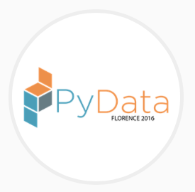

<div style="background-color: rgb(51, 51, 51)"> 
    
</div>


```python
import pandas as pd
import numpy as np
```

<a name="absolute_rank"></a>
# Community Voting Results

### Absolute Ranking


```python
rankings = pd.read_csv('./ranking.txt', sep='~', skiprows=1, header=0)

rankings.drop('TID', axis=1, inplace=True)
rankings.drop('Idx', axis=1, inplace=True)

rankings.Gender = rankings.Gender.apply(lambda g: '+'.join('\U0001f469\u200d\U0001f4bb' if l=='female' else '\U0001f468\u200d\U0001f4bb' 
                                         for l in g.split(',')))
pd.set_option('display.max_rows', rankings.index.size)
pd.set_option('display.max_colwidth', 200)
rankings
```


<div>
<table border="1" class="dataframe">
  <thead>
    <tr style="text-align: right;">
      <th></th>
      <th>Type</th>
      <th>Duration</th>
      <th>Group</th>
      <th>Lang</th>
      <th>Title</th>
      <th>Speakers</th>
      <th>Gender</th>
    </tr>
  </thead>
  <tbody>
    <tr>
      <th>0</th>
      <td>Talk</td>
      <td>45</td>
      <td>PyData</td>
      <td>it</td>
      <td>AI, Machine Learning e Deep Learning: cosa cambia?</td>
      <td>Antonio Spadaro</td>
      <td>👨‍💻</td>
    </tr>
    <tr>
      <th>1</th>
      <td>Talk</td>
      <td>90</td>
      <td>PyCommunity</td>
      <td>it</td>
      <td>L’Italia, python e la chimera dell’Agile</td>
      <td>Gabriele Giaccari</td>
      <td>👨‍💻</td>
    </tr>
    <tr>
      <th>2</th>
      <td>Talk</td>
      <td>45</td>
      <td>PyData</td>
      <td>en</td>
      <td>Facial Analysis Techniques for Pythonista (and beyond!)</td>
      <td>Alex Casalboni</td>
      <td>👨‍💻</td>
    </tr>
    <tr>
      <th>3</th>
      <td>Talk</td>
      <td>45</td>
      <td>PyLang</td>
      <td>en</td>
      <td>Performant Python</td>
      <td>Burkhard Kloss</td>
      <td>👨‍💻</td>
    </tr>
    <tr>
      <th>4</th>
      <td>Talk</td>
      <td>45</td>
      <td>PyLang</td>
      <td>en</td>
      <td>Demystifying Decorators</td>
      <td>Akul Mehra</td>
      <td>👨‍💻</td>
    </tr>
    <tr>
      <th>5</th>
      <td>Talk</td>
      <td>45</td>
      <td>PyData</td>
      <td>en</td>
      <td>Solving the Rubiks Cube with Python</td>
      <td>Daan van Berkel</td>
      <td>👨‍💻</td>
    </tr>
    <tr>
      <th>6</th>
      <td>Talk</td>
      <td>45</td>
      <td>PyWeb</td>
      <td>en</td>
      <td>Building Serverless applications with Python</td>
      <td>Andrii Soldatenko</td>
      <td>👨‍💻</td>
    </tr>
    <tr>
      <th>7</th>
      <td>Talk</td>
      <td>60</td>
      <td>PyData</td>
      <td>en</td>
      <td>Deep Learning made easy</td>
      <td>Jalem Raj Rohit</td>
      <td>👨‍💻</td>
    </tr>
    <tr>
      <th>8</th>
      <td>Talk</td>
      <td>60</td>
      <td>PyData</td>
      <td>en</td>
      <td>The unconventional Introduction to Deep Learning</td>
      <td>Valerio Maggio</td>
      <td>👨‍💻</td>
    </tr>
    <tr>
      <th>9</th>
      <td>Training</td>
      <td>240</td>
      <td>PyData</td>
      <td>en</td>
      <td>Deep Learning, the Keras way</td>
      <td>Valerio Maggio</td>
      <td>👨‍💻</td>
    </tr>
    <tr>
      <th>10</th>
      <td>Talk</td>
      <td>60</td>
      <td>PyData</td>
      <td>en</td>
      <td>A Gentle Introduction to Neural Networks (with Python)</td>
      <td>Tariq Rashid</td>
      <td>👨‍💻</td>
    </tr>
    <tr>
      <th>11</th>
      <td>Talk</td>
      <td>45</td>
      <td>PyData</td>
      <td>en</td>
      <td>Introduction to Data-Analysis with Pandas</td>
      <td>Alexander Hendorf</td>
      <td>👨‍💻</td>
    </tr>
    <tr>
      <th>12</th>
      <td>Talk</td>
      <td>60</td>
      <td>PyData</td>
      <td>it</td>
      <td>Machine Learning con Python: previsione in real-time della richiesta di energia elettrica</td>
      <td>Felice Tuosto</td>
      <td>👨‍💻</td>
    </tr>
    <tr>
      <th>13</th>
      <td>Talk</td>
      <td>45</td>
      <td>PyWeb</td>
      <td>it</td>
      <td>Create a serverless infrastructure for data collection with Python and AWS</td>
      <td>David Santucci</td>
      <td>👨‍💻</td>
    </tr>
    <tr>
      <th>14</th>
      <td>Talk</td>
      <td>30</td>
      <td>PyLang</td>
      <td>en</td>
      <td>Tales from the Crypt: A Cryptography Primer</td>
      <td>Adam Englander</td>
      <td>👨‍💻</td>
    </tr>
    <tr>
      <th>15</th>
      <td>Talk</td>
      <td>45</td>
      <td>PyLang</td>
      <td>it</td>
      <td>ByteCode al supporto dei test per protocolli ed enforcing di best practices</td>
      <td>Alessandro Molina</td>
      <td>👨‍💻</td>
    </tr>
    <tr>
      <th>16</th>
      <td>Talk</td>
      <td>60</td>
      <td>PyLang</td>
      <td>en</td>
      <td>Solving the web most popular code shortening competition with Python 3</td>
      <td>Alessandro Amici</td>
      <td>👨‍💻</td>
    </tr>
    <tr>
      <th>17</th>
      <td>Talk</td>
      <td>45</td>
      <td>PyData</td>
      <td>it</td>
      <td>Affrontare le sfide del cambiamento climatico con Python</td>
      <td>Alessandro Amici</td>
      <td>👨‍💻</td>
    </tr>
    <tr>
      <th>18</th>
      <td>Talk</td>
      <td>45</td>
      <td>PyData</td>
      <td>en</td>
      <td>Time Series Analysis with Pandas</td>
      <td>Alexander Hendorf</td>
      <td>👨‍💻</td>
    </tr>
    <tr>
      <th>19</th>
      <td>Talk</td>
      <td>45</td>
      <td>PyLang</td>
      <td>it</td>
      <td>Unreal Engine 4 e Python: Ora si Puo'</td>
      <td>Roberto De Ioris</td>
      <td>👨‍💻</td>
    </tr>
    <tr>
      <th>20</th>
      <td>Talk</td>
      <td>60</td>
      <td>PyData</td>
      <td>it</td>
      <td>Machine Learning con Python: algoritmi NILM e real-time processing</td>
      <td>Felice Tuosto</td>
      <td>👨‍💻</td>
    </tr>
    <tr>
      <th>21</th>
      <td>Talk</td>
      <td>45</td>
      <td>PyData</td>
      <td>en</td>
      <td>OpenCV for face detection</td>
      <td>Ken Alger</td>
      <td>👨‍💻</td>
    </tr>
    <tr>
      <th>22</th>
      <td>Talk</td>
      <td>60</td>
      <td>PyDatabase</td>
      <td>it</td>
      <td>Digital Analytics Data Aggregation: un case study dal mondo reale utilizzando SQL, NoSQL e Pandas</td>
      <td>Alessandro Pelliciari</td>
      <td>👨‍💻</td>
    </tr>
    <tr>
      <th>23</th>
      <td>Talk</td>
      <td>45</td>
      <td>PyCommunity</td>
      <td>en</td>
      <td>Is it too late to learn how to program and how being a developer change my life</td>
      <td>Alicia Carr</td>
      <td>👩‍💻</td>
    </tr>
    <tr>
      <th>24</th>
      <td>Talk</td>
      <td>45</td>
      <td>PyCommunity</td>
      <td>it</td>
      <td>Perché Python fa schifo!</td>
      <td>Antonio Spadaro</td>
      <td>👨‍💻</td>
    </tr>
    <tr>
      <th>25</th>
      <td>Talk</td>
      <td>45</td>
      <td>PyWeb</td>
      <td>it</td>
      <td>Indicizzare e ricercare tonnellate di dati con ElasticSearch e Django</td>
      <td>Ernesto Arbitrio</td>
      <td>👨‍💻</td>
    </tr>
    <tr>
      <th>26</th>
      <td>Talk</td>
      <td>45</td>
      <td>PyWeb</td>
      <td>it</td>
      <td>Django Rest Framework - Tips&amp;Tricks</td>
      <td>Luca Zacchetti</td>
      <td>👨‍💻</td>
    </tr>
    <tr>
      <th>27</th>
      <td>Talk</td>
      <td>45</td>
      <td>PyData</td>
      <td>en</td>
      <td>How to turn Wikipedia into a Quiz Game</td>
      <td>Andrea Cappelli, Roberto Turrin</td>
      <td>👨‍💻+👨‍💻</td>
    </tr>
    <tr>
      <th>28</th>
      <td>Talk</td>
      <td>30</td>
      <td>PyWeb</td>
      <td>en</td>
      <td>Out of Sight, Out of Mind: Survival tricks and tools for remote developers</td>
      <td>Alessio Bragadini</td>
      <td>👨‍💻</td>
    </tr>
    <tr>
      <th>29</th>
      <td>Talk</td>
      <td>60</td>
      <td>PyData</td>
      <td>it</td>
      <td>Where are you going? An overview on machine learning models for human mobility</td>
      <td>Gianni Barlacchi</td>
      <td>👨‍💻</td>
    </tr>
    <tr>
      <th>30</th>
      <td>Talk</td>
      <td>45</td>
      <td>PyLang</td>
      <td>en</td>
      <td>Python on $5 IoT Device</td>
      <td>Ken Alger</td>
      <td>👨‍💻</td>
    </tr>
    <tr>
      <th>31</th>
      <td>Talk</td>
      <td>60</td>
      <td>PyData</td>
      <td>it</td>
      <td>Tensor decomposition with Python: Learning structures from multidimensional data</td>
      <td>André Panisson</td>
      <td>👨‍💻</td>
    </tr>
    <tr>
      <th>32</th>
      <td>Talk</td>
      <td>45</td>
      <td>PyData</td>
      <td>en</td>
      <td>An Introduction to Pandas for Data Analysis in Python</td>
      <td>Ayush Kumar Singh</td>
      <td>👨‍💻</td>
    </tr>
    <tr>
      <th>33</th>
      <td>Training</td>
      <td>240</td>
      <td>PyLang</td>
      <td>en</td>
      <td>4️⃣ ore di Silenzio 😶 Assoluto 🛌 😴💤</td>
      <td>Carlo🍺 Miron🍺</td>
      <td>👨‍💻</td>
    </tr>
    <tr>
      <th>34</th>
      <td>Talk</td>
      <td>60</td>
      <td>PyLang</td>
      <td>en</td>
      <td>PyPy Status Update</td>
      <td>Antonio Cuni</td>
      <td>👨‍💻</td>
    </tr>
    <tr>
      <th>35</th>
      <td>Talk</td>
      <td>45</td>
      <td>PyWeb</td>
      <td>en</td>
      <td>Crash test of Django ORM</td>
      <td>Andrii Soldatenko</td>
      <td>👨‍💻</td>
    </tr>
    <tr>
      <th>36</th>
      <td>Talk</td>
      <td>60</td>
      <td>PyWeb</td>
      <td>en</td>
      <td>Understanding Serverless Architecture</td>
      <td>Jalem Raj Rohit</td>
      <td>👨‍💻</td>
    </tr>
    <tr>
      <th>37</th>
      <td>Talk</td>
      <td>45</td>
      <td>PyWeb</td>
      <td>it</td>
      <td>Getting started with requests HTTP library</td>
      <td>Andrea Grandi</td>
      <td>👨‍💻</td>
    </tr>
    <tr>
      <th>38</th>
      <td>Talk</td>
      <td>45</td>
      <td>PyData</td>
      <td>en</td>
      <td>Basic principles of scientific data visualization</td>
      <td>Giuseppe Jurman</td>
      <td>👨‍💻</td>
    </tr>
    <tr>
      <th>39</th>
      <td>Talk</td>
      <td>60</td>
      <td>PyWeb</td>
      <td>it</td>
      <td>Serverless computing con Python e AWS</td>
      <td>Federico Caboni</td>
      <td>👨‍💻</td>
    </tr>
    <tr>
      <th>40</th>
      <td>Talk</td>
      <td>30</td>
      <td>PyLang</td>
      <td>en</td>
      <td>Behavioral Driven Development: Tame the Beast</td>
      <td>Adam Englander</td>
      <td>👨‍💻</td>
    </tr>
    <tr>
      <th>41</th>
      <td>Talk</td>
      <td>45</td>
      <td>PyData</td>
      <td>en</td>
      <td>Explore the brain with Nilearn</td>
      <td>Darya Chyzhyk</td>
      <td>👩‍💻</td>
    </tr>
    <tr>
      <th>42</th>
      <td>Talk</td>
      <td>45</td>
      <td>PyData</td>
      <td>en</td>
      <td>An Introduction to Feature Selection in Machine Learning using Python</td>
      <td>Rahul Baboota</td>
      <td>👨‍💻</td>
    </tr>
    <tr>
      <th>43</th>
      <td>Talk</td>
      <td>45</td>
      <td>PyData</td>
      <td>it</td>
      <td>Word Embedding: come codificare il linguaggio naturale per algoritmi di previsione e classificazione</td>
      <td>Felice Tuosto, Andrea Ianni</td>
      <td>👨‍💻+👨‍💻</td>
    </tr>
    <tr>
      <th>44</th>
      <td>Training</td>
      <td>240</td>
      <td>PyData</td>
      <td>en</td>
      <td>Intro to Natural Language Processing in Python</td>
      <td>Marco Bonzanini</td>
      <td>👨‍💻</td>
    </tr>
    <tr>
      <th>45</th>
      <td>Talk</td>
      <td>60</td>
      <td>PyData</td>
      <td>en</td>
      <td>The Journey Of aeneas: A Python Adventure In Text and Speech</td>
      <td>Alberto Pettarin</td>
      <td>👨‍💻</td>
    </tr>
    <tr>
      <th>46</th>
      <td>Talk</td>
      <td>60</td>
      <td>PyCommunity</td>
      <td>en</td>
      <td>Python in Africa</td>
      <td>Anna Makarudze</td>
      <td>👩‍💻</td>
    </tr>
    <tr>
      <th>47</th>
      <td>Talk</td>
      <td>45</td>
      <td>PyLang</td>
      <td>it</td>
      <td>Python e swift: linguaggi a confronto</td>
      <td>Lelio Campanile</td>
      <td>👨‍💻</td>
    </tr>
    <tr>
      <th>48</th>
      <td>Talk</td>
      <td>45</td>
      <td>PyData</td>
      <td>en</td>
      <td>Jupyter: if you don't use it yet you're doing wrong</td>
      <td>Christian Barra</td>
      <td>👨‍💻</td>
    </tr>
    <tr>
      <th>49</th>
      <td>Talk</td>
      <td>45</td>
      <td>PyWeb</td>
      <td>it</td>
      <td>Deploy automatizzato di un progetto Python 3/Django con Ansible</td>
      <td>Marco Santamaria</td>
      <td>👨‍💻</td>
    </tr>
    <tr>
      <th>50</th>
      <td>Talk</td>
      <td>30</td>
      <td>PyCommunity</td>
      <td>en</td>
      <td>From Idea to Presentation: How to Prepare a Conference Talk</td>
      <td>Anna Ossowski</td>
      <td>👩‍💻</td>
    </tr>
    <tr>
      <th>51</th>
      <td>Talk</td>
      <td>60</td>
      <td>PyCommunity</td>
      <td>it</td>
      <td>E.T. chiama Python</td>
      <td>Davide Corio</td>
      <td>👨‍💻</td>
    </tr>
    <tr>
      <th>52</th>
      <td>Talk</td>
      <td>60</td>
      <td>PyWeb</td>
      <td>en</td>
      <td>Serverless computing with Python and AWS</td>
      <td>Federico Caboni</td>
      <td>👨‍💻</td>
    </tr>
    <tr>
      <th>53</th>
      <td>Talk</td>
      <td>45</td>
      <td>PyWeb</td>
      <td>en</td>
      <td>Why I still develop synchronous web in the asyncIO era</td>
      <td>Giovanni Barillari</td>
      <td>👨‍💻</td>
    </tr>
    <tr>
      <th>54</th>
      <td>Talk</td>
      <td>30</td>
      <td>PyCommunity</td>
      <td>en</td>
      <td>Be(come) a Mentor! Help Others Succeed!</td>
      <td>Anna Ossowski</td>
      <td>👩‍💻</td>
    </tr>
    <tr>
      <th>55</th>
      <td>Talk</td>
      <td>45</td>
      <td>PyLang</td>
      <td>en</td>
      <td>Test Driven Deployment with Ansible 2.</td>
      <td>Roberto Polli</td>
      <td>👨‍💻</td>
    </tr>
    <tr>
      <th>56</th>
      <td>Talk</td>
      <td>30</td>
      <td>PyCommunity</td>
      <td>en</td>
      <td>No Coding Skills Required: How to Contribute to Open Source in Other Ways</td>
      <td>Anna Ossowski</td>
      <td>👩‍💻</td>
    </tr>
    <tr>
      <th>57</th>
      <td>Talk</td>
      <td>30</td>
      <td>PyWeb</td>
      <td>en</td>
      <td>Django among modern web frameworks – was Angular2 a good choice?</td>
      <td>Andrzej Krawczyk</td>
      <td>👨‍💻</td>
    </tr>
    <tr>
      <th>58</th>
      <td>Talk</td>
      <td>60</td>
      <td>PyLang</td>
      <td>en</td>
      <td>42 PyCharm Tips and Tricks</td>
      <td>Dmitry Trofimov</td>
      <td>👨‍💻</td>
    </tr>
    <tr>
      <th>59</th>
      <td>Talk</td>
      <td>45</td>
      <td>PyWeb</td>
      <td>en</td>
      <td>An Introduction to web scraping using Python</td>
      <td>Manoj Pandey</td>
      <td>👨‍💻</td>
    </tr>
    <tr>
      <th>60</th>
      <td>Talk</td>
      <td>45</td>
      <td>PyWeb</td>
      <td>it</td>
      <td>Perché sviluppo ancora web sincrono nell'era dell'asyncIO</td>
      <td>Giovanni Barillari</td>
      <td>👨‍💻</td>
    </tr>
    <tr>
      <th>61</th>
      <td>Talk</td>
      <td>60</td>
      <td>PyBusiness</td>
      <td>it</td>
      <td>Realizzare stampe HTML e PDF usando solo Python</td>
      <td>Saverio Porcari</td>
      <td>👨‍💻</td>
    </tr>
    <tr>
      <th>62</th>
      <td>Talk</td>
      <td>45</td>
      <td>PyLang</td>
      <td>it</td>
      <td>Chat Bot in Telegram (e slack e altri)</td>
      <td>Lorenzo Buonanno, Tommaso Sartor</td>
      <td>👨‍💻+👨‍💻</td>
    </tr>
    <tr>
      <th>63</th>
      <td>Talk</td>
      <td>30</td>
      <td>PyWeb</td>
      <td>en</td>
      <td>Django and the testing pyramid</td>
      <td>Aaron Bassett</td>
      <td>👨‍💻</td>
    </tr>
    <tr>
      <th>64</th>
      <td>Talk</td>
      <td>45</td>
      <td>PyCommunity</td>
      <td>en</td>
      <td>Growing a Python community</td>
      <td>Anton Caceres</td>
      <td>👨‍💻</td>
    </tr>
    <tr>
      <th>65</th>
      <td>Talk</td>
      <td>45</td>
      <td>PyData</td>
      <td>en</td>
      <td>Sparking Pandas: an experiment</td>
      <td>Francesco Bruni</td>
      <td>👨‍💻</td>
    </tr>
    <tr>
      <th>66</th>
      <td>Talk</td>
      <td>30</td>
      <td>PyWeb</td>
      <td>en</td>
      <td>Data loss prevention in modern web applications</td>
      <td>Xavier Dutreilh</td>
      <td>👨‍💻</td>
    </tr>
    <tr>
      <th>67</th>
      <td>Talk</td>
      <td>60</td>
      <td>PyCommunity</td>
      <td>en</td>
      <td>Don't try to look smart. Be smart</td>
      <td>Flavio Percoco</td>
      <td>👨‍💻</td>
    </tr>
    <tr>
      <th>68</th>
      <td>Talk</td>
      <td>60</td>
      <td>PyWeb</td>
      <td>en</td>
      <td>Amazon Web Services for dummies - tips and tricks</td>
      <td>Justyna Janczyszyn</td>
      <td>👩‍💻</td>
    </tr>
    <tr>
      <th>69</th>
      <td>Talk</td>
      <td>30</td>
      <td>PyCommunity</td>
      <td>en</td>
      <td>Compassionate Code Reviews</td>
      <td>April Wensel</td>
      <td>👩‍💻</td>
    </tr>
    <tr>
      <th>70</th>
      <td>Talk</td>
      <td>45</td>
      <td>PyWeb</td>
      <td>it</td>
      <td>OpneSSH SFTP service con Python: pysftpserver.</td>
      <td>Filippo Morelli</td>
      <td>👨‍💻</td>
    </tr>
    <tr>
      <th>71</th>
      <td>Talk</td>
      <td>30</td>
      <td>PyCommunity</td>
      <td>en</td>
      <td>Rants and Ruminations From A Job Applicant After 💯 CS Job Interviews in Silicon Valley</td>
      <td>Susan Tan</td>
      <td>👩‍💻</td>
    </tr>
    <tr>
      <th>72</th>
      <td>Talk</td>
      <td>60</td>
      <td>PyWeb</td>
      <td>it</td>
      <td>Amazon Web Services per i principianti - consigli e trucchi</td>
      <td>Justyna Janczyszyn</td>
      <td>👩‍💻</td>
    </tr>
    <tr>
      <th>73</th>
      <td>Talk</td>
      <td>60</td>
      <td>PyLang</td>
      <td>it</td>
      <td>Creare videogiochi per smartphone con Kivy</td>
      <td>Rigel Di Scala</td>
      <td>👨‍💻</td>
    </tr>
    <tr>
      <th>74</th>
      <td>Talk</td>
      <td>60</td>
      <td>PyLang</td>
      <td>it</td>
      <td>Rusty Python</td>
      <td>Matteo Bertini</td>
      <td>👨‍💻</td>
    </tr>
    <tr>
      <th>75</th>
      <td>Talk</td>
      <td>45</td>
      <td>PyData</td>
      <td>en</td>
      <td>Space weather monitoring for a simulation of a Martian settlement based on Virtual Reality</td>
      <td>Giovanni Bruno</td>
      <td>👨‍💻</td>
    </tr>
    <tr>
      <th>76</th>
      <td>Talk</td>
      <td>45</td>
      <td>PyDatabase</td>
      <td>it</td>
      <td>Full Text Search con PostgreSQL</td>
      <td>Giuseppe Broccolo</td>
      <td>👨‍💻</td>
    </tr>
    <tr>
      <th>77</th>
      <td>Talk</td>
      <td>45</td>
      <td>PyDatabase</td>
      <td>it</td>
      <td>Disaster recovery: una serie di sfortunati eventi</td>
      <td>Giulio Calacoci</td>
      <td>👨‍💻</td>
    </tr>
    <tr>
      <th>78</th>
      <td>Training</td>
      <td>240</td>
      <td>PyLang</td>
      <td>it</td>
      <td>Scrivere Chat Bot per Telegram e Slack</td>
      <td>Lorenzo Buonanno, Tommaso Sartor</td>
      <td>👨‍💻+👨‍💻</td>
    </tr>
    <tr>
      <th>79</th>
      <td>Talk</td>
      <td>30</td>
      <td>PyCommunity</td>
      <td>en</td>
      <td>The Hidden Power Dynamics of Open Source</td>
      <td>Anna Ossowski</td>
      <td>👩‍💻</td>
    </tr>
    <tr>
      <th>80</th>
      <td>Talk</td>
      <td>45</td>
      <td>PyData</td>
      <td>en</td>
      <td>Catching Neutrinos with Python and KM3NeT</td>
      <td>Tamás Gál</td>
      <td>👨‍💻</td>
    </tr>
    <tr>
      <th>81</th>
      <td>Talk</td>
      <td>45</td>
      <td>PyLang</td>
      <td>it</td>
      <td>Svilluppare con python sull'iPad</td>
      <td>Lelio Campanile</td>
      <td>👨‍💻</td>
    </tr>
    <tr>
      <th>82</th>
      <td>Talk</td>
      <td>45</td>
      <td>PyData</td>
      <td>it</td>
      <td>Il Viaggio di aeneas: Un'Avventura Con Python Tra Testo e Parlato</td>
      <td>Alberto Pettarin</td>
      <td>👨‍💻</td>
    </tr>
    <tr>
      <th>83</th>
      <td>Talk</td>
      <td>45</td>
      <td>PyLang</td>
      <td>en</td>
      <td>Just one Shade of OpenStack</td>
      <td>Roberto Polli</td>
      <td>👨‍💻</td>
    </tr>
    <tr>
      <th>84</th>
      <td>Talk</td>
      <td>60</td>
      <td>PyDatabase</td>
      <td>it</td>
      <td>Python e PostgreSQL, un connubio perfetto</td>
      <td>Marco Nenciarini</td>
      <td>👨‍💻</td>
    </tr>
    <tr>
      <th>85</th>
      <td>Talk</td>
      <td>30</td>
      <td>PyCommunity</td>
      <td>en</td>
      <td>Applying the unix philosophy to django projects: a report from the real world</td>
      <td>Federico Capoano</td>
      <td>👨‍💻</td>
    </tr>
    <tr>
      <th>86</th>
      <td>Talk</td>
      <td>45</td>
      <td>PyCommunity</td>
      <td>it</td>
      <td>Taiga e l’agile project management: join the Oompa Loompas’ Army!</td>
      <td>Gabriele Giaccari</td>
      <td>👨‍💻</td>
    </tr>
    <tr>
      <th>87</th>
      <td>Talk</td>
      <td>45</td>
      <td>PyLang</td>
      <td>en</td>
      <td>Plugin Based Chat Bots in Telegram (and Slack and others)</td>
      <td>Lorenzo Buonanno, Tommaso Sartor</td>
      <td>👨‍💻+👨‍💻</td>
    </tr>
    <tr>
      <th>88</th>
      <td>Talk</td>
      <td>45</td>
      <td>PyBusiness</td>
      <td>it</td>
      <td>Da applicativi Desktop a Web</td>
      <td>Luigi Renna</td>
      <td>👨‍💻</td>
    </tr>
    <tr>
      <th>89</th>
      <td>Talk</td>
      <td>45</td>
      <td>PyWeb</td>
      <td>it</td>
      <td>Open edX, soluzione per l'e-learning basata su Django</td>
      <td>Davide Corio</td>
      <td>👨‍💻</td>
    </tr>
    <tr>
      <th>90</th>
      <td>Talk</td>
      <td>45</td>
      <td>PyWeb</td>
      <td>en</td>
      <td>Automated deploy of a Python 3/Django project with Ansible</td>
      <td>Marco Santamaria</td>
      <td>👨‍💻</td>
    </tr>
    <tr>
      <th>91</th>
      <td>Talk</td>
      <td>30</td>
      <td>PyWeb</td>
      <td>en</td>
      <td>Type uWSGI; press enter; what happens?</td>
      <td>Philip James</td>
      <td>👨‍💻</td>
    </tr>
    <tr>
      <th>92</th>
      <td>Talk</td>
      <td>30</td>
      <td>PyWeb</td>
      <td>en</td>
      <td>Planet friendly web development with Django</td>
      <td>Chris Adams</td>
      <td>👨‍💻</td>
    </tr>
    <tr>
      <th>93</th>
      <td>Talk</td>
      <td>60</td>
      <td>PyWeb</td>
      <td>it</td>
      <td>weppy: il framework web per umani</td>
      <td>Giovanni Barillari</td>
      <td>👨‍💻</td>
    </tr>
    <tr>
      <th>94</th>
      <td>Talk</td>
      <td>45</td>
      <td>PyData</td>
      <td>en</td>
      <td>Word Embeddings for Natural Language Processing in Python</td>
      <td>Marco Bonzanini</td>
      <td>👨‍💻</td>
    </tr>
    <tr>
      <th>95</th>
      <td>Talk</td>
      <td>45</td>
      <td>PyCommunity</td>
      <td>en</td>
      <td>Scientific Hooliganism: lessons from the first hack in history</td>
      <td>Lilly Ryan</td>
      <td>👩‍💻</td>
    </tr>
    <tr>
      <th>96</th>
      <td>Talk</td>
      <td>30</td>
      <td>PyCommunity</td>
      <td>en</td>
      <td>Threading Yarn, Writing Code: What Traditional Arts and Crafts Can Teach Us About Programming</td>
      <td>Anna Ossowski</td>
      <td>👩‍💻</td>
    </tr>
    <tr>
      <th>97</th>
      <td>Talk</td>
      <td>45</td>
      <td>PyLang</td>
      <td>en</td>
      <td>Attack of Pythons : Gotchas and Landmines in Python</td>
      <td>Manoj Pandey</td>
      <td>👨‍💻</td>
    </tr>
    <tr>
      <th>98</th>
      <td>Talk</td>
      <td>45</td>
      <td>PyWeb</td>
      <td>en</td>
      <td>Presenting pysftpserver: OpenSSH SFTP service with Python.</td>
      <td>Filippo Morelli</td>
      <td>👨‍💻</td>
    </tr>
    <tr>
      <th>99</th>
      <td>Talk</td>
      <td>30</td>
      <td>PyCommunity</td>
      <td>en</td>
      <td>Navigating unconscious bias</td>
      <td>Anna Schneider</td>
      <td>👩‍💻</td>
    </tr>
    <tr>
      <th>100</th>
      <td>Talk</td>
      <td>30</td>
      <td>PyLang</td>
      <td>en</td>
      <td>Loop better: a deeper look at iteration in Python</td>
      <td>Trey Hunner</td>
      <td>👨‍💻</td>
    </tr>
    <tr>
      <th>101</th>
      <td>Talk</td>
      <td>60</td>
      <td>PyData</td>
      <td>it</td>
      <td>Validazione e decodifica di file XML con Python</td>
      <td>Davide Brunato</td>
      <td>👨‍💻</td>
    </tr>
    <tr>
      <th>102</th>
      <td>Talk</td>
      <td>60</td>
      <td>PyData</td>
      <td>it</td>
      <td>Dai dati alla visualizzazione: la mia prima data pipeline</td>
      <td>Riccardo Magliocchetti</td>
      <td>👨‍💻</td>
    </tr>
    <tr>
      <th>103</th>
      <td>Talk</td>
      <td>45</td>
      <td>PyWeb</td>
      <td>it</td>
      <td>Django nella giungla Javascript</td>
      <td>Patrick Guido Arminio</td>
      <td>👨‍💻</td>
    </tr>
    <tr>
      <th>104</th>
      <td>Talk</td>
      <td>45</td>
      <td>PyDatabase</td>
      <td>it</td>
      <td>Ricerca full text in Django con PostgreSQL</td>
      <td>Paolo Melchiorre</td>
      <td>👨‍💻</td>
    </tr>
    <tr>
      <th>105</th>
      <td>Training</td>
      <td>240</td>
      <td>PyData</td>
      <td>en</td>
      <td>Supervised learning in high dimensional data: from zero to ℵ-0</td>
      <td>Matteo Barbieri</td>
      <td>👨‍💻</td>
    </tr>
    <tr>
      <th>106</th>
      <td>Talk</td>
      <td>45</td>
      <td>PyLang</td>
      <td>en</td>
      <td>Ansible roles, private git repos and the Ansible Galaxy tool</td>
      <td>Serena Lorenzini</td>
      <td>👩‍💻</td>
    </tr>
    <tr>
      <th>107</th>
      <td>Training</td>
      <td>240</td>
      <td>PyLang</td>
      <td>en</td>
      <td>Writing Plugin Based Chat Bots in Telegram (and Slack)</td>
      <td>Lorenzo Buonanno, Tommaso Sartor</td>
      <td>👨‍💻+👨‍💻</td>
    </tr>
    <tr>
      <th>108</th>
      <td>Talk</td>
      <td>45</td>
      <td>PyData</td>
      <td>en</td>
      <td>How to use pandas the wrong way</td>
      <td>Pietro Battiston</td>
      <td>👨‍💻</td>
    </tr>
    <tr>
      <th>109</th>
      <td>Talk</td>
      <td>30</td>
      <td>PyLang</td>
      <td>en</td>
      <td>Comprehensible Comprehensions</td>
      <td>Trey Hunner</td>
      <td>👨‍💻</td>
    </tr>
    <tr>
      <th>110</th>
      <td>Talk</td>
      <td>60</td>
      <td>PyCommunity</td>
      <td>en</td>
      <td>E.T. phone Python</td>
      <td>Davide Corio</td>
      <td>👨‍💻</td>
    </tr>
    <tr>
      <th>111</th>
      <td>Talk</td>
      <td>30</td>
      <td>PyCommunity</td>
      <td>en</td>
      <td>Leading an open source project as a startup.</td>
      <td>Nicolas Garnier</td>
      <td>👨‍💻</td>
    </tr>
    <tr>
      <th>112</th>
      <td>Talk</td>
      <td>30</td>
      <td>PyWeb</td>
      <td>en</td>
      <td>The hard long journey of submitting a form</td>
      <td>Filipe de Alencar Ximenes</td>
      <td>👨‍💻</td>
    </tr>
    <tr>
      <th>113</th>
      <td>Talk</td>
      <td>30</td>
      <td>PyCommunity</td>
      <td>en</td>
      <td>Security Starts With You: Social Engineering</td>
      <td>Tiberius Hefflin</td>
      <td>👨‍💻</td>
    </tr>
    <tr>
      <th>114</th>
      <td>Talk</td>
      <td>30</td>
      <td>PyCommunity</td>
      <td>en</td>
      <td>How Not To Password</td>
      <td>Tiberius Hefflin</td>
      <td>👨‍💻</td>
    </tr>
    <tr>
      <th>115</th>
      <td>Talk</td>
      <td>60</td>
      <td>PyWeb</td>
      <td>en</td>
      <td>Infrastructure as Code with Terraform</td>
      <td>Justyna Janczyszyn</td>
      <td>👩‍💻</td>
    </tr>
    <tr>
      <th>116</th>
      <td>Talk</td>
      <td>30</td>
      <td>PyWeb</td>
      <td>en</td>
      <td>The mullet architecture - Elasticsearch in the front, Postgres in the back</td>
      <td>Honza Král</td>
      <td>👨‍💻</td>
    </tr>
    <tr>
      <th>117</th>
      <td>Training</td>
      <td>240</td>
      <td>PyLang</td>
      <td>en</td>
      <td>Costruiamo l’Internet dei Robot</td>
      <td>Ludovico Orlando Russo</td>
      <td>👨‍💻</td>
    </tr>
    <tr>
      <th>118</th>
      <td>Talk</td>
      <td>45</td>
      <td>PyLang</td>
      <td>it</td>
      <td>Rules of thumb to test the documentation</td>
      <td>Marco Buttu</td>
      <td>👨‍💻</td>
    </tr>
    <tr>
      <th>119</th>
      <td>Talk</td>
      <td>60</td>
      <td>PyWeb</td>
      <td>it</td>
      <td>Infrastruttura come codice con Terraform</td>
      <td>Justyna Janczyszyn</td>
      <td>👩‍💻</td>
    </tr>
    <tr>
      <th>120</th>
      <td>Talk</td>
      <td>45</td>
      <td>PyWeb</td>
      <td>en</td>
      <td>Geospatial three amigos: Python, Leaflet, and ElasticSearch</td>
      <td>Roberto Rosario</td>
      <td>👨‍💻</td>
    </tr>
    <tr>
      <th>121</th>
      <td>Talk</td>
      <td>45</td>
      <td>PyCommunity</td>
      <td>en</td>
      <td>ZimboPy: Empowering Zimbabwean Girls As Change Makers</td>
      <td>Marlene Mhangami</td>
      <td>👩‍💻</td>
    </tr>
    <tr>
      <th>122</th>
      <td>Talk</td>
      <td>45</td>
      <td>PyLang</td>
      <td>en</td>
      <td>Continuous Delivery for Iot with Python and Iottly</td>
      <td>Stefano Terna</td>
      <td>👨‍💻</td>
    </tr>
    <tr>
      <th>123</th>
      <td>Talk</td>
      <td>30</td>
      <td>PyLang</td>
      <td>en</td>
      <td>Python, Locales and Writing Systems</td>
      <td>Rae Knowler</td>
      <td>👩‍💻</td>
    </tr>
    <tr>
      <th>124</th>
      <td>Talk</td>
      <td>30</td>
      <td>PyWeb</td>
      <td>en</td>
      <td>Django Admin - The Swiss Army Knife</td>
      <td>Prakash Kumar</td>
      <td>👨‍💻</td>
    </tr>
    <tr>
      <th>125</th>
      <td>Talk</td>
      <td>45</td>
      <td>PyCommunity</td>
      <td>en</td>
      <td>Keeping up with the pace of a fast growing community without dying</td>
      <td>Flavio Percoco</td>
      <td>👨‍💻</td>
    </tr>
    <tr>
      <th>126</th>
      <td>Talk</td>
      <td>45</td>
      <td>PyBusiness</td>
      <td>it</td>
      <td>Analisi dati e grafici in Genropy</td>
      <td>Francesco Porcari</td>
      <td>👨‍💻</td>
    </tr>
    <tr>
      <th>127</th>
      <td>Talk</td>
      <td>60</td>
      <td>PyLang</td>
      <td>it</td>
      <td>Cross-platform game development with Kivy</td>
      <td>Rigel Di Scala</td>
      <td>👨‍💻</td>
    </tr>
    <tr>
      <th>128</th>
      <td>Talk</td>
      <td>45</td>
      <td>PyCommunity</td>
      <td>en</td>
      <td>Combating Impostor Syndrome</td>
      <td>Ken Alger</td>
      <td>👨‍💻</td>
    </tr>
    <tr>
      <th>129</th>
      <td>Talk</td>
      <td>45</td>
      <td>PyWeb</td>
      <td>it</td>
      <td>MIT MicroMasters: come sviluppare una web application basata su servizi esterni.</td>
      <td>Giovanni Di Milia</td>
      <td>👨‍💻</td>
    </tr>
    <tr>
      <th>130</th>
      <td>Talk</td>
      <td>45</td>
      <td>PyDatabase</td>
      <td>it</td>
      <td>PostgreSQL su NFS: miti e verità</td>
      <td>Jonathan Battiato</td>
      <td>👨‍💻</td>
    </tr>
    <tr>
      <th>131</th>
      <td>Talk</td>
      <td>45</td>
      <td>PyData</td>
      <td>it</td>
      <td>Misura: Un sistema per il controllo strumentale, l'acquisizione dati ed il calcolo scientifico</td>
      <td>Daniele Paganelli</td>
      <td>👨‍💻</td>
    </tr>
    <tr>
      <th>132</th>
      <td>Talk</td>
      <td>45</td>
      <td>PyData</td>
      <td>en</td>
      <td>The Wild West of Data Wrangling</td>
      <td>Sarah Guido</td>
      <td>👩‍💻</td>
    </tr>
    <tr>
      <th>133</th>
      <td>Talk</td>
      <td>45</td>
      <td>PyLang</td>
      <td>it</td>
      <td>Ansible: sviluppo e utilizzo di roles seguendo il modello di Ansible Galaxy</td>
      <td>Serena Lorenzini</td>
      <td>👩‍💻</td>
    </tr>
    <tr>
      <th>134</th>
      <td>Talk</td>
      <td>45</td>
      <td>PyData</td>
      <td>it</td>
      <td>Come usare male pandas</td>
      <td>Pietro Battiston</td>
      <td>👨‍💻</td>
    </tr>
    <tr>
      <th>135</th>
      <td>Talk</td>
      <td>30</td>
      <td>PyWeb</td>
      <td>en</td>
      <td>Serverlessness - augmenting your Django apps with Functions-as-a-Service</td>
      <td>Tom Dyson</td>
      <td>👨‍💻</td>
    </tr>
    <tr>
      <th>136</th>
      <td>Talk</td>
      <td>45</td>
      <td>PyData</td>
      <td>it</td>
      <td>Monitoring Beach Morphology with Python</td>
      <td>Luca Liberti</td>
      <td>👨‍💻</td>
    </tr>
    <tr>
      <th>137</th>
      <td>Talk</td>
      <td>45</td>
      <td>PyLang</td>
      <td>en</td>
      <td>Artistic Python: Mixing Python Programming with Fashion</td>
      <td>Ria Baldevia</td>
      <td>👩‍💻</td>
    </tr>
    <tr>
      <th>138</th>
      <td>Talk</td>
      <td>45</td>
      <td>PyLang</td>
      <td>en</td>
      <td>Python + Windows, like a boss</td>
      <td>Nicola Iarocci</td>
      <td>👨‍💻</td>
    </tr>
    <tr>
      <th>139</th>
      <td>Talk</td>
      <td>45</td>
      <td>PyLang</td>
      <td>it</td>
      <td>Pilotare un braccio robotico dal cloud con GenroPy e Raspberry</td>
      <td>Michele Bertoldi</td>
      <td>👨‍💻</td>
    </tr>
    <tr>
      <th>140</th>
      <td>Talk</td>
      <td>30</td>
      <td>PyWeb</td>
      <td>en</td>
      <td>Qualities of great reusable Django apps</td>
      <td>Flávio Juvenal da Silva Junior</td>
      <td>👨‍💻</td>
    </tr>
    <tr>
      <th>141</th>
      <td>Talk</td>
      <td>45</td>
      <td>PyData</td>
      <td>en</td>
      <td>Differential network analysis and graph classification: a glocal approach</td>
      <td>Giuseppe Jurman</td>
      <td>👨‍💻</td>
    </tr>
    <tr>
      <th>142</th>
      <td>Talk</td>
      <td>30</td>
      <td>PyCommunity</td>
      <td>en</td>
      <td>Never Accept the First Offer</td>
      <td>Tiberius Hefflin</td>
      <td>👨‍💻</td>
    </tr>
    <tr>
      <th>143</th>
      <td>Talk</td>
      <td>45</td>
      <td>PyLang</td>
      <td>en</td>
      <td>Roboto Framework for Test Code Coverage for cloud services.</td>
      <td>khushbu parakh</td>
      <td>👩‍💻</td>
    </tr>
    <tr>
      <th>144</th>
      <td>Talk</td>
      <td>45</td>
      <td>PyData</td>
      <td>it</td>
      <td>RFLab - Controllo remoto strumentazione di un laboratorio nel settore delle microonde</td>
      <td>Andrea Saba</td>
      <td>👨‍💻</td>
    </tr>
    <tr>
      <th>145</th>
      <td>Talk</td>
      <td>60</td>
      <td>PyWeb</td>
      <td>en</td>
      <td>weppy: the web framework for humans</td>
      <td>Giovanni Barillari</td>
      <td>👨‍💻</td>
    </tr>
    <tr>
      <th>146</th>
      <td>Talk</td>
      <td>45</td>
      <td>PyBusiness</td>
      <td>it</td>
      <td>iCond: GenroPy per amministratori di condomini</td>
      <td>Andrea Busanelli</td>
      <td>👨‍💻</td>
    </tr>
    <tr>
      <th>147</th>
      <td>Talk</td>
      <td>45</td>
      <td>PyBusiness</td>
      <td>it</td>
      <td>Sviluppo lato client con Odoo</td>
      <td>Davide Corio</td>
      <td>👨‍💻</td>
    </tr>
    <tr>
      <th>148</th>
      <td>Talk</td>
      <td>45</td>
      <td>PyData</td>
      <td>it</td>
      <td>Fuzzy is the new sexy: a tour of scikit-fuzzy</td>
      <td>Niccolo Raspa</td>
      <td>👨‍💻</td>
    </tr>
    <tr>
      <th>149</th>
      <td>Talk</td>
      <td>30</td>
      <td>PyWeb</td>
      <td>en</td>
      <td>Scaling Django with Kubernetes</td>
      <td>Saket Bhushan</td>
      <td>👨‍💻</td>
    </tr>
    <tr>
      <th>150</th>
      <td>Talk</td>
      <td>30</td>
      <td>PyCommunity</td>
      <td>en</td>
      <td>Mastering Your Tools</td>
      <td>Miguel Branco Palhas</td>
      <td>👨‍💻</td>
    </tr>
    <tr>
      <th>151</th>
      <td>Talk</td>
      <td>30</td>
      <td>PyWeb</td>
      <td>en</td>
      <td>Beginning with django? Why you need to continue with django</td>
      <td>Opetunde Adepoju</td>
      <td>👩‍💻</td>
    </tr>
    <tr>
      <th>152</th>
      <td>Talk</td>
      <td>45</td>
      <td>PyLang</td>
      <td>en</td>
      <td>Awesome CLI</td>
      <td>Mark Fink</td>
      <td>👨‍💻</td>
    </tr>
    <tr>
      <th>153</th>
      <td>Talk</td>
      <td>60</td>
      <td>PyLang</td>
      <td>it</td>
      <td>Creazione ed evoluzione di un framework per interfacce grafiche Multi-Touch con OpenGL</td>
      <td>Tiziano Carotti</td>
      <td>👨‍💻</td>
    </tr>
    <tr>
      <th>154</th>
      <td>Training</td>
      <td>240</td>
      <td>PyBusiness</td>
      <td>en</td>
      <td>Creiamo un'applicazione per la gestione di ticket in Genropy</td>
      <td>Francesco Porcari</td>
      <td>👨‍💻</td>
    </tr>
    <tr>
      <th>155</th>
      <td>Talk</td>
      <td>45</td>
      <td>PyBusiness</td>
      <td>it</td>
      <td>Form e Campi dinamici in Genropy</td>
      <td>Francesco Porcari</td>
      <td>👨‍💻</td>
    </tr>
    <tr>
      <th>156</th>
      <td>Talk</td>
      <td>45</td>
      <td>PyData</td>
      <td>it</td>
      <td>Real-time Trajectory Optimization through contacts, a simple test case.</td>
      <td>Tommaso Sartor</td>
      <td>👨‍💻</td>
    </tr>
    <tr>
      <th>157</th>
      <td>Training</td>
      <td>240</td>
      <td>PyData</td>
      <td>it</td>
      <td>Quando il saggio indica il cielo, pandas guarda l'indice</td>
      <td>Pietro Battiston</td>
      <td>👨‍💻</td>
    </tr>
    <tr>
      <th>158</th>
      <td>Talk</td>
      <td>30</td>
      <td>PyWeb</td>
      <td>en</td>
      <td>Migrating from JavaEE to Django: the OSIS case of embracing cultural and technical changes</td>
      <td>Hildeberto Mendonca</td>
      <td>👨‍💻</td>
    </tr>
    <tr>
      <th>159</th>
      <td>Talk</td>
      <td>30</td>
      <td>PyCommunity</td>
      <td>en</td>
      <td>Why the Internet Loves Cats</td>
      <td>Tiberius Hefflin</td>
      <td>👨‍💻</td>
    </tr>
    <tr>
      <th>160</th>
      <td>Talk</td>
      <td>30</td>
      <td>PyLang</td>
      <td>en</td>
      <td>James and the Giant Forensics Toolkit</td>
      <td>Tiberius Hefflin</td>
      <td>👨‍💻</td>
    </tr>
    <tr>
      <th>161</th>
      <td>Talk</td>
      <td>30</td>
      <td>PyCommunity</td>
      <td>en</td>
      <td>Time Tracking is Hard</td>
      <td>Sam Deng</td>
      <td>👨‍💻</td>
    </tr>
    <tr>
      <th>162</th>
      <td>Talk</td>
      <td>45</td>
      <td>PyDatabase</td>
      <td>en</td>
      <td>Taking care of PostgreSQL with Ansible</td>
      <td>Rubens Souza</td>
      <td>👨‍💻</td>
    </tr>
    <tr>
      <th>163</th>
      <td>Talk</td>
      <td>30</td>
      <td>PyCommunity</td>
      <td>en</td>
      <td>The Monster on the Project</td>
      <td>Tiberius Hefflin</td>
      <td>👨‍💻</td>
    </tr>
    <tr>
      <th>164</th>
      <td>Talk</td>
      <td>45</td>
      <td>PyLang</td>
      <td>it</td>
      <td>ENVIFATE: plugin per QGIS per la valutazione del rischio di inquinamento ambientale</td>
      <td>Francesco Geri</td>
      <td>👨‍💻</td>
    </tr>
    <tr>
      <th>165</th>
      <td>Talk</td>
      <td>30</td>
      <td>PyWeb</td>
      <td>en</td>
      <td>Integrating the Bokeh library with Django</td>
      <td>Ken Alger</td>
      <td>👨‍💻</td>
    </tr>
    <tr>
      <th>166</th>
      <td>Talk</td>
      <td>30</td>
      <td>PyWeb</td>
      <td>en</td>
      <td>Preventing issues on Django with linters and tools</td>
      <td>Flávio Juvenal da Silva Junior</td>
      <td>👨‍💻</td>
    </tr>
    <tr>
      <th>167</th>
      <td>Talk</td>
      <td>60</td>
      <td>PyBusiness</td>
      <td>it</td>
      <td>Genropy: 10 anni di sviluppo di un framework italiano</td>
      <td>Giovanni Porcari</td>
      <td>👨‍💻</td>
    </tr>
    <tr>
      <th>168</th>
      <td>Talk</td>
      <td>60</td>
      <td>PyWeb</td>
      <td>it</td>
      <td>Django ORM in server TCP con backend multischema PostgreSQL</td>
      <td>Luca Ferroni</td>
      <td>👨‍💻</td>
    </tr>
    <tr>
      <th>169</th>
      <td>Talk</td>
      <td>45</td>
      <td>PyData</td>
      <td>it</td>
      <td>LiFT - Un tagger di features per l’analisi multidimensionale di testi ottimizzato per PySpark</td>
      <td>Michele Gabusi</td>
      <td>👨‍💻</td>
    </tr>
    <tr>
      <th>170</th>
      <td>Talk</td>
      <td>45</td>
      <td>PyLang</td>
      <td>it</td>
      <td>Terrain Generation in Python with Processing</td>
      <td>Paolo Improta</td>
      <td>👨‍💻</td>
    </tr>
    <tr>
      <th>171</th>
      <td>Talk</td>
      <td>45</td>
      <td>PyBusiness</td>
      <td>it</td>
      <td>Genropy - Caso d'uso: gestione di una infrastruttura telefonica VoIP di medie/grandi dimensioni</td>
      <td>Mauro Zanardi</td>
      <td>👨‍💻</td>
    </tr>
    <tr>
      <th>172</th>
      <td>Talk</td>
      <td>45</td>
      <td>PyBusiness</td>
      <td>it</td>
      <td>Un anno di Genropy</td>
      <td>Muhammad Hassan Khurshid</td>
      <td>👨‍💻</td>
    </tr>
    <tr>
      <th>173</th>
      <td>Talk</td>
      <td>30</td>
      <td>PyCommunity</td>
      <td>en</td>
      <td>Dial M For Mentor</td>
      <td>Mariatta Wijaya</td>
      <td>👩‍💻</td>
    </tr>
    <tr>
      <th>174</th>
      <td>Talk</td>
      <td>30</td>
      <td>PyWeb</td>
      <td>en</td>
      <td>Deploying your django application using puppet</td>
      <td>Krzysztof Żuraw</td>
      <td>👨‍💻</td>
    </tr>
    <tr>
      <th>175</th>
      <td>Talk</td>
      <td>30</td>
      <td>PyWeb</td>
      <td>en</td>
      <td>Addons: I can solve 90% of your problems. The other 90% are up to you.</td>
      <td>Stefan Foulis</td>
      <td>👨‍💻</td>
    </tr>
    <tr>
      <th>176</th>
      <td>Talk</td>
      <td>45</td>
      <td>PyData</td>
      <td>en</td>
      <td>ADENINE: A Data ExploratioN pIpeliNE</td>
      <td>Samuele Fiorini</td>
      <td>👨‍💻</td>
    </tr>
    <tr>
      <th>177</th>
      <td>Talk</td>
      <td>30</td>
      <td>PyCommunity</td>
      <td>en</td>
      <td>People Are Coming To My Beginning Workshop, What Now?</td>
      <td>Nicholle James</td>
      <td>👩‍💻</td>
    </tr>
    <tr>
      <th>178</th>
      <td>Talk</td>
      <td>45</td>
      <td>PyBusiness</td>
      <td>it</td>
      <td>Wargame web app - Odoo come framework di sviluppo</td>
      <td>Nicola Malcontenti</td>
      <td>👨‍💻</td>
    </tr>
    <tr>
      <th>179</th>
      <td>Talk</td>
      <td>45</td>
      <td>PyBusiness</td>
      <td>it</td>
      <td>Usare Erpy da applicazioni esterne</td>
      <td>Giovanni Porcari</td>
      <td>👨‍💻</td>
    </tr>
    <tr>
      <th>180</th>
      <td>Talk</td>
      <td>30</td>
      <td>PyWeb</td>
      <td>en</td>
      <td>Using SASS in Django</td>
      <td>Jacob Rief</td>
      <td>👨‍💻</td>
    </tr>
  </tbody>
</table>
</div>


<a name="trainings"></a>
# Trainings


```python
rankings[rankings['Type'].values == 'Training']
```


<div>
<table border="1" class="dataframe">
  <thead>
    <tr style="text-align: right;">
      <th></th>
      <th>Type</th>
      <th>Duration</th>
      <th>Group</th>
      <th>Lang</th>
      <th>Title</th>
      <th>Speakers</th>
      <th>Gender</th>
    </tr>
  </thead>
  <tbody>
    <tr>
      <th>9</th>
      <td>Training</td>
      <td>240</td>
      <td>PyData</td>
      <td>en</td>
      <td>Deep Learning, the Keras way</td>
      <td>Valerio Maggio</td>
      <td>👨‍💻</td>
    </tr>
    <tr>
      <th>33</th>
      <td>Training</td>
      <td>240</td>
      <td>PyLang</td>
      <td>en</td>
      <td>4️⃣ ore di Silenzio 😶 Assoluto 🛌 😴💤</td>
      <td>Carlo🍺 Miron🍺</td>
      <td>👨‍💻</td>
    </tr>
    <tr>
      <th>44</th>
      <td>Training</td>
      <td>240</td>
      <td>PyData</td>
      <td>en</td>
      <td>Intro to Natural Language Processing in Python</td>
      <td>Marco Bonzanini</td>
      <td>👨‍💻</td>
    </tr>
    <tr>
      <th>78</th>
      <td>Training</td>
      <td>240</td>
      <td>PyLang</td>
      <td>it</td>
      <td>Scrivere Chat Bot per Telegram e Slack</td>
      <td>Lorenzo Buonanno, Tommaso Sartor</td>
      <td>👨‍💻+👨‍💻</td>
    </tr>
    <tr>
      <th>105</th>
      <td>Training</td>
      <td>240</td>
      <td>PyData</td>
      <td>en</td>
      <td>Supervised learning in high dimensional data: from zero to ℵ-0</td>
      <td>Matteo Barbieri</td>
      <td>👨‍💻</td>
    </tr>
    <tr>
      <th>107</th>
      <td>Training</td>
      <td>240</td>
      <td>PyLang</td>
      <td>en</td>
      <td>Writing Plugin Based Chat Bots in Telegram (and Slack)</td>
      <td>Lorenzo Buonanno, Tommaso Sartor</td>
      <td>👨‍💻+👨‍💻</td>
    </tr>
    <tr>
      <th>117</th>
      <td>Training</td>
      <td>240</td>
      <td>PyLang</td>
      <td>en</td>
      <td>Costruiamo l’Internet dei Robot</td>
      <td>Ludovico Orlando Russo</td>
      <td>👨‍💻</td>
    </tr>
    <tr>
      <th>154</th>
      <td>Training</td>
      <td>240</td>
      <td>PyBusiness</td>
      <td>en</td>
      <td>Creiamo un'applicazione per la gestione di ticket in Genropy</td>
      <td>Francesco Porcari</td>
      <td>👨‍💻</td>
    </tr>
    <tr>
      <th>157</th>
      <td>Training</td>
      <td>240</td>
      <td>PyData</td>
      <td>it</td>
      <td>Quando il saggio indica il cielo, pandas guarda l'indice</td>
      <td>Pietro Battiston</td>
      <td>👨‍💻</td>
    </tr>
  </tbody>
</table>
</div>


## Speakers Stats


```python
from collections import defaultdict
speakers = defaultdict(set)
```


```python
for i, speaker in enumerate(rankings.Speakers.values):
    for j, name in enumerate(speaker.split(',')):
        gender = rankings.Gender[i].split('+')[j]
        speakers[gender].add(name)
```


```python
count_speakers = sum(len(s) for s in speakers.values())
print(count_speakers)
```

    131


```python
for k in speakers:
    print('{} --> {}'.format(k, len(speakers[k])))
```

    👨‍💻 --> 113
    👩‍💻 --> 18


<a name="talks"></a>
# Talks


```python
talks = rankings[rankings['Type'].values == 'Talk']
```

<a name="pycon"></a>
##  `PyLang` 


```python
pylang = talks[talks['Group'].values == 'PyLang']
pylang.index = np.arange(1, pylang.index.size+1)
pylang
```


<div>
<table border="1" class="dataframe">
  <thead>
    <tr style="text-align: right;">
      <th></th>
      <th>Type</th>
      <th>Duration</th>
      <th>Group</th>
      <th>Lang</th>
      <th>Title</th>
      <th>Speakers</th>
      <th>Gender</th>
    </tr>
  </thead>
  <tbody>
    <tr>
      <th>1</th>
      <td>Talk</td>
      <td>45</td>
      <td>PyLang</td>
      <td>en</td>
      <td>Performant Python</td>
      <td>Burkhard Kloss</td>
      <td>👨‍💻</td>
    </tr>
    <tr>
      <th>2</th>
      <td>Talk</td>
      <td>45</td>
      <td>PyLang</td>
      <td>en</td>
      <td>Demystifying Decorators</td>
      <td>Akul Mehra</td>
      <td>👨‍💻</td>
    </tr>
    <tr>
      <th>3</th>
      <td>Talk</td>
      <td>30</td>
      <td>PyLang</td>
      <td>en</td>
      <td>Tales from the Crypt: A Cryptography Primer</td>
      <td>Adam Englander</td>
      <td>👨‍💻</td>
    </tr>
    <tr>
      <th>4</th>
      <td>Talk</td>
      <td>45</td>
      <td>PyLang</td>
      <td>it</td>
      <td>ByteCode al supporto dei test per protocolli ed enforcing di best practices</td>
      <td>Alessandro Molina</td>
      <td>👨‍💻</td>
    </tr>
    <tr>
      <th>5</th>
      <td>Talk</td>
      <td>60</td>
      <td>PyLang</td>
      <td>en</td>
      <td>Solving the web most popular code shortening competition with Python 3</td>
      <td>Alessandro Amici</td>
      <td>👨‍💻</td>
    </tr>
    <tr>
      <th>6</th>
      <td>Talk</td>
      <td>45</td>
      <td>PyLang</td>
      <td>it</td>
      <td>Unreal Engine 4 e Python: Ora si Puo'</td>
      <td>Roberto De Ioris</td>
      <td>👨‍💻</td>
    </tr>
    <tr>
      <th>7</th>
      <td>Talk</td>
      <td>45</td>
      <td>PyLang</td>
      <td>en</td>
      <td>Python on $5 IoT Device</td>
      <td>Ken Alger</td>
      <td>👨‍💻</td>
    </tr>
    <tr>
      <th>8</th>
      <td>Talk</td>
      <td>60</td>
      <td>PyLang</td>
      <td>en</td>
      <td>PyPy Status Update</td>
      <td>Antonio Cuni</td>
      <td>👨‍💻</td>
    </tr>
    <tr>
      <th>9</th>
      <td>Talk</td>
      <td>30</td>
      <td>PyLang</td>
      <td>en</td>
      <td>Behavioral Driven Development: Tame the Beast</td>
      <td>Adam Englander</td>
      <td>👨‍💻</td>
    </tr>
    <tr>
      <th>10</th>
      <td>Talk</td>
      <td>45</td>
      <td>PyLang</td>
      <td>it</td>
      <td>Python e swift: linguaggi a confronto</td>
      <td>Lelio Campanile</td>
      <td>👨‍💻</td>
    </tr>
    <tr>
      <th>11</th>
      <td>Talk</td>
      <td>45</td>
      <td>PyLang</td>
      <td>en</td>
      <td>Test Driven Deployment with Ansible 2.</td>
      <td>Roberto Polli</td>
      <td>👨‍💻</td>
    </tr>
    <tr>
      <th>12</th>
      <td>Talk</td>
      <td>60</td>
      <td>PyLang</td>
      <td>en</td>
      <td>42 PyCharm Tips and Tricks</td>
      <td>Dmitry Trofimov</td>
      <td>👨‍💻</td>
    </tr>
    <tr>
      <th>13</th>
      <td>Talk</td>
      <td>45</td>
      <td>PyLang</td>
      <td>it</td>
      <td>Chat Bot in Telegram (e slack e altri)</td>
      <td>Lorenzo Buonanno, Tommaso Sartor</td>
      <td>👨‍💻+👨‍💻</td>
    </tr>
    <tr>
      <th>14</th>
      <td>Talk</td>
      <td>60</td>
      <td>PyLang</td>
      <td>it</td>
      <td>Creare videogiochi per smartphone con Kivy</td>
      <td>Rigel Di Scala</td>
      <td>👨‍💻</td>
    </tr>
    <tr>
      <th>15</th>
      <td>Talk</td>
      <td>60</td>
      <td>PyLang</td>
      <td>it</td>
      <td>Rusty Python</td>
      <td>Matteo Bertini</td>
      <td>👨‍💻</td>
    </tr>
    <tr>
      <th>16</th>
      <td>Talk</td>
      <td>45</td>
      <td>PyLang</td>
      <td>it</td>
      <td>Svilluppare con python sull'iPad</td>
      <td>Lelio Campanile</td>
      <td>👨‍💻</td>
    </tr>
    <tr>
      <th>17</th>
      <td>Talk</td>
      <td>45</td>
      <td>PyLang</td>
      <td>en</td>
      <td>Just one Shade of OpenStack</td>
      <td>Roberto Polli</td>
      <td>👨‍💻</td>
    </tr>
    <tr>
      <th>18</th>
      <td>Talk</td>
      <td>45</td>
      <td>PyLang</td>
      <td>en</td>
      <td>Plugin Based Chat Bots in Telegram (and Slack and others)</td>
      <td>Lorenzo Buonanno, Tommaso Sartor</td>
      <td>👨‍💻+👨‍💻</td>
    </tr>
    <tr>
      <th>19</th>
      <td>Talk</td>
      <td>45</td>
      <td>PyLang</td>
      <td>en</td>
      <td>Attack of Pythons : Gotchas and Landmines in Python</td>
      <td>Manoj Pandey</td>
      <td>👨‍💻</td>
    </tr>
    <tr>
      <th>20</th>
      <td>Talk</td>
      <td>30</td>
      <td>PyLang</td>
      <td>en</td>
      <td>Loop better: a deeper look at iteration in Python</td>
      <td>Trey Hunner</td>
      <td>👨‍💻</td>
    </tr>
    <tr>
      <th>21</th>
      <td>Talk</td>
      <td>45</td>
      <td>PyLang</td>
      <td>en</td>
      <td>Ansible roles, private git repos and the Ansible Galaxy tool</td>
      <td>Serena Lorenzini</td>
      <td>👩‍💻</td>
    </tr>
    <tr>
      <th>22</th>
      <td>Talk</td>
      <td>30</td>
      <td>PyLang</td>
      <td>en</td>
      <td>Comprehensible Comprehensions</td>
      <td>Trey Hunner</td>
      <td>👨‍💻</td>
    </tr>
    <tr>
      <th>23</th>
      <td>Talk</td>
      <td>45</td>
      <td>PyLang</td>
      <td>it</td>
      <td>Rules of thumb to test the documentation</td>
      <td>Marco Buttu</td>
      <td>👨‍💻</td>
    </tr>
    <tr>
      <th>24</th>
      <td>Talk</td>
      <td>45</td>
      <td>PyLang</td>
      <td>en</td>
      <td>Continuous Delivery for Iot with Python and Iottly</td>
      <td>Stefano Terna</td>
      <td>👨‍💻</td>
    </tr>
    <tr>
      <th>25</th>
      <td>Talk</td>
      <td>30</td>
      <td>PyLang</td>
      <td>en</td>
      <td>Python, Locales and Writing Systems</td>
      <td>Rae Knowler</td>
      <td>👩‍💻</td>
    </tr>
    <tr>
      <th>26</th>
      <td>Talk</td>
      <td>60</td>
      <td>PyLang</td>
      <td>it</td>
      <td>Cross-platform game development with Kivy</td>
      <td>Rigel Di Scala</td>
      <td>👨‍💻</td>
    </tr>
    <tr>
      <th>27</th>
      <td>Talk</td>
      <td>45</td>
      <td>PyLang</td>
      <td>it</td>
      <td>Ansible: sviluppo e utilizzo di roles seguendo il modello di Ansible Galaxy</td>
      <td>Serena Lorenzini</td>
      <td>👩‍💻</td>
    </tr>
    <tr>
      <th>28</th>
      <td>Talk</td>
      <td>45</td>
      <td>PyLang</td>
      <td>en</td>
      <td>Artistic Python: Mixing Python Programming with Fashion</td>
      <td>Ria Baldevia</td>
      <td>👩‍💻</td>
    </tr>
    <tr>
      <th>29</th>
      <td>Talk</td>
      <td>45</td>
      <td>PyLang</td>
      <td>en</td>
      <td>Python + Windows, like a boss</td>
      <td>Nicola Iarocci</td>
      <td>👨‍💻</td>
    </tr>
    <tr>
      <th>30</th>
      <td>Talk</td>
      <td>45</td>
      <td>PyLang</td>
      <td>it</td>
      <td>Pilotare un braccio robotico dal cloud con GenroPy e Raspberry</td>
      <td>Michele Bertoldi</td>
      <td>👨‍💻</td>
    </tr>
    <tr>
      <th>31</th>
      <td>Talk</td>
      <td>45</td>
      <td>PyLang</td>
      <td>en</td>
      <td>Roboto Framework for Test Code Coverage for cloud services.</td>
      <td>khushbu parakh</td>
      <td>👩‍💻</td>
    </tr>
    <tr>
      <th>32</th>
      <td>Talk</td>
      <td>45</td>
      <td>PyLang</td>
      <td>en</td>
      <td>Awesome CLI</td>
      <td>Mark Fink</td>
      <td>👨‍💻</td>
    </tr>
    <tr>
      <th>33</th>
      <td>Talk</td>
      <td>60</td>
      <td>PyLang</td>
      <td>it</td>
      <td>Creazione ed evoluzione di un framework per interfacce grafiche Multi-Touch con OpenGL</td>
      <td>Tiziano Carotti</td>
      <td>👨‍💻</td>
    </tr>
    <tr>
      <th>34</th>
      <td>Talk</td>
      <td>30</td>
      <td>PyLang</td>
      <td>en</td>
      <td>James and the Giant Forensics Toolkit</td>
      <td>Tiberius Hefflin</td>
      <td>👨‍💻</td>
    </tr>
    <tr>
      <th>35</th>
      <td>Talk</td>
      <td>45</td>
      <td>PyLang</td>
      <td>it</td>
      <td>ENVIFATE: plugin per QGIS per la valutazione del rischio di inquinamento ambientale</td>
      <td>Francesco Geri</td>
      <td>👨‍💻</td>
    </tr>
    <tr>
      <th>36</th>
      <td>Talk</td>
      <td>45</td>
      <td>PyLang</td>
      <td>it</td>
      <td>Terrain Generation in Python with Processing</td>
      <td>Paolo Improta</td>
      <td>👨‍💻</td>
    </tr>
  </tbody>
</table>
</div>


```python
print('Number of Talks Proposed: ', pylang.index.size)
```

    Number of Talks Proposed:  36


<a name="pycomm"></a>
## `PyCommunity` 


```python
pycommunity = talks[talks['Group'].values == 'PyCommunity']
pycommunity.index = np.arange(1, pycommunity.index.size+1)
pycommunity
```


<div>
<table border="1" class="dataframe">
  <thead>
    <tr style="text-align: right;">
      <th></th>
      <th>Type</th>
      <th>Duration</th>
      <th>Group</th>
      <th>Lang</th>
      <th>Title</th>
      <th>Speakers</th>
      <th>Gender</th>
    </tr>
  </thead>
  <tbody>
    <tr>
      <th>1</th>
      <td>Talk</td>
      <td>90</td>
      <td>PyCommunity</td>
      <td>it</td>
      <td>L’Italia, python e la chimera dell’Agile</td>
      <td>Gabriele Giaccari</td>
      <td>👨‍💻</td>
    </tr>
    <tr>
      <th>2</th>
      <td>Talk</td>
      <td>45</td>
      <td>PyCommunity</td>
      <td>en</td>
      <td>Is it too late to learn how to program and how being a developer change my life</td>
      <td>Alicia Carr</td>
      <td>👩‍💻</td>
    </tr>
    <tr>
      <th>3</th>
      <td>Talk</td>
      <td>45</td>
      <td>PyCommunity</td>
      <td>it</td>
      <td>Perché Python fa schifo!</td>
      <td>Antonio Spadaro</td>
      <td>👨‍💻</td>
    </tr>
    <tr>
      <th>4</th>
      <td>Talk</td>
      <td>60</td>
      <td>PyCommunity</td>
      <td>en</td>
      <td>Python in Africa</td>
      <td>Anna Makarudze</td>
      <td>👩‍💻</td>
    </tr>
    <tr>
      <th>5</th>
      <td>Talk</td>
      <td>30</td>
      <td>PyCommunity</td>
      <td>en</td>
      <td>From Idea to Presentation: How to Prepare a Conference Talk</td>
      <td>Anna Ossowski</td>
      <td>👩‍💻</td>
    </tr>
    <tr>
      <th>6</th>
      <td>Talk</td>
      <td>60</td>
      <td>PyCommunity</td>
      <td>it</td>
      <td>E.T. chiama Python</td>
      <td>Davide Corio</td>
      <td>👨‍💻</td>
    </tr>
    <tr>
      <th>7</th>
      <td>Talk</td>
      <td>30</td>
      <td>PyCommunity</td>
      <td>en</td>
      <td>Be(come) a Mentor! Help Others Succeed!</td>
      <td>Anna Ossowski</td>
      <td>👩‍💻</td>
    </tr>
    <tr>
      <th>8</th>
      <td>Talk</td>
      <td>30</td>
      <td>PyCommunity</td>
      <td>en</td>
      <td>No Coding Skills Required: How to Contribute to Open Source in Other Ways</td>
      <td>Anna Ossowski</td>
      <td>👩‍💻</td>
    </tr>
    <tr>
      <th>9</th>
      <td>Talk</td>
      <td>45</td>
      <td>PyCommunity</td>
      <td>en</td>
      <td>Growing a Python community</td>
      <td>Anton Caceres</td>
      <td>👨‍💻</td>
    </tr>
    <tr>
      <th>10</th>
      <td>Talk</td>
      <td>60</td>
      <td>PyCommunity</td>
      <td>en</td>
      <td>Don't try to look smart. Be smart</td>
      <td>Flavio Percoco</td>
      <td>👨‍💻</td>
    </tr>
    <tr>
      <th>11</th>
      <td>Talk</td>
      <td>30</td>
      <td>PyCommunity</td>
      <td>en</td>
      <td>Compassionate Code Reviews</td>
      <td>April Wensel</td>
      <td>👩‍💻</td>
    </tr>
    <tr>
      <th>12</th>
      <td>Talk</td>
      <td>30</td>
      <td>PyCommunity</td>
      <td>en</td>
      <td>Rants and Ruminations From A Job Applicant After 💯 CS Job Interviews in Silicon Valley</td>
      <td>Susan Tan</td>
      <td>👩‍💻</td>
    </tr>
    <tr>
      <th>13</th>
      <td>Talk</td>
      <td>30</td>
      <td>PyCommunity</td>
      <td>en</td>
      <td>The Hidden Power Dynamics of Open Source</td>
      <td>Anna Ossowski</td>
      <td>👩‍💻</td>
    </tr>
    <tr>
      <th>14</th>
      <td>Talk</td>
      <td>30</td>
      <td>PyCommunity</td>
      <td>en</td>
      <td>Applying the unix philosophy to django projects: a report from the real world</td>
      <td>Federico Capoano</td>
      <td>👨‍💻</td>
    </tr>
    <tr>
      <th>15</th>
      <td>Talk</td>
      <td>45</td>
      <td>PyCommunity</td>
      <td>it</td>
      <td>Taiga e l’agile project management: join the Oompa Loompas’ Army!</td>
      <td>Gabriele Giaccari</td>
      <td>👨‍💻</td>
    </tr>
    <tr>
      <th>16</th>
      <td>Talk</td>
      <td>45</td>
      <td>PyCommunity</td>
      <td>en</td>
      <td>Scientific Hooliganism: lessons from the first hack in history</td>
      <td>Lilly Ryan</td>
      <td>👩‍💻</td>
    </tr>
    <tr>
      <th>17</th>
      <td>Talk</td>
      <td>30</td>
      <td>PyCommunity</td>
      <td>en</td>
      <td>Threading Yarn, Writing Code: What Traditional Arts and Crafts Can Teach Us About Programming</td>
      <td>Anna Ossowski</td>
      <td>👩‍💻</td>
    </tr>
    <tr>
      <th>18</th>
      <td>Talk</td>
      <td>30</td>
      <td>PyCommunity</td>
      <td>en</td>
      <td>Navigating unconscious bias</td>
      <td>Anna Schneider</td>
      <td>👩‍💻</td>
    </tr>
    <tr>
      <th>19</th>
      <td>Talk</td>
      <td>60</td>
      <td>PyCommunity</td>
      <td>en</td>
      <td>E.T. phone Python</td>
      <td>Davide Corio</td>
      <td>👨‍💻</td>
    </tr>
    <tr>
      <th>20</th>
      <td>Talk</td>
      <td>30</td>
      <td>PyCommunity</td>
      <td>en</td>
      <td>Leading an open source project as a startup.</td>
      <td>Nicolas Garnier</td>
      <td>👨‍💻</td>
    </tr>
    <tr>
      <th>21</th>
      <td>Talk</td>
      <td>30</td>
      <td>PyCommunity</td>
      <td>en</td>
      <td>Security Starts With You: Social Engineering</td>
      <td>Tiberius Hefflin</td>
      <td>👨‍💻</td>
    </tr>
    <tr>
      <th>22</th>
      <td>Talk</td>
      <td>30</td>
      <td>PyCommunity</td>
      <td>en</td>
      <td>How Not To Password</td>
      <td>Tiberius Hefflin</td>
      <td>👨‍💻</td>
    </tr>
    <tr>
      <th>23</th>
      <td>Talk</td>
      <td>45</td>
      <td>PyCommunity</td>
      <td>en</td>
      <td>ZimboPy: Empowering Zimbabwean Girls As Change Makers</td>
      <td>Marlene Mhangami</td>
      <td>👩‍💻</td>
    </tr>
    <tr>
      <th>24</th>
      <td>Talk</td>
      <td>45</td>
      <td>PyCommunity</td>
      <td>en</td>
      <td>Keeping up with the pace of a fast growing community without dying</td>
      <td>Flavio Percoco</td>
      <td>👨‍💻</td>
    </tr>
    <tr>
      <th>25</th>
      <td>Talk</td>
      <td>45</td>
      <td>PyCommunity</td>
      <td>en</td>
      <td>Combating Impostor Syndrome</td>
      <td>Ken Alger</td>
      <td>👨‍💻</td>
    </tr>
    <tr>
      <th>26</th>
      <td>Talk</td>
      <td>30</td>
      <td>PyCommunity</td>
      <td>en</td>
      <td>Never Accept the First Offer</td>
      <td>Tiberius Hefflin</td>
      <td>👨‍💻</td>
    </tr>
    <tr>
      <th>27</th>
      <td>Talk</td>
      <td>30</td>
      <td>PyCommunity</td>
      <td>en</td>
      <td>Mastering Your Tools</td>
      <td>Miguel Branco Palhas</td>
      <td>👨‍💻</td>
    </tr>
    <tr>
      <th>28</th>
      <td>Talk</td>
      <td>30</td>
      <td>PyCommunity</td>
      <td>en</td>
      <td>Why the Internet Loves Cats</td>
      <td>Tiberius Hefflin</td>
      <td>👨‍💻</td>
    </tr>
    <tr>
      <th>29</th>
      <td>Talk</td>
      <td>30</td>
      <td>PyCommunity</td>
      <td>en</td>
      <td>Time Tracking is Hard</td>
      <td>Sam Deng</td>
      <td>👨‍💻</td>
    </tr>
    <tr>
      <th>30</th>
      <td>Talk</td>
      <td>30</td>
      <td>PyCommunity</td>
      <td>en</td>
      <td>The Monster on the Project</td>
      <td>Tiberius Hefflin</td>
      <td>👨‍💻</td>
    </tr>
    <tr>
      <th>31</th>
      <td>Talk</td>
      <td>30</td>
      <td>PyCommunity</td>
      <td>en</td>
      <td>Dial M For Mentor</td>
      <td>Mariatta Wijaya</td>
      <td>👩‍💻</td>
    </tr>
    <tr>
      <th>32</th>
      <td>Talk</td>
      <td>30</td>
      <td>PyCommunity</td>
      <td>en</td>
      <td>People Are Coming To My Beginning Workshop, What Now?</td>
      <td>Nicholle James</td>
      <td>👩‍💻</td>
    </tr>
  </tbody>
</table>
</div>


```python
print('Number of Talks Proposed: ', pycommunity.index.size)
```

    Number of Talks Proposed:  32


<div style="background-color: #FAFAFA">
    <a name="pydata"></a>
    
</div>


```python
pydataers = talks[talks['Group'].values == 'PyData']
pydataers.index = np.arange(1, pydataers.index.size+1)
pydataers
```


<div>
<table border="1" class="dataframe">
  <thead>
    <tr style="text-align: right;">
      <th></th>
      <th>Type</th>
      <th>Duration</th>
      <th>Group</th>
      <th>Lang</th>
      <th>Title</th>
      <th>Speakers</th>
      <th>Gender</th>
    </tr>
  </thead>
  <tbody>
    <tr>
      <th>1</th>
      <td>Talk</td>
      <td>45</td>
      <td>PyData</td>
      <td>it</td>
      <td>AI, Machine Learning e Deep Learning: cosa cambia?</td>
      <td>Antonio Spadaro</td>
      <td>👨‍💻</td>
    </tr>
    <tr>
      <th>2</th>
      <td>Talk</td>
      <td>45</td>
      <td>PyData</td>
      <td>en</td>
      <td>Facial Analysis Techniques for Pythonista (and beyond!)</td>
      <td>Alex Casalboni</td>
      <td>👨‍💻</td>
    </tr>
    <tr>
      <th>3</th>
      <td>Talk</td>
      <td>45</td>
      <td>PyData</td>
      <td>en</td>
      <td>Solving the Rubiks Cube with Python</td>
      <td>Daan van Berkel</td>
      <td>👨‍💻</td>
    </tr>
    <tr>
      <th>4</th>
      <td>Talk</td>
      <td>60</td>
      <td>PyData</td>
      <td>en</td>
      <td>Deep Learning made easy</td>
      <td>Jalem Raj Rohit</td>
      <td>👨‍💻</td>
    </tr>
    <tr>
      <th>5</th>
      <td>Talk</td>
      <td>60</td>
      <td>PyData</td>
      <td>en</td>
      <td>The unconventional Introduction to Deep Learning</td>
      <td>Valerio Maggio</td>
      <td>👨‍💻</td>
    </tr>
    <tr>
      <th>6</th>
      <td>Talk</td>
      <td>60</td>
      <td>PyData</td>
      <td>en</td>
      <td>A Gentle Introduction to Neural Networks (with Python)</td>
      <td>Tariq Rashid</td>
      <td>👨‍💻</td>
    </tr>
    <tr>
      <th>7</th>
      <td>Talk</td>
      <td>45</td>
      <td>PyData</td>
      <td>en</td>
      <td>Introduction to Data-Analysis with Pandas</td>
      <td>Alexander Hendorf</td>
      <td>👨‍💻</td>
    </tr>
    <tr>
      <th>8</th>
      <td>Talk</td>
      <td>60</td>
      <td>PyData</td>
      <td>it</td>
      <td>Machine Learning con Python: previsione in real-time della richiesta di energia elettrica</td>
      <td>Felice Tuosto</td>
      <td>👨‍💻</td>
    </tr>
    <tr>
      <th>9</th>
      <td>Talk</td>
      <td>45</td>
      <td>PyData</td>
      <td>it</td>
      <td>Affrontare le sfide del cambiamento climatico con Python</td>
      <td>Alessandro Amici</td>
      <td>👨‍💻</td>
    </tr>
    <tr>
      <th>10</th>
      <td>Talk</td>
      <td>45</td>
      <td>PyData</td>
      <td>en</td>
      <td>Time Series Analysis with Pandas</td>
      <td>Alexander Hendorf</td>
      <td>👨‍💻</td>
    </tr>
    <tr>
      <th>11</th>
      <td>Talk</td>
      <td>60</td>
      <td>PyData</td>
      <td>it</td>
      <td>Machine Learning con Python: algoritmi NILM e real-time processing</td>
      <td>Felice Tuosto</td>
      <td>👨‍💻</td>
    </tr>
    <tr>
      <th>12</th>
      <td>Talk</td>
      <td>45</td>
      <td>PyData</td>
      <td>en</td>
      <td>OpenCV for face detection</td>
      <td>Ken Alger</td>
      <td>👨‍💻</td>
    </tr>
    <tr>
      <th>13</th>
      <td>Talk</td>
      <td>45</td>
      <td>PyData</td>
      <td>en</td>
      <td>How to turn Wikipedia into a Quiz Game</td>
      <td>Andrea Cappelli, Roberto Turrin</td>
      <td>👨‍💻+👨‍💻</td>
    </tr>
    <tr>
      <th>14</th>
      <td>Talk</td>
      <td>60</td>
      <td>PyData</td>
      <td>it</td>
      <td>Where are you going? An overview on machine learning models for human mobility</td>
      <td>Gianni Barlacchi</td>
      <td>👨‍💻</td>
    </tr>
    <tr>
      <th>15</th>
      <td>Talk</td>
      <td>60</td>
      <td>PyData</td>
      <td>it</td>
      <td>Tensor decomposition with Python: Learning structures from multidimensional data</td>
      <td>André Panisson</td>
      <td>👨‍💻</td>
    </tr>
    <tr>
      <th>16</th>
      <td>Talk</td>
      <td>45</td>
      <td>PyData</td>
      <td>en</td>
      <td>An Introduction to Pandas for Data Analysis in Python</td>
      <td>Ayush Kumar Singh</td>
      <td>👨‍💻</td>
    </tr>
    <tr>
      <th>17</th>
      <td>Talk</td>
      <td>45</td>
      <td>PyData</td>
      <td>en</td>
      <td>Basic principles of scientific data visualization</td>
      <td>Giuseppe Jurman</td>
      <td>👨‍💻</td>
    </tr>
    <tr>
      <th>18</th>
      <td>Talk</td>
      <td>45</td>
      <td>PyData</td>
      <td>en</td>
      <td>Explore the brain with Nilearn</td>
      <td>Darya Chyzhyk</td>
      <td>👩‍💻</td>
    </tr>
    <tr>
      <th>19</th>
      <td>Talk</td>
      <td>45</td>
      <td>PyData</td>
      <td>en</td>
      <td>An Introduction to Feature Selection in Machine Learning using Python</td>
      <td>Rahul Baboota</td>
      <td>👨‍💻</td>
    </tr>
    <tr>
      <th>20</th>
      <td>Talk</td>
      <td>45</td>
      <td>PyData</td>
      <td>it</td>
      <td>Word Embedding: come codificare il linguaggio naturale per algoritmi di previsione e classificazione</td>
      <td>Felice Tuosto, Andrea Ianni</td>
      <td>👨‍💻+👨‍💻</td>
    </tr>
    <tr>
      <th>21</th>
      <td>Talk</td>
      <td>60</td>
      <td>PyData</td>
      <td>en</td>
      <td>The Journey Of aeneas: A Python Adventure In Text and Speech</td>
      <td>Alberto Pettarin</td>
      <td>👨‍💻</td>
    </tr>
    <tr>
      <th>22</th>
      <td>Talk</td>
      <td>45</td>
      <td>PyData</td>
      <td>en</td>
      <td>Jupyter: if you don't use it yet you're doing wrong</td>
      <td>Christian Barra</td>
      <td>👨‍💻</td>
    </tr>
    <tr>
      <th>23</th>
      <td>Talk</td>
      <td>45</td>
      <td>PyData</td>
      <td>en</td>
      <td>Sparking Pandas: an experiment</td>
      <td>Francesco Bruni</td>
      <td>👨‍💻</td>
    </tr>
    <tr>
      <th>24</th>
      <td>Talk</td>
      <td>45</td>
      <td>PyData</td>
      <td>en</td>
      <td>Space weather monitoring for a simulation of a Martian settlement based on Virtual Reality</td>
      <td>Giovanni Bruno</td>
      <td>👨‍💻</td>
    </tr>
    <tr>
      <th>25</th>
      <td>Talk</td>
      <td>45</td>
      <td>PyData</td>
      <td>en</td>
      <td>Catching Neutrinos with Python and KM3NeT</td>
      <td>Tamás Gál</td>
      <td>👨‍💻</td>
    </tr>
    <tr>
      <th>26</th>
      <td>Talk</td>
      <td>45</td>
      <td>PyData</td>
      <td>it</td>
      <td>Il Viaggio di aeneas: Un'Avventura Con Python Tra Testo e Parlato</td>
      <td>Alberto Pettarin</td>
      <td>👨‍💻</td>
    </tr>
    <tr>
      <th>27</th>
      <td>Talk</td>
      <td>45</td>
      <td>PyData</td>
      <td>en</td>
      <td>Word Embeddings for Natural Language Processing in Python</td>
      <td>Marco Bonzanini</td>
      <td>👨‍💻</td>
    </tr>
    <tr>
      <th>28</th>
      <td>Talk</td>
      <td>60</td>
      <td>PyData</td>
      <td>it</td>
      <td>Validazione e decodifica di file XML con Python</td>
      <td>Davide Brunato</td>
      <td>👨‍💻</td>
    </tr>
    <tr>
      <th>29</th>
      <td>Talk</td>
      <td>60</td>
      <td>PyData</td>
      <td>it</td>
      <td>Dai dati alla visualizzazione: la mia prima data pipeline</td>
      <td>Riccardo Magliocchetti</td>
      <td>👨‍💻</td>
    </tr>
    <tr>
      <th>30</th>
      <td>Talk</td>
      <td>45</td>
      <td>PyData</td>
      <td>en</td>
      <td>How to use pandas the wrong way</td>
      <td>Pietro Battiston</td>
      <td>👨‍💻</td>
    </tr>
    <tr>
      <th>31</th>
      <td>Talk</td>
      <td>45</td>
      <td>PyData</td>
      <td>it</td>
      <td>Misura: Un sistema per il controllo strumentale, l'acquisizione dati ed il calcolo scientifico</td>
      <td>Daniele Paganelli</td>
      <td>👨‍💻</td>
    </tr>
    <tr>
      <th>32</th>
      <td>Talk</td>
      <td>45</td>
      <td>PyData</td>
      <td>en</td>
      <td>The Wild West of Data Wrangling</td>
      <td>Sarah Guido</td>
      <td>👩‍💻</td>
    </tr>
    <tr>
      <th>33</th>
      <td>Talk</td>
      <td>45</td>
      <td>PyData</td>
      <td>it</td>
      <td>Come usare male pandas</td>
      <td>Pietro Battiston</td>
      <td>👨‍💻</td>
    </tr>
    <tr>
      <th>34</th>
      <td>Talk</td>
      <td>45</td>
      <td>PyData</td>
      <td>it</td>
      <td>Monitoring Beach Morphology with Python</td>
      <td>Luca Liberti</td>
      <td>👨‍💻</td>
    </tr>
    <tr>
      <th>35</th>
      <td>Talk</td>
      <td>45</td>
      <td>PyData</td>
      <td>en</td>
      <td>Differential network analysis and graph classification: a glocal approach</td>
      <td>Giuseppe Jurman</td>
      <td>👨‍💻</td>
    </tr>
    <tr>
      <th>36</th>
      <td>Talk</td>
      <td>45</td>
      <td>PyData</td>
      <td>it</td>
      <td>RFLab - Controllo remoto strumentazione di un laboratorio nel settore delle microonde</td>
      <td>Andrea Saba</td>
      <td>👨‍💻</td>
    </tr>
    <tr>
      <th>37</th>
      <td>Talk</td>
      <td>45</td>
      <td>PyData</td>
      <td>it</td>
      <td>Fuzzy is the new sexy: a tour of scikit-fuzzy</td>
      <td>Niccolo Raspa</td>
      <td>👨‍💻</td>
    </tr>
    <tr>
      <th>38</th>
      <td>Talk</td>
      <td>45</td>
      <td>PyData</td>
      <td>it</td>
      <td>Real-time Trajectory Optimization through contacts, a simple test case.</td>
      <td>Tommaso Sartor</td>
      <td>👨‍💻</td>
    </tr>
    <tr>
      <th>39</th>
      <td>Talk</td>
      <td>45</td>
      <td>PyData</td>
      <td>it</td>
      <td>LiFT - Un tagger di features per l’analisi multidimensionale di testi ottimizzato per PySpark</td>
      <td>Michele Gabusi</td>
      <td>👨‍💻</td>
    </tr>
    <tr>
      <th>40</th>
      <td>Talk</td>
      <td>45</td>
      <td>PyData</td>
      <td>en</td>
      <td>ADENINE: A Data ExploratioN pIpeliNE</td>
      <td>Samuele Fiorini</td>
      <td>👨‍💻</td>
    </tr>
  </tbody>
</table>
</div>


```python
print('Number of Talks Proposed: ', pydataers.index.size)
```

    Number of Talks Proposed:  40


<a name="pyweb"></a>
## `PyWeb` 


```python
pyweb = talks[talks['Group'].values == 'PyWeb']
pyweb.index = np.arange(1, pyweb.index.size+1)
pyweb
```


<div>
<table border="1" class="dataframe">
  <thead>
    <tr style="text-align: right;">
      <th></th>
      <th>Type</th>
      <th>Duration</th>
      <th>Group</th>
      <th>Lang</th>
      <th>Title</th>
      <th>Speakers</th>
      <th>Gender</th>
    </tr>
  </thead>
  <tbody>
    <tr>
      <th>1</th>
      <td>Talk</td>
      <td>45</td>
      <td>PyWeb</td>
      <td>en</td>
      <td>Building Serverless applications with Python</td>
      <td>Andrii Soldatenko</td>
      <td>👨‍💻</td>
    </tr>
    <tr>
      <th>2</th>
      <td>Talk</td>
      <td>45</td>
      <td>PyWeb</td>
      <td>it</td>
      <td>Create a serverless infrastructure for data collection with Python and AWS</td>
      <td>David Santucci</td>
      <td>👨‍💻</td>
    </tr>
    <tr>
      <th>3</th>
      <td>Talk</td>
      <td>45</td>
      <td>PyWeb</td>
      <td>it</td>
      <td>Indicizzare e ricercare tonnellate di dati con ElasticSearch e Django</td>
      <td>Ernesto Arbitrio</td>
      <td>👨‍💻</td>
    </tr>
    <tr>
      <th>4</th>
      <td>Talk</td>
      <td>45</td>
      <td>PyWeb</td>
      <td>it</td>
      <td>Django Rest Framework - Tips&amp;Tricks</td>
      <td>Luca Zacchetti</td>
      <td>👨‍💻</td>
    </tr>
    <tr>
      <th>5</th>
      <td>Talk</td>
      <td>30</td>
      <td>PyWeb</td>
      <td>en</td>
      <td>Out of Sight, Out of Mind: Survival tricks and tools for remote developers</td>
      <td>Alessio Bragadini</td>
      <td>👨‍💻</td>
    </tr>
    <tr>
      <th>6</th>
      <td>Talk</td>
      <td>45</td>
      <td>PyWeb</td>
      <td>en</td>
      <td>Crash test of Django ORM</td>
      <td>Andrii Soldatenko</td>
      <td>👨‍💻</td>
    </tr>
    <tr>
      <th>7</th>
      <td>Talk</td>
      <td>60</td>
      <td>PyWeb</td>
      <td>en</td>
      <td>Understanding Serverless Architecture</td>
      <td>Jalem Raj Rohit</td>
      <td>👨‍💻</td>
    </tr>
    <tr>
      <th>8</th>
      <td>Talk</td>
      <td>45</td>
      <td>PyWeb</td>
      <td>it</td>
      <td>Getting started with requests HTTP library</td>
      <td>Andrea Grandi</td>
      <td>👨‍💻</td>
    </tr>
    <tr>
      <th>9</th>
      <td>Talk</td>
      <td>60</td>
      <td>PyWeb</td>
      <td>it</td>
      <td>Serverless computing con Python e AWS</td>
      <td>Federico Caboni</td>
      <td>👨‍💻</td>
    </tr>
    <tr>
      <th>10</th>
      <td>Talk</td>
      <td>45</td>
      <td>PyWeb</td>
      <td>it</td>
      <td>Deploy automatizzato di un progetto Python 3/Django con Ansible</td>
      <td>Marco Santamaria</td>
      <td>👨‍💻</td>
    </tr>
    <tr>
      <th>11</th>
      <td>Talk</td>
      <td>60</td>
      <td>PyWeb</td>
      <td>en</td>
      <td>Serverless computing with Python and AWS</td>
      <td>Federico Caboni</td>
      <td>👨‍💻</td>
    </tr>
    <tr>
      <th>12</th>
      <td>Talk</td>
      <td>45</td>
      <td>PyWeb</td>
      <td>en</td>
      <td>Why I still develop synchronous web in the asyncIO era</td>
      <td>Giovanni Barillari</td>
      <td>👨‍💻</td>
    </tr>
    <tr>
      <th>13</th>
      <td>Talk</td>
      <td>30</td>
      <td>PyWeb</td>
      <td>en</td>
      <td>Django among modern web frameworks – was Angular2 a good choice?</td>
      <td>Andrzej Krawczyk</td>
      <td>👨‍💻</td>
    </tr>
    <tr>
      <th>14</th>
      <td>Talk</td>
      <td>45</td>
      <td>PyWeb</td>
      <td>en</td>
      <td>An Introduction to web scraping using Python</td>
      <td>Manoj Pandey</td>
      <td>👨‍💻</td>
    </tr>
    <tr>
      <th>15</th>
      <td>Talk</td>
      <td>45</td>
      <td>PyWeb</td>
      <td>it</td>
      <td>Perché sviluppo ancora web sincrono nell'era dell'asyncIO</td>
      <td>Giovanni Barillari</td>
      <td>👨‍💻</td>
    </tr>
    <tr>
      <th>16</th>
      <td>Talk</td>
      <td>30</td>
      <td>PyWeb</td>
      <td>en</td>
      <td>Django and the testing pyramid</td>
      <td>Aaron Bassett</td>
      <td>👨‍💻</td>
    </tr>
    <tr>
      <th>17</th>
      <td>Talk</td>
      <td>30</td>
      <td>PyWeb</td>
      <td>en</td>
      <td>Data loss prevention in modern web applications</td>
      <td>Xavier Dutreilh</td>
      <td>👨‍💻</td>
    </tr>
    <tr>
      <th>18</th>
      <td>Talk</td>
      <td>60</td>
      <td>PyWeb</td>
      <td>en</td>
      <td>Amazon Web Services for dummies - tips and tricks</td>
      <td>Justyna Janczyszyn</td>
      <td>👩‍💻</td>
    </tr>
    <tr>
      <th>19</th>
      <td>Talk</td>
      <td>45</td>
      <td>PyWeb</td>
      <td>it</td>
      <td>OpneSSH SFTP service con Python: pysftpserver.</td>
      <td>Filippo Morelli</td>
      <td>👨‍💻</td>
    </tr>
    <tr>
      <th>20</th>
      <td>Talk</td>
      <td>60</td>
      <td>PyWeb</td>
      <td>it</td>
      <td>Amazon Web Services per i principianti - consigli e trucchi</td>
      <td>Justyna Janczyszyn</td>
      <td>👩‍💻</td>
    </tr>
    <tr>
      <th>21</th>
      <td>Talk</td>
      <td>45</td>
      <td>PyWeb</td>
      <td>it</td>
      <td>Open edX, soluzione per l'e-learning basata su Django</td>
      <td>Davide Corio</td>
      <td>👨‍💻</td>
    </tr>
    <tr>
      <th>22</th>
      <td>Talk</td>
      <td>45</td>
      <td>PyWeb</td>
      <td>en</td>
      <td>Automated deploy of a Python 3/Django project with Ansible</td>
      <td>Marco Santamaria</td>
      <td>👨‍💻</td>
    </tr>
    <tr>
      <th>23</th>
      <td>Talk</td>
      <td>30</td>
      <td>PyWeb</td>
      <td>en</td>
      <td>Type uWSGI; press enter; what happens?</td>
      <td>Philip James</td>
      <td>👨‍💻</td>
    </tr>
    <tr>
      <th>24</th>
      <td>Talk</td>
      <td>30</td>
      <td>PyWeb</td>
      <td>en</td>
      <td>Planet friendly web development with Django</td>
      <td>Chris Adams</td>
      <td>👨‍💻</td>
    </tr>
    <tr>
      <th>25</th>
      <td>Talk</td>
      <td>60</td>
      <td>PyWeb</td>
      <td>it</td>
      <td>weppy: il framework web per umani</td>
      <td>Giovanni Barillari</td>
      <td>👨‍💻</td>
    </tr>
    <tr>
      <th>26</th>
      <td>Talk</td>
      <td>45</td>
      <td>PyWeb</td>
      <td>en</td>
      <td>Presenting pysftpserver: OpenSSH SFTP service with Python.</td>
      <td>Filippo Morelli</td>
      <td>👨‍💻</td>
    </tr>
    <tr>
      <th>27</th>
      <td>Talk</td>
      <td>45</td>
      <td>PyWeb</td>
      <td>it</td>
      <td>Django nella giungla Javascript</td>
      <td>Patrick Guido Arminio</td>
      <td>👨‍💻</td>
    </tr>
    <tr>
      <th>28</th>
      <td>Talk</td>
      <td>30</td>
      <td>PyWeb</td>
      <td>en</td>
      <td>The hard long journey of submitting a form</td>
      <td>Filipe de Alencar Ximenes</td>
      <td>👨‍💻</td>
    </tr>
    <tr>
      <th>29</th>
      <td>Talk</td>
      <td>60</td>
      <td>PyWeb</td>
      <td>en</td>
      <td>Infrastructure as Code with Terraform</td>
      <td>Justyna Janczyszyn</td>
      <td>👩‍💻</td>
    </tr>
    <tr>
      <th>30</th>
      <td>Talk</td>
      <td>30</td>
      <td>PyWeb</td>
      <td>en</td>
      <td>The mullet architecture - Elasticsearch in the front, Postgres in the back</td>
      <td>Honza Král</td>
      <td>👨‍💻</td>
    </tr>
    <tr>
      <th>31</th>
      <td>Talk</td>
      <td>60</td>
      <td>PyWeb</td>
      <td>it</td>
      <td>Infrastruttura come codice con Terraform</td>
      <td>Justyna Janczyszyn</td>
      <td>👩‍💻</td>
    </tr>
    <tr>
      <th>32</th>
      <td>Talk</td>
      <td>45</td>
      <td>PyWeb</td>
      <td>en</td>
      <td>Geospatial three amigos: Python, Leaflet, and ElasticSearch</td>
      <td>Roberto Rosario</td>
      <td>👨‍💻</td>
    </tr>
    <tr>
      <th>33</th>
      <td>Talk</td>
      <td>30</td>
      <td>PyWeb</td>
      <td>en</td>
      <td>Django Admin - The Swiss Army Knife</td>
      <td>Prakash Kumar</td>
      <td>👨‍💻</td>
    </tr>
    <tr>
      <th>34</th>
      <td>Talk</td>
      <td>45</td>
      <td>PyWeb</td>
      <td>it</td>
      <td>MIT MicroMasters: come sviluppare una web application basata su servizi esterni.</td>
      <td>Giovanni Di Milia</td>
      <td>👨‍💻</td>
    </tr>
    <tr>
      <th>35</th>
      <td>Talk</td>
      <td>30</td>
      <td>PyWeb</td>
      <td>en</td>
      <td>Serverlessness - augmenting your Django apps with Functions-as-a-Service</td>
      <td>Tom Dyson</td>
      <td>👨‍💻</td>
    </tr>
    <tr>
      <th>36</th>
      <td>Talk</td>
      <td>30</td>
      <td>PyWeb</td>
      <td>en</td>
      <td>Qualities of great reusable Django apps</td>
      <td>Flávio Juvenal da Silva Junior</td>
      <td>👨‍💻</td>
    </tr>
    <tr>
      <th>37</th>
      <td>Talk</td>
      <td>60</td>
      <td>PyWeb</td>
      <td>en</td>
      <td>weppy: the web framework for humans</td>
      <td>Giovanni Barillari</td>
      <td>👨‍💻</td>
    </tr>
    <tr>
      <th>38</th>
      <td>Talk</td>
      <td>30</td>
      <td>PyWeb</td>
      <td>en</td>
      <td>Scaling Django with Kubernetes</td>
      <td>Saket Bhushan</td>
      <td>👨‍💻</td>
    </tr>
    <tr>
      <th>39</th>
      <td>Talk</td>
      <td>30</td>
      <td>PyWeb</td>
      <td>en</td>
      <td>Beginning with django? Why you need to continue with django</td>
      <td>Opetunde Adepoju</td>
      <td>👩‍💻</td>
    </tr>
    <tr>
      <th>40</th>
      <td>Talk</td>
      <td>30</td>
      <td>PyWeb</td>
      <td>en</td>
      <td>Migrating from JavaEE to Django: the OSIS case of embracing cultural and technical changes</td>
      <td>Hildeberto Mendonca</td>
      <td>👨‍💻</td>
    </tr>
    <tr>
      <th>41</th>
      <td>Talk</td>
      <td>30</td>
      <td>PyWeb</td>
      <td>en</td>
      <td>Integrating the Bokeh library with Django</td>
      <td>Ken Alger</td>
      <td>👨‍💻</td>
    </tr>
    <tr>
      <th>42</th>
      <td>Talk</td>
      <td>30</td>
      <td>PyWeb</td>
      <td>en</td>
      <td>Preventing issues on Django with linters and tools</td>
      <td>Flávio Juvenal da Silva Junior</td>
      <td>👨‍💻</td>
    </tr>
    <tr>
      <th>43</th>
      <td>Talk</td>
      <td>60</td>
      <td>PyWeb</td>
      <td>it</td>
      <td>Django ORM in server TCP con backend multischema PostgreSQL</td>
      <td>Luca Ferroni</td>
      <td>👨‍💻</td>
    </tr>
    <tr>
      <th>44</th>
      <td>Talk</td>
      <td>30</td>
      <td>PyWeb</td>
      <td>en</td>
      <td>Deploying your django application using puppet</td>
      <td>Krzysztof Żuraw</td>
      <td>👨‍💻</td>
    </tr>
    <tr>
      <th>45</th>
      <td>Talk</td>
      <td>30</td>
      <td>PyWeb</td>
      <td>en</td>
      <td>Addons: I can solve 90% of your problems. The other 90% are up to you.</td>
      <td>Stefan Foulis</td>
      <td>👨‍💻</td>
    </tr>
    <tr>
      <th>46</th>
      <td>Talk</td>
      <td>30</td>
      <td>PyWeb</td>
      <td>en</td>
      <td>Using SASS in Django</td>
      <td>Jacob Rief</td>
      <td>👨‍💻</td>
    </tr>
  </tbody>
</table>
</div>


```python
print('Number of Talks Proposed: ', pyweb.index.size)
```

    Number of Talks Proposed:  46


<a name="pybusiness"></a>
##  `PyBusiness` 


```python
pybusiness = talks[talks['Group'].values == 'PyBusiness']
pybusiness.index = np.arange(1, pybusiness.index.size+1)
pybusiness
```


<div>
<table border="1" class="dataframe">
  <thead>
    <tr style="text-align: right;">
      <th></th>
      <th>Type</th>
      <th>Duration</th>
      <th>Group</th>
      <th>Lang</th>
      <th>Title</th>
      <th>Speakers</th>
      <th>Gender</th>
    </tr>
  </thead>
  <tbody>
    <tr>
      <th>1</th>
      <td>Talk</td>
      <td>60</td>
      <td>PyBusiness</td>
      <td>it</td>
      <td>Realizzare stampe HTML e PDF usando solo Python</td>
      <td>Saverio Porcari</td>
      <td>👨‍💻</td>
    </tr>
    <tr>
      <th>2</th>
      <td>Talk</td>
      <td>45</td>
      <td>PyBusiness</td>
      <td>it</td>
      <td>Da applicativi Desktop a Web</td>
      <td>Luigi Renna</td>
      <td>👨‍💻</td>
    </tr>
    <tr>
      <th>3</th>
      <td>Talk</td>
      <td>45</td>
      <td>PyBusiness</td>
      <td>it</td>
      <td>Analisi dati e grafici in Genropy</td>
      <td>Francesco Porcari</td>
      <td>👨‍💻</td>
    </tr>
    <tr>
      <th>4</th>
      <td>Talk</td>
      <td>45</td>
      <td>PyBusiness</td>
      <td>it</td>
      <td>iCond: GenroPy per amministratori di condomini</td>
      <td>Andrea Busanelli</td>
      <td>👨‍💻</td>
    </tr>
    <tr>
      <th>5</th>
      <td>Talk</td>
      <td>45</td>
      <td>PyBusiness</td>
      <td>it</td>
      <td>Sviluppo lato client con Odoo</td>
      <td>Davide Corio</td>
      <td>👨‍💻</td>
    </tr>
    <tr>
      <th>6</th>
      <td>Talk</td>
      <td>45</td>
      <td>PyBusiness</td>
      <td>it</td>
      <td>Form e Campi dinamici in Genropy</td>
      <td>Francesco Porcari</td>
      <td>👨‍💻</td>
    </tr>
    <tr>
      <th>7</th>
      <td>Talk</td>
      <td>60</td>
      <td>PyBusiness</td>
      <td>it</td>
      <td>Genropy: 10 anni di sviluppo di un framework italiano</td>
      <td>Giovanni Porcari</td>
      <td>👨‍💻</td>
    </tr>
    <tr>
      <th>8</th>
      <td>Talk</td>
      <td>45</td>
      <td>PyBusiness</td>
      <td>it</td>
      <td>Genropy - Caso d'uso: gestione di una infrastruttura telefonica VoIP di medie/grandi dimensioni</td>
      <td>Mauro Zanardi</td>
      <td>👨‍💻</td>
    </tr>
    <tr>
      <th>9</th>
      <td>Talk</td>
      <td>45</td>
      <td>PyBusiness</td>
      <td>it</td>
      <td>Un anno di Genropy</td>
      <td>Muhammad Hassan Khurshid</td>
      <td>👨‍💻</td>
    </tr>
    <tr>
      <th>10</th>
      <td>Talk</td>
      <td>45</td>
      <td>PyBusiness</td>
      <td>it</td>
      <td>Wargame web app - Odoo come framework di sviluppo</td>
      <td>Nicola Malcontenti</td>
      <td>👨‍💻</td>
    </tr>
    <tr>
      <th>11</th>
      <td>Talk</td>
      <td>45</td>
      <td>PyBusiness</td>
      <td>it</td>
      <td>Usare Erpy da applicazioni esterne</td>
      <td>Giovanni Porcari</td>
      <td>👨‍💻</td>
    </tr>
  </tbody>
</table>
</div>


```python
print('Number of Talks Proposed: ', pybusiness.index.size)
```

    Number of Talks Proposed:  11


<a name="pydb"></a>
## `PyDatabase` 


```python
pydb = talks[talks['Group'].values == 'PyDatabase']
pydb.index = np.arange(1, pydb.index.size+1)
pydb
```


<div>
<table border="1" class="dataframe">
  <thead>
    <tr style="text-align: right;">
      <th></th>
      <th>Type</th>
      <th>Duration</th>
      <th>Group</th>
      <th>Lang</th>
      <th>Title</th>
      <th>Speakers</th>
      <th>Gender</th>
    </tr>
  </thead>
  <tbody>
    <tr>
      <th>1</th>
      <td>Talk</td>
      <td>60</td>
      <td>PyDatabase</td>
      <td>it</td>
      <td>Digital Analytics Data Aggregation: un case study dal mondo reale utilizzando SQL, NoSQL e Pandas</td>
      <td>Alessandro Pelliciari</td>
      <td>👨‍💻</td>
    </tr>
    <tr>
      <th>2</th>
      <td>Talk</td>
      <td>45</td>
      <td>PyDatabase</td>
      <td>it</td>
      <td>Full Text Search con PostgreSQL</td>
      <td>Giuseppe Broccolo</td>
      <td>👨‍💻</td>
    </tr>
    <tr>
      <th>3</th>
      <td>Talk</td>
      <td>45</td>
      <td>PyDatabase</td>
      <td>it</td>
      <td>Disaster recovery: una serie di sfortunati eventi</td>
      <td>Giulio Calacoci</td>
      <td>👨‍💻</td>
    </tr>
    <tr>
      <th>4</th>
      <td>Talk</td>
      <td>60</td>
      <td>PyDatabase</td>
      <td>it</td>
      <td>Python e PostgreSQL, un connubio perfetto</td>
      <td>Marco Nenciarini</td>
      <td>👨‍💻</td>
    </tr>
    <tr>
      <th>5</th>
      <td>Talk</td>
      <td>45</td>
      <td>PyDatabase</td>
      <td>it</td>
      <td>Ricerca full text in Django con PostgreSQL</td>
      <td>Paolo Melchiorre</td>
      <td>👨‍💻</td>
    </tr>
    <tr>
      <th>6</th>
      <td>Talk</td>
      <td>45</td>
      <td>PyDatabase</td>
      <td>it</td>
      <td>PostgreSQL su NFS: miti e verità</td>
      <td>Jonathan Battiato</td>
      <td>👨‍💻</td>
    </tr>
    <tr>
      <th>7</th>
      <td>Talk</td>
      <td>45</td>
      <td>PyDatabase</td>
      <td>en</td>
      <td>Taking care of PostgreSQL with Ansible</td>
      <td>Rubens Souza</td>
      <td>👨‍💻</td>
    </tr>
  </tbody>
</table>
</div>


```python
print('Number of Talks Proposed: ', pydb.index.size)
```

    Number of Talks Proposed:  7

