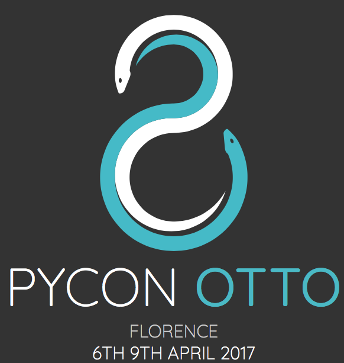

# PyCon 7 Community Voting Results #

 
    

Community Voting Results and Rankings of Talks proposed at PyCon Otto: [http://pycon.it]()

* **Notebook**: [Conference Talks Rankings](Conference Talks Rankings.ipynb)

## All the Rankings: ##
* [**Absolute Ranking**](https://gist.github.com/leriomaggio/3762d7e50d208d26c192fff5c6faa813#community-voting-results)

* [**Talks**](https://gist.github.com/leriomaggio/3762d7e50d208d26c192fff5c6faa813#talks)
* [**Traninngs**](https://gist.github.com/leriomaggio/3762d7e50d208d26c192fff5c6faa813#trainings)

### Tracks

*  [**PyLang**](https://gist.github.com/leriomaggio/3762d7e50d208d26c192fff5c6faa813#pylang)
* [**PyCommunity**](https://gist.github.com/leriomaggio/3762d7e50d208d26c192fff5c6faa813#pycommunity)
*  [**PyData**](https://gist.github.com/leriomaggio/3762d7e50d208d26c192fff5c6faa813#pydata)
*  [**PyWeb**](https://gist.github.com/leriomaggio/3762d7e50d208d26c192fff5c6faa813#pyweb)
* [**PyBusiness**](https://gist.github.com/leriomaggio/3762d7e50d208d26c192fff5c6faa813#pybusiness)
* [**PyDatabase**](https://gist.github.com/leriomaggio/3762d7e50d208d26c192fff5c6faa813#pydb)
